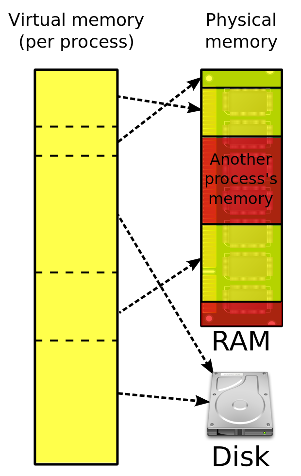

# Hardware: Computing Resources

In order to better understand how we can use the available computing resources most efficiently in an analytics task, this chapter first provides a basic conceptual introduction to the most important hardware components and how they matter for computation.


## Components of a standard computing environment

Figure \@ref(fig:components) illustrates the key components of a standard computing environment to process digital data. In our case, these components serve the purpose of computing a statistic, given a large data set as input. 

```{r components, echo=FALSE, out.width = "60%", fig.align='center', fig.cap= "(ref:components)", purl=FALSE}
include_graphics("img/03_script-hardware_w.jpg")
```

(ref:components) Basic components of a standard computing environment.

- *Mass Storage* refers to the type of computer memory we use to store data in the long run. This is what we call the *hard drive* or *hard disk*. 

- In order to work with data (e.g., in R), it first has to be loaded into the *memory* of our computer. More specifically, into the Random Access Memory (*RAM*). Typically, data is only loaded in the RAM as long as we work with it. 

- The component actually *processing* data is the Central Processing Unit (CPU). When using R to process data, R commands are translated into complex combinations of a small set of basic operations which the *CPU* then executes. 


For what follows, consider the main difference between 'data analytics' and 'Big Data analytics' that in the latter case, the standard usage of one or several of these components fails or works very inefficiently because the amount of data overwhelms its normal capacity. 

From the hardware-perspective, there are two basic strategies to cope with the situation that one of these components is overwhelmed by the amount of data:

- *Scale up ('horizontal scaling')*: Extend the physical capacity of the affected component by building a system with large RAM shared between applications. This sounds like a trivial solution ('if RAM is too small, buy more RAM...'), but in practice it can be very expensive. 
- *Scale out ('vertical scaling')*: Distribute the workload over several computers (or separate components of a system). 

From a software-perspective, there are many (context-specific) strategies that can help us to use the resources available more efficiently in order to process large amounts of data. In the following sub-sections, we first get an idea of what we mean by capacity and *big* regarding the most important hardware components. First we focus on mass storage and memory, then on


## Mass storage 

In a simple computing environment, the mass storage device (hard disk) is where the data is stored to be analyzed. So, in what units to we measure the size of data sets and consequently the mass storage capacity of a computer? The smallest unit of information in computing/digital data is called a *bit* (from *bi*nary dig*it*; abbrev. 'b') and can take one of two (symbolic) values, either a `0` or a `1` ("off" or "on"). Consider, for example, the decimal number `139`. Written in the binary system, `139` corresponds to the binary number `10001011`. In order to store this number on a hard disk, we require a capacity of 8 bits, or one *byte* (1 byte = 8 bits; abbrev. 'B'). Historically, one byte encoded a single character of text (i.e., in the ASCII character encoding system). 4 bytes (or 32 bits) are called a *word*. When thinking of a given data set in its raw/binary representation, we can simply think of it as a row of `0`s and  `1`s.

Bigger units for storage capacity usually build on bytes:

 - $1 \text{ kilobyte (KB)} = 1000^{1}   \approx 2^{10}   \text{ bytes}$
 - $1 \text{ megabyte (MB)} = 1000^{2}   \approx 2^{20}   \text{ bytes}$
 - $1 \text{ gigabyte (GB)} = 1000^{3}   \approx 2^{30}   \text{ bytes}$
 - $1 \text{ terabyte (TB)} = 1000^{4}   \approx 2^{40}   \text{ bytes}$
 - $1 \text{ petabyte (PB)} = 1000^{5}   \approx 2^{50}   \text{ bytes}$
 - $1 \text{ exabyte (EB)} = 1000^{6}    \approx 2^{60}   \text{ bytes}$
 - $1 \text{ zettabyte (ZB)} = 1000^{7}  \approx 2^{70}   \text{ bytes}$

$$1 ZB = 1000000000000000000000\text{ bytes} = 1 \text{ billion terabytes} = 1 \text{ trillion gigabytes}.$$
Currently, a common laptop or desktop computer has several hundred GBs or 1-2 TBs of mass storage capacity. The problems related to a lack of mass storage capacity in Big Data Analytics are likely the easiest to understand. Suppose you collect large amounts of data from an online source such as the Twitter API. At some point, R will throw an error and stop the data collection procedure as the operating system will not allow R to use up more disk space. The simplest solution to this problem is to clean up your hard disk: empty the trash, archive files in the cloud or on an external drive and delete them on the main disk, etc. In addition, there are some easy-to-learn tricks to use from within R to safe some disk space.

### Avoid redundancies

Different formats to structure data stored on disk use up more or less space. A simple example is the comparison of [JSON (JavaScript Object Notaion)](https://en.wikipedia.org/wiki/JSON) to [CSV (Comma Separated Values)](https://en.wikipedia.org/wiki/Comma-separated_values), both data structures that are widely used to store data for analytics purposes. JSON is much more flexible in that it allows the definition of abundantly complex hierarchical data structures (and even allows for hints at data types). However, this flexibility comes with some overhead in the usage of special characters to define the structure. Consider the following JSON excerpt of an economic time series fetched from the Federal Reserve's [FRED API](https://fred.stlouisfed.org/docs/api/fred/series_observations.html#example_json).


```
{
    "realtime_start": "2013-08-14",
    "realtime_end": "2013-08-14",
    "observation_start": "1776-07-04",
    "observation_end": "9999-12-31",
    "units": "lin",
    "output_type": 1,
    "file_type": "json",
    "order_by": "observation_date",
    "sort_order": "asc",
    "count": 84,
    "offset": 0,
    "limit": 100000,
    "observations": [
        {
            "realtime_start": "2013-08-14",
            "realtime_end": "2013-08-14",
            "date": "1929-01-01",
            "value": "1065.9"
        },
        {
            "realtime_start": "2013-08-14",
            "realtime_end": "2013-08-14",
            "date": "1930-01-01",
            "value": "975.5"
        },
        ...,
        {
            "realtime_start": "2013-08-14",
            "realtime_end": "2013-08-14",
            "date": "2012-01-01",
            "value": "15693.1"
        }
    ]
}
```

The JSON format is very practical here to separate metadata (like what time frame is covered by this data set etc.) in the first few lines on top from the actual data in `"observations"` further down. However, note that due to this structure the key names like `"date"`, and `"value"` occur for each observation in that time series. In addition `"realtime_start"` and `"realtime_end"` occur both in the metadata section and again in each observation. Each of those occurrences costs some bytes of storage space on your hard disk but does not add any information once you have parsed and imported the time series into R. The same information could also be stored in a more efficient way on your hard disk by simply storing the metadata in a separate text file and the actual observations in a CSV file (in a table-like structure):

```
"date","value"
"1929-01-01", "1065.9"
"1930-01-01", "975.5"

...,

"2012-01-01", 15693.1"
```

In fact, in that particular example, storing the data in JSON format would take up more than double the hard-disk space than CSV. Of course, this is not to say that one should generally store data in CSV files. In many situations, you might really have to rely on JSON's flexibility to represent more complex structures. However, in practice it is very much worth the while to think about whether you can improve storage efficiency by simply storing the raw data in a different format.

Another related point to storing data in CSV files is to remove redundancies by splitting the data into several tables/CSV-files, whereby each table contains the variables exclusively describing the type of observation in it. For example, when analyzing customer data for marketing purposes, the data set stored in one CSV file might be at the level of individual purchases. That is each row contains both information on what has been purchased on which day by which customer as well as additional variables describing the customer (such as customer id, name, address, etc.). Instead of keeping all of this data in one file, we could split it into two files, where one only contains the order ids and corresponding customer ids as well as attributes of individual orders (but not additional attributes of the customers themselves) and the other contains the customer ids and all customer attributes. Thereby, we avoid redundancies in the form of repeatedly storing the same values of customer attributes (like name and address) for each order.^[This concept of organizing data in several tables is the basis of relational database management systems, which we will look at in more detail in chapter 5. However, the basic idea is also very useful to store the raw data efficiently even if there is not intention to later build a database and run SQL queries on it.]


### Data compression 

Data compression essentially follows from the same basic idea of avoiding redundancies in data storage as the simple approaches discussed above. However, it happens on a much more fundamental level. Data compression algorithms encode the information contained in the original representation of the data with fewer bits. In the case of lossless compression, this results in a new data file containing the exact same information but taking up less space on disk. In simple terms, compression replaces repeatedly occurring sequences with shorter expressions and keeps track of replacements in a table. Based on the table, the file can then again be de-compressed to show the original representation of the data. For example, consider the following character string containing.

```
"xxxxxyyyyyzzzz"
```

The same data could be represented with fewer bits as:


```
"5x6y4z"
```

which needs less than half the bits to be stored (but contains the same information).

There are several easy ways to use your mass storage capacity more efficiently with data compression in R. Most conveniently, some functions to import/export data in R directly allow for reading and writing of compressed formats. For example, the `fread()`/`fwrite()` functions provided in the `data.table`-package will automatically use the GZIP (de-)compression utility when writing to (reading from) a CSV file with a `.gz` file extension in the file name.

```{r warning=FALSE, message=FALSE}
# load packages
library(data.table)

# load example data from basic R installation
data("LifeCycleSavings")

# write data to normal csv file and check size
fwrite(LifeCycleSavings, file="lcs.csv")
file.size("lcs.csv")

# write data to a GZIPPED (compressed) csv file and check size
fwrite(LifeCycleSavings, file="lcs.csv.gz")
file.size("lcs.csv.gz")

# read/import the compressed data
lcs <- data.table::fread("lcs.csv.gz")
```
Alternatively, you can also use other types of data compressions as follows.

```{r}
# common ZIP compression (independent of data.table package)
write.csv(LifeCycleSavings, file="lcs.csv")
file.size("lcs.csv")
zip(zipfile = "lcs.csv.zip", files =  "lcs.csv")
file.size("lcs.csv.zip")

# unzip/decompress and read/import data
lcs_path <- unzip("lcs.csv.zip")
lcs <- read.csv(lcs_path)


```

Note that data compression is subject to a time-memory trade-off. Compression and de-compression is computationally intense and needs time. When using compression in order to make more efficient use of the available mass storage capacity, think about how frequently you expect the data to be loaded into R as part of the data analysis tasks ahead and for how long your will need to keep the data stored on your hard disk. Importing GBs of compressed data can be uncomfortably slower than importing from a decompressed file.

So far, we have only focused on data size in the context of mass storage capacity. But what happens once you load a large data set into R (e.g., by means of `read.csv()`? A program called a "parser" is executed that reads the raw data from the hard disk and creates a representation of that data in the R environment, that is, in random access memory (RAM). All common computers have more GBs of mass storage available than GBs of RAM. Hence, new problems to hardware capacity loom at the stage of data import, which brings us to the next subsection.


## Random access memory (RAM)

Currently, a common laptop or desktop computer has 8-32 GB of RAM capacity. These are more-or-less the numbers you should keep in the back of your mind for the examples/discussions that follow. That is, we will consider a data set as "big" if it takes up several GBs in RAM (and therefore might overwhelm a machine with 8GB RAM capacity).

There are several types of problems that you might run into in practice when attempting to import and analyze a data set of the size close to or larger than your computers RAM capacity. First, importing the data might take much longer than expected, your computer might freeze during import (or later during the analysis), R/Rstudio might crash, you might get an Error message hinting at a lack of RAM. How can you anticipate such problems and what can you do about them?

Many of the techniques and packages discussed in the following chapters are in one or the other way solutions to this kind of problems. However, there are a few relatively simple things to keep in mind before we go into these details.

1. The same data stored on the mass storage device (e.g., in a CSV file) might take up more or less space in RAM. This is due to the fact that the data is (technically speaking) structured differently in a CSV or JSON file than in, for example, a data table or a matrix in R. For example, it is reasonable to anticipate that the example JSON file with the economic time series data, will take up less space as a time series object in R (in RAM) than it does on the hard disk (for one thing just simply due to the fact that we will not keep the redundancies mentioned before). 

2. The import might work well but some parts of the data analysis script might require much more memory to run through even without loading additional data from disk. A classical example for this is regression analysis performed with, for example, `lm()` in R. As part of the OLS estimation procedure, `lm` will need to create the model matrix (usually denoted $X$). Depending on the model you want to estimate, the model matrix might actually be larger than the data frame containing the data set. In fact, this can happen quite easily if you specify a fixed effects model in which you want to account for the fixed effects via dummy variables (for example, for each country except for one).^[For example, if you specify something like `lm(y~x1 + x2 + country, data=mydata)` and `country` is a categorical variable (factor).] Again, the result can be one of several. An error message hinting to a lack of memory, a crash, or the computer slowing down a lot. Anticipating these types of problems is very tricky since the memory problems are often caused at a lower level of a function from the package that provides you with the data analytics routine you intend to use. Accordingly, error messages might be rather cryptic. 

3. Keep in mind that you have some leeway to guide how much space imported data takes up in R by considering data structures and data types. For example, you can use factors instead of character vectors when importing categorical variables into R (the default in `read.csv`) and for some operations it makes sense to work with matrices instead of data frames.

Finally, recall the lessons regarding memory usage from the section "Writing efficient R code" in chapter 1.  


## Combining RAM and hard-disk: virtual memory

what if all RAM of our computer is not enough to store all the data we want to analyze?

Modern operating systems have a way to dealing with such a situation. Once all RAM is used up by the currently running programs, the OS allocates parts of the memory back to the hard-disk which then works as *virtual memory*. The following figure illustrates this point.

```{r vm, echo=FALSE, out.width = "30%", fig.align='center', fig.cap= "(ref:vm)", purl=FALSE}

```

(ref:vm) Virtual memory. Figure by Ehamberg (CC BY-SA 3.0).

For example, when we implement an R-script that imports one file after the other into the R environment, ignoring the RAM capacity of our computer, the OS will start *paging* data to the virtual memory. This happens 'under the hood' without explicit instructions by the user. We quite likely notice that the computer slows down a lot when this happens.

While this default usage of virtual memory by the OS is helpful to run several applications at the same time, each taking up a moderate amount of memory, it is not a really useful tool for processing large amounts of data in one application (R). However, the underlying idea of using both RAM and Mass storage simultaneously in order to cope with a lack of memory is very useful in the context of big data analytics.

Several R packages have been developed that exploit the idea behind virtual memory explicitly for analyzing large amounts of data. The basic idea behind these packages is to map a data set to the hard disk when loading it into R. The actual data values are stored in chunks on the hard-disk, while the structure/metadata of the data set is loaded into R. See this week's slide set as well as @walkowiak_2016, Chapter 3 for more details and example code.


## CPU and parallelization

The actual processing of the data is done in the computer's central processing unit (CPU). Consequently, the performance of the CPU has a substantial effect on how fast a data analytics task runs. Thereby, a CPU's performance is usually denoted by its *clock rate* measured in gigaherz (GHz). In simple terms, a CPU with a clock rate of 4.8 GHz can execute 4.8 billion basic operations per second. Holding all other aspects constant, you can thus expect an analytics task to run faster if it runs on a computer with higher CPU clock rate. Alternatively to scaling up the CPU, we can exploit that modern CPUs have several *cores*. In the normal usage of a PC, the operating system makes use of these cores in order to run several applications smoothly *in parallel* (e.g., you listen to music on Spotify while browsing the web and running some analytics script in RStudio in the background). 

Modern computing environments such as R allow us to explicitly run parts of the same analytics task in parallel, that is, on several CPU cores at the same time. Following the same logic, we can also connect several computers (each with several CPU cores) in a cluster computer and run the program in parallel on all of these computing nodes. Both of these approaches are generally referred to as *parallelization* and both are supported in several R packages.

Thereby, an R program run in parallel typically involves the following steps

- First, several instances of R are running at the same time (across one machine with multiple CPU cores or across a cluster computer). One of the instances (i.e., the *master* instance) breaks the computation into batches and sends those to the other instances.
- Second, each of the instances processes its batch and sends the results back to the master instance.
- Finally, the master instance combines the partial results to the final result and returns it to the user.

To illustrate this point, consider the following econometric problem: you have a customer [data set](https://www.kaggle.com/jackdaoud/marketing-data?select=marketing_data.csv) with detailed data on customer characteristics, past customer behavior and information on online marketing campaigns. Your task is to figure out, which customers are more likely to react positively to the most recent online marketing campaign. The aim is to optimize personalized marketing campaigns in the future based on insights gained from this exercise. In a first step you take a computationally intense "brute force" approach: you run all possible regressions with the dependent variable  `Response` (equal to 1 if the customer took the offer in the campaign and 0 otherwise). In total you have 21 independent variables, thus you need to run $2^20=1048576$ logit regressions (this is without considering linear combinations of covariates etc.). Finally, you want to select the model with the best fit according to deviance.

A simple sequential implementation to solve this problem could look like this (for the sake of time, we cap the number of regression models with N=10).

```{r}
# you can download the data set from 
# https://www.kaggle.com/jackdaoud/marketing-data?select=marketing_data.csv

# PREPARATION -----------------------------

# packages
library(stringr)

# import data
marketing <- read.csv("data/marketing_data.csv")
# clean/prepare data
marketing$Income <- as.numeric(gsub("[[:punct:]]", "", marketing$Income)) 
marketing$days_customer <- as.Date(Sys.Date())- as.Date(marketing$Dt_Customer, "%m/%d/%y")
marketing$Dt_Customer <- NULL

# all sets of independent vars
indep <- names(marketing)[ c(2:19, 27,28)]
combinations_list <- lapply(1:length(indep),
                            function(x) combn(indep, x, simplify = FALSE))
combinations_list <- unlist(combinations_list, recursive = FALSE)
models <- lapply(combinations_list,
                 function(x) paste("Response ~", paste(x, collapse="+")))

# COMPUTE REGRESSIONS --------------------------

N <- 10 # just for illustration, the actual code is N <- length(models)
pseudo_Rsq <- list()
length(pseudo_Rsq) <- N
for ( i in 1:N) {
  # fit the logit model via maximum likelihood
  fit <- glm(models[[i]], data=marketing, family = binomial())
  # compute the proportion of deviance explained by the independent vars (~R^2)
  pseudo_Rsq[[i]] <- 1-(fit$deviance/fit$null.deviance)
}

# SELECT THE WINNER ---------------
models[[which.max(pseudo_Rsq)]]

```


### Naive multi-session approach

There is actually a simple way of doing this "manually" on a multi-core PC, which intuitively illustrates the point of parallelization (although it would not be a very practical approach): you write an R script that loads the data set, runs the fist $n$ of the total of $N$ regressions and stores the result in a local text file. Next, you run the script in your current RStudio session, open an additional RStudio session and run the script with the next $n$ regressions, and so on until all cores are occupied with one RStudio session. In the end you collect all of the results from the  separate text files and combine them to get the final result. Depending on the problem at hand, this could indeed speed up the overall task and it is technically speaking a form of a "multi-session" approach. However, as you have surely noticed, this is unlikely a very practical approach.

### Multi-core and multi-node approach

A more practical approach is to write one R script (with the help of some specialized packages) that instructs R to automatically distribute the batches to different cores (or different computing nodes in a cluster computer), control and monitor the progress in all cores, and then automatically collect and combine the results from all cores. There are several approaches to achieve this in R.


#### Parallel for-loops using socket

Likely the most intuitive approach to parallelizing a task in R is the `foreach` package. It allows you to write a `foreach` statement that is very similar to the for-loop syntax in R. Hence, you can straightforwardly "translate" an already implemented sequential approach with a common for-loop to a parallel implementation. 

```{r}
# COMPUTE REGRESSIONS IN PARALLEL (MULTI-CORE) --------------------------

# packages for parallel processing
library(parallel)
library(doSNOW)

# get the number of cores available
ncores <- parallel::detectCores()
# set cores for parallel processing
ctemp <- makeCluster(ncores)
registerDoSNOW(ctemp)

# prepare loop
N <- 10000 # just for illustration, the actual code is N <- length(models)
# run loop in parallel
pseudo_Rsq <-
  foreach ( i = 1:N, .combine = c) %dopar% {
    # fit the logit model via maximum likelihood
    fit <- glm(models[[i]], data=marketing, family = binomial())
    # compute the proportion of deviance explained by the independent vars (~R^2)
    return(1-(fit$deviance/fit$null.deviance))
}

# SELECT THE WINNER ---------------
models[[which.max(pseudo_Rsq)]]

```


With relatively few cases, this approach is not very fast due to the overhead of "distributing" variables/objects from the master process to all cores/workers. In simple terms, the socket approach means that the cores do not share the same variables/the same environment, which creates overhead. However, this approach is usually very stable and runs on all platforms.


#### Parallel lapply using forking

```{r}
# COMPUTE REGRESSIONS IN PARALLEL (MULTI-CORE) --------------------------


# prepare parallel lapply (based on forking, here clearly faster than foreach)
N <- 10000 # just for illustration, the actual code is N <- length(models)
# run parallel lapply
pseudo_Rsq <- mclapply(1:N,
                       mc.cores = ncores,
                       FUN = function(i){
                         # fit the logit model via maximum likelihood
                         fit <- glm(models[[i]], data=marketing, family = binomial())
                         # compute the proportion of deviance explained by the independent vars (~R^2)
                         return(1-(fit$deviance/fit$null.deviance))
                         })

# SELECT THE WINNER, SHOW FINAL OUTPUT ---------------

best_model <- models[[which.max(pseudo_Rsq)]]
best_model

#summary(glm(best_model, data=marketing, family = binomial()))

```


In the fork approach, each core works with the same objects/variables in a shared environment, which makes this approach very fast. However, depending on what exactly is computed, sharing an environment can cause problems.^[Also, this approach does not work on Windows machines (see `?mclapply` for details).] If you are not sure whether your set up might run into issues with forking, better rely on a non-fork approach.

<!-- #### Parallelization based on futures -->
<!-- https://github.com/HenrikBengtsson/future -->
<!-- https://cran.r-project.org/web/packages/future/vignettes/future-3-topologies.html -->


## GPUs for scientific computing

The success of the computer games industry in the late 1990s/early 2000s led to an interesting positive externality for scientific computing. The ever more demanding graphics of modern computer games and the huge economic success of the computer games industry set incentives for hardware producers to invest in research and development of more powerful 'graphic cards', extending a normal PC/computing environment with additional computing power solely dedicated to graphics. At the heart of these graphic cards are so-called GPUs (Graphic Processing Units), microprocessors specifically optimized for graphics processing. The image below depicts a modern graphics card with NVIDIA GPUs, which is quite common in today's 'gaming' PCs. 


```{r nvidiagpu, echo=FALSE, out.width = "60%", fig.align='center', purl=FALSE}
include_graphics("img/nvidia_geeforce.png")
```


Why did the hardware industry not simply invest in the development of more powerful CPUs to deal with the more demanding PC games? The main reason is that the architecture of CPUs is designed not only for efficiency but also flexibility. That is, a CPU needs to perform well in all kind of computations, some parallel, some sequential, etc. Computing graphics is a comparatively narrow domain of computation and designing a processing unit architecture that is custom-made to excel just at this one task is thus much more cost efficient. Interestingly, this graphics-specific architecture  (specialized on highly parallel numerical [floating point] workloads) turns out to be also very useful in some core scientific computing tasks. In particular, matrix multiplications (see @fatahalian_etal2004 for a detailed discussion of why that is the case). A key aspect of GPUs is that they are composed of several multiprocessor units, of which each has in turn several cores. GPUS thus can perform computations with hundreds or even thousands of threads in parallel. The figure below illustrates this point.


```{r nvidia_architecture, echo=FALSE, out.width = "60%", fig.align='center', purl=FALSE}
include_graphics("img/nvidia_gpu.png")
```


<!-- ```{r nvidia_architecture, echo=FALSE, out.width = "60%", fig.align='center', fig.cap= "(ref:nvidiaarchitecture)", purl=FALSE} -->
<!-- include_graphics("img/nvidia_gpu.png") -->
<!-- ``` -->

<!-- (ref:nvidiaarchitecture) Typical NVIDIA GPU architecture (illustration and notes by @hernandez_etal2013). The GPU is comprised of a set of Streaming MultiProcessors (SM). Each SM is comprised of several Stream Processor (SP) cores, as shown for the NVIDIA’s Fermi architecture (a). The GPU resources are controlled by the programmer through the CUDA programming model, shown in (b). -->


While, initially, programming GPUs for scientific computing required a very good understanding of the hardware. Graphics card producers have realized that there is an additional market for their products (in particular with the recent rise of deep learning), and provide several high-level APIs to use GPUs for other tasks than graphics processing. Over the last few years more  high-level software has been developed, which makes it much easier to use GPUs in parallel computing tasks. The following subsections shows some examples of such software in the R environment.^[Note that while these examples are easy to implement and run, setting up a GPU for scientific computing still can involve many steps and some knowledge of your computer's system. The examples presuppose that all installation and configuration steps (GPU drivers, CUDA, etc.) have already been completed successfully.]


### GPUs in R

<!-- ## Installation -->

<!-- This is for pop OS machines. Install drivers etc. for NVIDIA card -->
<!-- ```{bash eval=FALSE} -->
<!-- # sudo apt install tensorflow-cuda-latest -->
<!-- ``` -->

<!-- Install OpenCL -->

<!-- ```{bash eval=FALSE} -->
<!-- # sudo apt install tensorflow-cuda-latest -->
<!-- ``` -->


<!-- Install `gpuR` in R (`install.packages("gpuR")`). -->


#### GPU computing example: Matrix multiplication comparison (`gpuR`)

The `gpuR` package provides basic R functions to compute with GPUs from  within the R environment. In the following example we compare the performance of the CPU with the GPU based on a matrix multiplication exercise. For a large $N\times P$ matrix $X$, we want to compute $X^tX$.


In a first step, we load the `gpuR`-package.^[As with the setting up of GPUs on your machine in general, installing all prerequisites to make `gpuR` work on your local machine can be a bit of work and can depend a lot on your system.] Note the output to the console. It shows the type of GPU  identified by `gpuR`. This is the platform on which `gpuR` will compute the GPU examples. In order to compare the performances, we also load the `bench` package.

```{r  warning=FALSE, message=FALSE }
# load package
library(bench)
library(gpuR)

```


Next, we initiate a large matrix filled with pseudo random numbers, representing a data set with $N$ observations and $P$ variables.

```{r}
# initiate data set with pseudo random numbers
N <- 10000  # number of observations
P <- 100 # number of variables
X <- matrix(rnorm(N * P, 0, 1), nrow = N, ncol =P)

```

For the GPU examples to work, we need one more preparatory step. GPUs have their own memory, which they can access faster than they can access RAM. However, this GPU memory is typically not very large compared to the memory CPUs have access to. Hence, there is a potential trade-off between losing some efficiency but working with more data or vice versa.^[If we instruct the GPU to use the own memory, but the data does not fit in it, the program will result in an error.] Here, we show both variants. With `gpuMatrix()` we create an object representing matrix `X` for computation on the GPU. However, this only points the GPU to the matrix and does not actually transfer data to the GPU's memory. The latter is done in the other variant with `vclMatrix()`.

```{r}
# prepare GPU-specific objects/settings
gpuX <- gpuMatrix(X, type = "float")  # point GPU to matrix (matrix stored in non-GPU memory)
vclX <- vclMatrix(X, type = "float")  # transfer matrix to GPU (matrix stored in GPU memory)
```


Now we run the three examples: first, based on standard R, using the CPU. Then, computing on the GPU but using CPU memory. And finally, computing on the GPU and using GPU memory. In order to make the comparison fair, we force `bench::mark()` to run at least 20 iterations per benchmarked variant.

```{r}
# compare three approaches
(gpu_cpu <- bench::mark(
  
  # compute with CPU 
  cpu <- t(X) %*% X,
  
  # GPU version, GPU pointer to CPU memory (gpuMatrix is simply a pointer)
  gpu1_pointer <- t(gpuX) %*% gpuX,
  
  # GPU version, in GPU memory (vclMatrix formation is a memory transfer)
  gpu2_memory <- t(vclX) %*% vclX,
 
check = FALSE, memory = FALSE, min_iterations = 20))
```

The performance comparison is visualized with boxplots.

```{r}
plot(gpu_cpu, type = "boxplot")
```

The theoretically expected pattern becomes clearly visible. When using the GPU + GPU memory, the matrix operation takes on average less than 20ms , with GPU + RAM over 30ms and with the common CPU operation close to 100ms to finish. In the chapters on applied data analysis, we will look at some applications of GPUs in the domain of deep learning (which heavily relies on matrix multiplications).


<!-- ## Resource allocation  -->

<!-- When optimizing the performance of an analytics program processing large amounts of data, it is useful to differentiate between the efficient allocation of computational (CPU) power, and the allocation of RAM (and mass storage).^[In many data analysis tasks the two are, of course, intertwined. However, keeping both aspects in mind when optimizing an analytics program helps to choose the right tools.] Below, we will look at both aspects in turn.  -->


