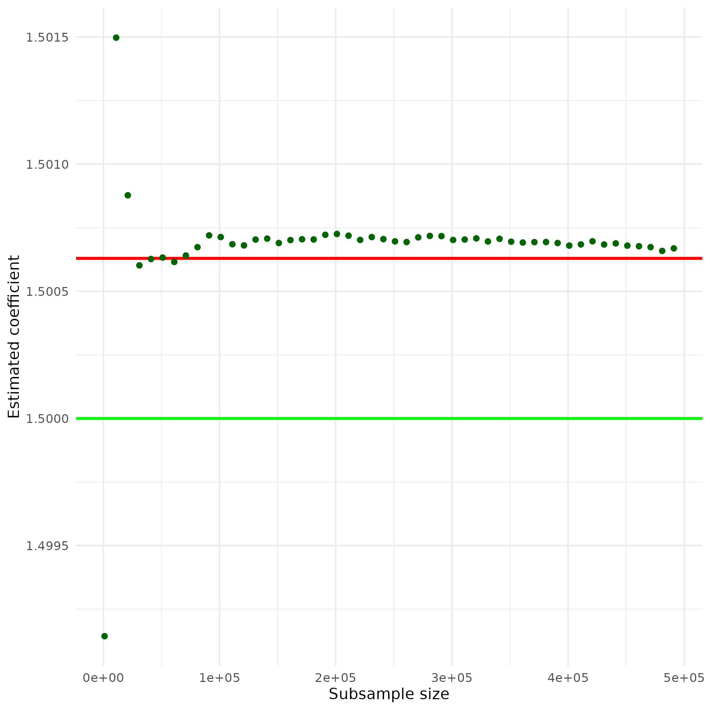

# The Two Domains of Big Data Analytics
As discussed in the previous chapter, data analytics in the context of Big Data
can be broadly categorized into two domains of statistical challenges:
techniques/estimators to address *big P* problems and techniques/estimators to
address *big N* problems. While this book predominantly focuses on how to handle
Big Data for applied economics and business analytics settings in the context of
*big N* problems, it is useful to set the stage for the following chapters with
two practical examples concerning both *big P* and *big N* methods.


## A practical *big P* problem \index{Big P}

Due to the abundance of digital data on all kinds of human activities, both
empirical economists and business analysts are increasingly confronted with
high-dimensional data (many signals, many variables). While having a lot of
variables to work with sounds kind of like a good thing, it introduces new
problems in coming up with useful predictive models. In the extreme case of
having more variables in the model than observations, traditional methods cannot
be used at all. In the less extreme case of just having dozens or hundreds of
variables in a model (and plenty of observations), we risk "falsely" discovering
seemingly influential variables and consequently coming up with a model with
potentially very misleading out-of-sample predictions. So how can we find a
reasonable model?^[Note that finding a model with good in-sample prediction
performance is trivial when you have a lot of variables: simply adding more
variables will improve the performance. However, that will inevitably result in
a nonsensical model as even highly significant variables might not have any
actual predictive power when looking at out-of-sample predictions. Hence, in
this kind of exercise we should *exclusively focus on out-of-sample predictions*
when assessing the performance of candidate models.]
Let us look at a real-life example. Suppose you work for Google's e-commerce
platform
[www.googlemerchandiseshop.com](https://shop.googlemerchandisestore.com), and
you are in charge of predicting purchases (i.e., the probability that a user
actually buys something from your store in a given session) based on user and
browser-session characteristics.^[We will in fact be working with a real-life
Google Analytics\index{Google Analytics} dataset from
www.googlemerchandiseshop.com; see here for details about the dataset:
https://www.blog.google/products/marketingplatform/analytics/introducing-google-analytics-sample/.]
The dependent variable `purchase` is an indicator equal to `1` if the
corresponding shop visit leads to a purchase and equal to `0` otherwise. All
other variables contain information about the user and the session (Where is the
user located? Which browser is (s)he using? etc.).

### Simple logistig regression (naive approach)

As the dependent variable is binary, we will first estimate a simple logit model\index{Logit model}, in which
we use the origins of the store visitors (how did a visitor end up in the shop)
as explanatory variables. Note that many of these variables are categorical, and
the model matrix thus contains a lot of "dummies" (indicator variables). The
plan in this (intentionally naive) first approach is to simply add a lot of
explanatory variables to the model, run logit, and then select the variables
with statistically significant coefficient estimates as the final predictive
model. The following code snippet covers the import of the data, the creation of
the model matrix (with all the dummy-variables), and the logit estimation.

```{r}
# import/inspect data
ga <- read.csv("data/ga.csv")
head(ga[, c("source", "browser", "city", "purchase")])
# create model matrix (dummy vars)
mm <- cbind(ga$purchase,
            model.matrix(purchase~source, data=ga,)[,-1])
mm_df <- as.data.frame(mm)
# clean variable names
names(mm_df) <- c("purchase",
                  gsub("source", "", names(mm_df)[-1]))
# run logit
model1 <- glm(purchase ~ .,
              data=mm_df, family=binomial)
```
Now we can perform the t-tests and filter out the "relevant" variables.
```{r}
model1_sum <- summary(model1)
# select "significant" variables for final model
pvalues <- model1_sum$coefficients[,"Pr(>|z|)"]
vars <- names(pvalues[which(pvalues<0.05)][-1])
vars
```
Finally, we re-estimate our "final" model.
```{r}
# specify and estimate the final model
finalmodel <- glm(purchase ~.,
                  data = mm_df[, c("purchase", vars)],
                  family = binomial)
```
The first problem with this approach is that we should not trust the coefficient
t-tests based on which we have selected the covariates too much. The first model
contains 62 explanatory variables (plus the intercept). With that many
hypothesis tests, we are quite likely to reject the NULL of no predictive effect
although there is actually no predictive effect. In addition, this approach
turns out to be unstable. There might be correlation between some of the
variables in the original set, and adding/removing even one variable might
substantially affect the predictive power of the model (and the apparent
relevance of other variables). We can see this already from the summary of our
final model estimate (generated in the next code chunk). One of the apparently
relevant predictors (`dfa`) is not at all significant anymore in this
specification. Thus, we might be tempted to further change the model, which in
turn would again change the apparent relevance of other covariates, and so on.
```{r}
summary(finalmodel)$coef[,c("Estimate", "Pr(>|z|)")]
```


An alternative approach would be to estimate models based on all possible
combinations of covariates and then use that sequence of models to select the
final model based on some out-of-sample prediction performance measure. Clearly
such an approach would take a long time to compute.

### Regularization: the lasso estimator

Instead, the *lasso estimator*\index{Lasso} provides a convenient and
efficient way to get a sequence of candidate models. The key idea behind lasso
is to penalize model complexity (the cause of instability) during the estimation
procedure.^[In simple terms, this is done by adding $\lambda\sum_k{|\beta_k|}$
as a "cost" to the optimization problem.] In a second step, we can then select a
final model from the sequence of candidate models based on, for example,
"out-of-sample" prediction\index{out-of-sample prediction} in a k-fold cross
validation.\index{Cross-validation}
The `gamlr`\index{gamlr package} package [@gamlr] provides both parts of this procedure (lasso for the
sequence of candidate models, and selection of the "best" model based on k-fold
cross-validation).
```{r warning=FALSE, message=FALSE}
# load packages
library(gamlr)
# create the model matrix
mm <- model.matrix(purchase~source, data = ga)
```
In cases with both many observations and many candidate explanatory variables,
the model matrix might get very large. Even simply generating the model matrix
might be a computational burden, as we might run out of memory to hold the model
matrix object. If this large model matrix is sparse (i.e, has a lot of `0`
entries), there is a much more memory-efficient way to store it in an R object.
R provides ways to represent such sparse matrices in a compressed way in
specialized R objects (such as `CsparseMatrix` provided in the `Matrix`
package\index{Matrix package} @Matrix). Instead of containing all $n\times m$ cells of the matrix, these
objects only explicitly store the cells with non-zero values and the
corresponding indices. Below, we make use of the high-level
`sparse.model.matrix`\index{sparse.model.matrix()} function to generate the model matrix and store it in a
sparse matrix object\index{Sparse matrix}. To illustrate the point of a more
memory-efficient representation, we show that the traditional matrix object is
about 7.5 times larger than the sparse version.
```{r}
# create the sparse model matrix
mm_sparse <- sparse.model.matrix(purchase~source, data = ga)
# the sparse representation needs less than 15% of
# the memory needed for the standard matrix representation:
as.numeric(object.size(mm)/object.size(mm_sparse))
```
Finally, we run the lasso estimation with k-fold cross-validation.
```{r}
# run k-fold cross-validation lasso
cvpurchase <- cv.gamlr(mm_sparse, ga$purchase, family="binomial")
```
We can then illustrate the performance of the selected final model – for
example, with an ROC curve\index{ROC curve}. Note that both the `coef` method
and the `predict` method for `gamlr` objects automatically select the 'best'
model.
```{r, fig.align='center', out.width="75%"}
# load packages
library(PRROC)
# use "best" model for prediction
# (model selection based on average OSS deviance
pred <- predict(cvpurchase$gamlr, mm_sparse, type="response")
# compute tpr, fpr; plot ROC
comparison <- roc.curve(scores.class0 = pred,
                       weights.class0=ga$purchase,
                       curve=TRUE)
plot(comparison)
```
Hence, econometrics techniques such as lasso\index{Lasso} help deal with *big P* problems by
providing reasonable ways to select a good predictive model (in other words,
decide which of the many variables should be included).


## A practical *big N* problem \index{Big N}

Big N problems are situations in which we know what type of model we want to use
but the *number of observations* is too big to run the estimation (the computer
crashes or slows down significantly). The simplest statistical solution to such
a problem is usually to just estimate the model based on a smaller sample.
However, we might not want to do that for other reasons (i.e., if we require a big N for statistical power reasons). As an illustration of how an alternative statistical procedure can speed up the analysis of big N datasets, we look at a procedure to estimate linear
models for situations where the classical OLS estimator\index{Ordinary Least Squares (OLS)} is computationally too
demanding when analyzing large datasets: The *Uluru* algorithm\index{Uluru algorithm}
[@dhillon_2013].

### OLS as a point of reference \index{Ordinary Least Squares (OLS)}

Recall the OLS estimator in matrix notation, given the linear model

$\mathbf{y}=\mathbf{X}\beta + \epsilon$:
$$\hat{\beta}_{OLS} =
(\mathbf{X}^\intercal\mathbf{X})^{-1}\mathbf{X}^{\intercal}\mathbf{y}$$.


In order to compute $\hat{\beta}_{OLS}$, we have to compute
$(\mathbf{X}^\intercal\mathbf{X})^{-1}$, which implies a computationally
expensive matrix inversion.^[The computational complexity of this is larger than
$O(n^{2})$. That is, for an input of size $n$, the time needed to compute (or
the number of operations needed) is $n^2$.] If our dataset is large,
$\mathbf{X}$ is large, and the inversion can take up a lot of computation time.
Moreover, the inversion and matrix multiplication to get $\hat{\beta}_{OLS}$
needs a lot of memory. In practice, it might well be that the estimation of a
linear model via OLS with the standard approach in R (`lm()`\index{lm()}) brings a computer
to its knees, as there is not enough memory available.
To further illustrate the point, we implement the OLS estimator\index{Ordinary Least Squares (OLS)} in R.
```{r}
beta_ols <-
     function(X, y) {
          # compute cross products and inverse
          XXi <- solve(crossprod(X,X))
          Xy <- crossprod(X, y)
          return( XXi  %*% Xy )
     }
```
Now, we will test our OLS estimator\index{Ordinary Least Squares (OLS)} function with a few (pseudo-)random numbers
in a Monte Carlo study. First, we set the sample size parameters `n` (the number
of observations in our pseudo-sample) and `p` (the number of variables
describing each of these observations) and initialize the dataset `X`.
```{r}
# set parameter values
n <- 10000000
p <- 4
# generate sample based on Monte Carlo
# generate a design matrix (~ our 'dataset')
# with 4 variables and 10,000 observations
X <- matrix(rnorm(n*p, mean = 10), ncol = p)
# add column for intercept
X <- cbind(rep(1, n), X)
```
Now we define what the real linear model that we have in mind looks like and
compute the output `y` of this model, given the input `X`.^[In reality we would
not know this, of course. Acting as if we knew the real model is exactly the
point of Monte Carlo studies. It allows us to analyze the properties of
estimators by simulation.]
```{r}
# MC model
y <- 2 + 1.5*X[,2] + 4*X[,3] - 3.5*X[,4] + 0.5*X[,5] + rnorm(n)
```
Finally, we test our `beta_ols` function.
```{r}
# apply the OLS estimator
beta_ols(X, y)
```

### The *Uluru* algorithm\index{Uluru algorithm} as an alternative to OLS \index{Ordinary Least Squares (OLS)}

Following @dhillon_2013, we implement a procedure to compute

$\hat{\beta}_{Uluru}$:
$$\hat{\beta}_{Uluru}=\hat{\beta}_{FS} + \hat{\beta}_{correct}$$, where
$$\hat{\beta}_{FS} =
(\mathbf{X}_{subs}^\intercal\mathbf{X}_{subs})^{-1}\mathbf{X}_{subs}^{\intercal}\mathbf{y}_{subs}$$,
and $$\hat{\beta}_{correct}= \frac{n_{subs}}{n_{rem}} \cdot
(\mathbf{X}_{subs}^\intercal\mathbf{X}_{subs})^{-1}
\mathbf{X}_{rem}^{\intercal}\mathbf{R}_{rem}$$, and $$\mathbf{R}_{rem} =
\mathbf{Y}_{rem} - \mathbf{X}_{rem}  \cdot \hat{\beta}_{FS}$$.

The key idea behind this is that the computational bottleneck of the OLS
estimator, the cross product and matrix inversion,
$(\mathbf{X}^\intercal\mathbf{X})^{-1}$, is only computed on a sub-sample
($X_{subs}$, etc.), not the entire dataset. However, the remainder of the
dataset is also taken into consideration (in order to correct a bias arising
from the sub-sampling). Again, we implement the estimator in R to further
illustrate this point.
```{r}
beta_uluru <-
     function(X_subs, y_subs, X_rem, y_rem) {
          # compute beta_fs
          #(this is simply OLS applied to the subsample)
          XXi_subs <- solve(crossprod(X_subs, X_subs))
          Xy_subs <- crossprod(X_subs, y_subs)
          b_fs <- XXi_subs  %*% Xy_subs
          # compute \mathbf{R}_{rem}
          R_rem <- y_rem - X_rem %*% b_fs
          # compute \hat{\beta}_{correct}
          b_correct <-
               (nrow(X_subs)/(nrow(X_rem))) *
               XXi_subs %*% crossprod(X_rem, R_rem)
          # beta uluru
          return(b_fs + b_correct)
     }
```
We then test it with the same input as above:
```{r}
# set size of sub-sample
n_subs <- 1000
# select sub-sample and remainder
n_obs <- nrow(X)
X_subs <- X[1L:n_subs,]
y_subs <- y[1L:n_subs]
X_rem <- X[(n_subs+1L):n_obs,]
y_rem <- y[(n_subs+1L):n_obs]
# apply the uluru estimator
beta_uluru(X_subs, y_subs, X_rem, y_rem)
```
This looks quite good already. Let's have a closer look with a little Monte
Carlo study. The aim of the simulation study is to visualize the difference
between the classical OLS\index{Ordinary Least Squares (OLS)} approach and the *Uluru* algorithm\index{Uluru algorithm} with regard to bias
and time complexity if we increase the sub-sample size in *Uluru*. For
simplicity, we only look at the first estimated coefficient $\beta_{1}$.

```{r eval=FALSE}
# define sub-samples
n_subs_sizes <- seq(from = 1000, to = 500000, by=10000)
n_runs <- length(n_subs_sizes)
# compute uluru result, stop time
mc_results <- rep(NA, n_runs)
mc_times <- rep(NA, n_runs)
for (i in 1:n_runs) {
     # set size of sub-sample
     n_subs <- n_subs_sizes[i]
     # select sub-sample and remainder
     n_obs <- nrow(X)
     X_subs <- X[1L:n_subs,]
     y_subs <- y[1L:n_subs]
     X_rem <- X[(n_subs+1L):n_obs,]
     y_rem <- y[(n_subs+1L):n_obs]
     mc_results[i] <- beta_uluru(X_subs,
                                 y_subs,
                                 X_rem,
                                 y_rem)[2] # (1 is the intercept)
     mc_times[i] <- system.time(beta_uluru(X_subs,
                                           y_subs,
                                           X_rem,
                                           y_rem))[3]
}
# compute OLS results and OLS time
ols_time <- system.time(beta_ols(X, y))
ols_res <- beta_ols(X, y)[2]
```

Let's visualize the comparison with OLS\index{Ordinary Least Squares (OLS)}.

```{r message=FALSE, warning=FALSE, eval=FALSE}
# load packages
library(ggplot2)
# prepare data to plot
plotdata <- data.frame(beta1 = mc_results,
                       time_elapsed = mc_times,
                       subs_size = n_subs_sizes)
```

First, let's look at the time used to estimate the linear model.

```{r eval=FALSE}
ggplot(plotdata, aes(x = subs_size, y = time_elapsed)) +
     geom_point(color="darkgreen") +
     geom_hline(yintercept = ols_time[3],
                color = "red",
                linewidth = 1) +
     theme_minimal() +
     ylab("Time elapsed") +
     xlab("Subsample size")
```

```{r uluru1, echo=FALSE, out.width = "75%",,  purl=FALSE, fig.align='center'}
include_graphics("img/uluru_comparison.png")
```


The horizontal red line indicates the computation time for estimation via OLS;
the green points indicate the computation time for the estimation via the
*Ulruru* algorithm\index{Uluru algorithm}. Note that even for large sub-samples, the computation time
is substantially lower than for OLS\index{Ordinary Least Squares (OLS)}.Finally, let's have a look at how close the results are to OLS.

```{r warning=FALSE, message=FALSE, eval=FALSE, fig.align='center'}
ggplot(plotdata, aes(x = subs_size, y = beta1)) +
     geom_hline(yintercept = ols_res,
                color = "red",
                linewidth = 1) +
       geom_hline(yintercept = 1.5,
                color = "green",
                linewidth = 1) +
     geom_point(color="darkgreen") +
     theme_minimal() +
     ylab("Estimated coefficient") +
     xlab("Subsample size")
```

```{r uluru2, echo=FALSE, out.width="75%",  purl=FALSE, fig.align='center'}

```


The horizontal red line indicates the size of the estimated coefficient, when
using OLS\index{Ordinary Least Squares (OLS)}. The horizontal green line indicates the size of the actual
coefficient. The green points indicate the size of the same coefficient
estimated by the *Uluru* algorithm\index{Uluru algorithm} for different sub-sample sizes. Note that
even relatively small sub-samples already deliver estimates very close to the
OLS\index{Ordinary Least Squares (OLS)} estimates.
Taken together, the example illustrates that alternative statistical methods,
optimized for large amounts of data, can deliver results very close to
traditional approaches. Yet, they can deliver these results much more
efficiently.