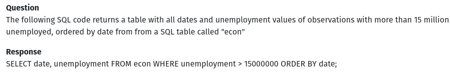

# (PART) Platform: Software and Computing Resources {-} 

# Introduction {#p .unnumbered}  
\index{Computing resources}


> "Are tomorrow’s bigger computers going to solve the problem? For some people,
yes – their data will stay the same size and computers will get big enough to
hold it comfortably. For other people it will only get worse – more powerful
computers mean extraordinarily larger datasets. If you are likely to be in this
latter group, you might want to get used to working with databases now."
[@burns_2011,p.16]

At the center of Figure \@ref(fig:components) you see an illustration of the key components of a standard local computing environment to process digital data. In this book, these components typically serve the purpose of computing a statistic, given a large dataset as input. In this part of the book, you will get familiar with how each of these components plays a role in the context of Big Data Analytics and how you can recognize and resolve potential problems caused by large datasets/large working loads for either of these components. The three most relevant of these components are:

- *Mass storage*.\index{Mass storage} This is the type of computer memory we use to store data over the long term. The mass storage device in our local computing environment (e.g., our PC/laptop) is generally referred to as the *hard drive* or *hard disk*\index{Hard disk}. 

- *RAM*.\index{Random Access Memory (RAM)} In order to work with data (e.g., in R), it first has to be loaded into the *memory*\index{Memory} of our computer – more specifically, into the random access memory (*RAM*). Typically, data is only loaded in the RAM for as long as we are working with it. 

- *CPU*.\index{Central Processing Unit (CPU)} The component actually *processing* data is the Central Processing Unit (CPU). When using R to process data, R commands are translated into complex combinations of a small sets of basic operations, which the *CPU*\index{Central Processing Unit (CPU)} then executes. 


For the rest of this book, consider the main difference between common 'data analytics' and 'Big Data Analytics' to be the following: in a Big Data Analytics context, the standard usage of one or several of the standard hardware\index{Hardware} components in your local computer fails to work or works very inefficiently because the amount of data overwhelms its normal capacity. 


```{r components, echo=FALSE, out.width = "99%", fig.align='center', fig.cap= "(ref:components)", purl=FALSE}
include_graphics("img/II_computing_environment.png")
```

(ref:components) Software, local computing resources, and cloud resources. 


However, before we discuss these *hardware* issues\index{Hardware} in Chapter 5, Chapter 4 focuses on the software we will work with to make use of these hardware components in the most efficient way. This perspective is symbolized in the left part of Figure \@ref(fig:components). There will be three main software components with which we work in what follows. The first is the terminal (i.e., bash): instead of using graphical user interfaces to interact with our local computing environment, we will rather use the terminal^[To be consistent with the cloud computing services (particularly EC2) introduced later on, the sections involving terminal commands assume you work with Ubuntu Linux\index{Linux}. However, the corrsponding code chunks are essentially identical for users working on a Mac/OSX-machine. In case you are working on a Windows machine, starting with Windows 10, you will have essentially the same tool available called the *Windows Terminal*. In older Windows versions the Linux terminal equivalent is called PowerShell or command prompt, which use a slightly different syntax, but provide similar functionality. See https://www.geeksforgeeks.org/linux-vs-windows-commands/ for an overview of how to get started with the Windows command promt, including a detailed listing of commands next to their corresponing Linux command equivalents.] to install software, download files, inspect files, and inspect hardware performance. For those of you not yet used to working with the terminal, do not worry! There are no prerequisites in knowledge about working with the terminal, and most of the use cases in this book are very simple and well explained. At this point, just note that there will be two types of code chunks (code examples) shown in what follows: either they show code that should be run in the terminal (in RStudio, such code should thus be entered in the tab/window called *Terminal*)\index{Terminal}, or *R* code (in RStudio, this code should be entered in the Tab/window called *Console*).\index{Console (R)}

R\index{R} [@rfoundation2021] will be the main language used throughout this book. It will be the primary language to gather, import, clean, visualize, and analyze data. However, as you will already see in some of the examples in this part of the book, we will often not necessarily use base R, but rather use R as a high-level interface to more specialized software and services. On the one hand this means we will install and use several specialized R packages designed to manipulate large datasets that are in fact written in other (faster) languages, such as C\index{C}. On the other hand, it will mean that we use R commands to communicate with other lower-level software systems that are particularly designed to handle large amounts of data (such as data warehouses, or software to run analytics scripts on cluster computers). The point is that even if the final computation is not actually done in R\index{R}, all you need to know to get the particular job done are the corresponding R commands to trigger this final computation.

There is one more indispensable software tool on which we will build throughout the book: Structured Query Language (SQL)\index{Structured Query Language (SQL)}, or to be precise, different variants of SQL in different contexts. The main reason for this is twofold: First, even if you primarily interact with some of the lower-level big data software tools from within R, it is often more comfortable (or, in some cases, even necessary) to send some of the instructions in the form of SQL commands (wrapped in an R function); second, while many of you might have only heard of SQL in the context of traditional relational database systems, SQL variants are nowadays actually used to interact with a variety of the most important big data systems, ranging from Apache Spark (a unified analytics platform for large-scale data processing) to Apache Druid (a column-based distributed data store) and AWS Athena (a cloud-based, serverless query service for simple storage/data lakes). Hence, if you work in data analytics/data science and want to seriously engage with big data, knowing your way around SQL\index{Structured Query Language (SQL)} is a very important asset.

Finally, Chapters 6 and 7 consider the situation where all of the tweaks to use the local computing resources most efficiently are still not enough to get the job done (one or several components are still overwhelmed and/or it simply takes too much time to run the analysis). From the hardware perspective, there are two basic strategies to cope with such a situation:

- *Scale out ('horizontal scaling')*: Distribute the workload over several computers (or separate components of a system).\index{Scale out} 
- *Scale up ('vertical scaling')*\index{Scale up}: Extend the physical capacity of the affected component by building a system with a large amount of RAM shared between applications. This sounds like a trivial solution ('if RAM\index{Random Access Memory (RAM)} is too small, buy more RAM...'), but in practice it can be very expensive. 

Nowadays, either of these approaches is typically taken with the help of cloud resources (illustrated in the right part of Figure \@ref(fig:components)). How this is basically done is introduced in Chapter 7. Regarding *vertical scaling*, you will see that the transition from a local computing environment to the cloud (involving some or all of the core computing components) is rather straightforward to learn. However, *horizontal scaling* for really massive datasets involves some new hardware and software concepts related to what are generally called *distributed systems*\index{Distributed system}. To this end, we first introduce the most relevant concepts related to distributed systems in Chapter 6.


# Software: Programming with (Big) Data 

The programming language and computing environment *R*\index{R} [@rfoundation2021] is particularly made for writing code in a data analytics context. However, the language was developed at a time when data analytics was primarily focused on moderately sized datasets that can easily be loaded/imported and worked with on a common PC. Depending on the field or industry you work in, this is not the case anymore. In this chapter, we will explore some of R's (potential) weaknesses as well as learn how to avoid them and how to exploit some of R's strengths when it comes to working with large datasets.  The first part of this chapter is primarily focused on understanding code profiling and improving code with the aim of making computationally intensive data analytics scripts in R run faster. This chapter presupposes basic knowledge of R data structures and data types as well as experience with basic programming concepts such as loops.^[Appendix B reviews the most relevant concepts regarding data types and data structures in R.] While very useful in writing analytics scripts, we will not look into topics like coding workflows, version control, and code sharing (e.g., by means of Git and GitHub^[However, in case you want to further explore how to use GitHub as part of your coding workflow, Appendix A provides a very short introduction to the topic.]). The assumption is that you bring some experience in writing analytics scripts already.

While R is a very useful tool for many aspects of Big Data Analytics that we will cover in the following chapters, R alone is not enough for a basic Big Data Analytics toolbox. The second part of this chapter introduces the reader to the *Structured Query Language (SQL)*\index{Structured Query Language (SQL)}, a programming language designed for managing data in relational databases. Although the type of databases where SQL is traditionally encountered would not necessarily be considered part of Big Data Analytics today, some versions of SQL are now used with systems particularly designed for Big Data Analytics (such as Amazon Athena\index{Amazon Athena} and Google BigQuery\index{Google BigQuery}). Hence, with a good knowledge of R in combination with basic SQL skills, you will be able to productively engage with a large array of practical Big Data Analytics problems.

## Domains of programming with (big) data

Programming tasks in the context of data analytics typically fall into one of the following broad categories:

- Procedures to import/export data.
- Procedures to clean and filter data.
- Implementing functions for statistical analysis.

When writing a program to process large amounts of data in any of these areas, it is helpful to take into consideration the following design choices:

1. Which basic (already implemented) R functions are more or less suitable as building blocks for the program?^[Throughout the rest of this book, I will point to specialized R packages and functions that are particularly designed to work with large amounts of data. Where necessary, we will also look more closely at the underlying concepts that explain why these specialized packages work better with large amounts of data than the standard approaches.]
2. How can we exploit/avoid some of R's lower-level characteristics in order to write more efficient code?
3. Is there a need to interface with a lower-level programming language in order to speed up the code? (advanced topic)

Finally, there is an additional important point to be made regarding the writing of code for *statistical analysis*: Independent of *how* we write a statistical procedure in R (or in any other language, for that matter), keep in mind that there might be an *alternative statistical procedure/algorithm* that is faster but delivers approximately the same result (as long as we use a sufficiently large sample). 


## Measuring R performance

When writing a data analysis script in R to process large amounts of data, it generally makes sense to first test each crucial part of the script with a small sub-sample. In order to quickly recognize potential bottlenecks, there are a couple of R packages that help you keep track of exactly how long each component of your script needs to process as well as how much memory it uses. The table below lists some of the packages and functions that you should keep in mind when *"profiling"*\index{Profiling} and testing your code. 

package | function | purpose
-------------- | -------------------- | ---------------------------------------------
`utils`  | `object.size()` | Provides an estimate of the memory that is being used to store an R object.
`pryr`\index{pryr package}   | `object_size()`\index{object\_size()} | Works similarly to `object.size()`\index{object.size()}, but counts more accurately and includes the size of environments.
`pryr` | `mem_used()`\index{mem\_used()}     | Returns the total amount of memory (in megabytes) currently used by R.
`pryr` | `mem_change()`\index{mem\_change()}   | Shows the change in memory (in megabytes) before and after running code.
`base`   | `system.time()`\index{system.time()} | Returns CPU (and other) times that an R expression used.
`microbenchmark`\index{microbenchmark package} | `microbenchmark()`\index{microbenchmark()} | Highly accurate timing of R expression evaluation.
`bench`\index{bench package} |  `mark()`\index{mark()} | Benchmark a series of functions.
`profvis`\index{profvis package}| `profvis()`\index{profvis()}  | Profiles an R expression and visualizes the profiling data (usage of memory, time elapsed, etc.).


Most of these functions are used in an interactive way in the R console. They serve either of two purposes that are central to profiling and improving your code's performance. First, in order to assess the performance of your R code you probably want to know how long it takes to run your entire script or a specific part of your script. The `system.time()`\index{system.time()} [@rfoundation2021] function provides an easy way to check this. This function is loaded by default with R; there is no need to install an additional package. Simply wrap it around the line(s) of code that you want to assess.


```{r}
# how much time does it take to run this loop?
system.time(for (i in 1:100) {i + 5})
```

Note that each time you run this line of code, the returned amount of time varies slightly. This has to do with the fact that the actual time needed to run a line of code can depend on various other processes happening at the same time on your computer.

The `microbenchmark`\index{microbenchmark package} [@microbenchmark] and `bench`\index{bench package} [@bench] packages provide additional functions to measure execution time in more sophisticated ways. In particular, they account for the fact that the processing time for the same code might vary and automatically run the code several times in order to return statistics about the processing time. In addition, `microbenchmark()`\index{microbenchmark()} provides highly detailed and highly accurate timing of R expression evaluation. The function is particularly useful to accurately find even minor room for improvement when testing a data analysis script on a smaller sub-sample (which might scale when working on a large dataset). For example, suppose you need to run a for-loop over millions of iterations, and there are different ways to implement the body of the loop (which does not take too much time to process in one iteration). Note that the function actually evaluates the R expression in question many times and returns a statistical summary of the timings.

```{r}
# load package
library(microbenchmark)
# how much time does it take to run this loop (exactly)?
microbenchmark(for (i in 1:100) {i + 5})
```


Second, a key aspect to improving the performance of data analysis scripts in R is to detect inefficient memory allocation as well as avoiding an R-object that is either growing too much or too large to handle in memory. To this end, you might want to monitor how much memory R occupies at different points in your script as well as how much memory is taken up by individual R objects. For example, `object.size()`\index{object.size()} returns the size of an R object, that is, the amount of memory it takes up in the R environment in bytes (`pryr::object_size()`\index{object\_size()} counts slightly more accurately). 

```{r}
hello <- "Hello, World!"
object.size(hello)
```


This is useful to implementing your script with a generally less memory-intensive approach. For example, for a specific task it might not matter whether a particular variable is stored as a `character`\index{character} vector or a `factor`\index{factor}. But storing it as `character` turns out to be more memory intensive (why?).

```{r}
# initialize a large string vector containing letters
large_string <- rep(LETTERS[1:20], 1000^2)
head(large_string)

# store the same information as a factor in a new variable
large_factor <- as.factor(large_string)

# is one bigger than the other?
object.size(large_string) - object.size(large_factor)
```


`pryr::mem_change()`\index{pryr package} [@pryr] is useful to track how different parts of your script affect the overall memory occupied by R.

```{r}
# load package
library(pryr)

# initialize a vector with 1000 (pseudo)-random numbers
mem_change(
        thousand_numbers <- runif(1000)
        )

```

```{r}

# initialize a vector with 1M (pseudo)-random numbers
mem_change(
        a_million_numbers <- runif(1000^2)
        )
```


 `bench::mark()`\index{mark()} allows you to easily compare the performance of several different implementations of a code chunk both regarding timing and memory usage. The following code example illustrates this in a comparison of two approaches to computing the product of each element in a vector `x` with a factor `z`.


```{r}
# load packages
library(bench)

# initialize variables
x <- 1:10000
z <- 1.5

# approach I: loop
multiplication <- 
        function(x,z) {
                result <- c()
                for (i in 1:length(x)) {result <- c(result, x[i]*z)}
                return(result)
        }
result <- multiplication(x,z)
head(result)

# approach II: "R-style"
result2 <- x * z 
head(result2)

# comparison
benchmarking <- 
        mark(
        result <- multiplication(x,z),
        result2 <- x * z, 
        min_iterations = 50 
)
benchmarking[, 4:9]

```

In addition, the `bench` package\index{bench package} [@bench]  provides a simple way to visualize these outputs:


```{r warning=FALSE, fig.width=7, fig.height=5, message=FALSE, out.width="75%", fig.align='center'}
plot(benchmarking, type = "boxplot")
```

Finally, to analyze the performance of your entire script/program, the `profvis` package\index{profvis package} [@profvis] provides visual summaries to quickly detect the most prominent bottlenecks. You can either call this via the `profvis()`\index{profvis()} function with the code section to be profiled as argument, or via the RStudio user interface by clicking on the Code Tools menu in the editor window and selecting "Profile selected lines". 

```{r eval=FALSE}
# load package
library(profvis)

# analyze performance of several lines of code
profvis({
        x <- 1:10000
        z <- 1.5

# approach I: loop
multiplication <- 
        function(x,z) {
                result <- c()
                for (i in 1:length(x)) {result <- c(result, x[i]*z)}
                return(result)
        }
result <- multiplication(x,z)

# approach II: "R-style"
result2 <- x * z 
head(result2) 
})
```


## Writing efficient R code


This subsection touches upon several prominent aspects of writing efficient/fast R code.^[This is not intended to be a definitive guide to writing efficient R code in every aspect. Instead the subsection aims at covering most of the typical pitfalls to avoid and to provide a number of easy-to-remember tricks to keep in mind when writing R code for computationally intensive tasks.]

### Memory allocation and growing objects
\index{Memory allocation}

R tends to "grow" already-initialized objects in memory when they are modified. At the initiation of the object, a small amount of memory is occupied at some location in memory. In simple terms, once the object grows, it might not have enough space where it is currently located. Hence, it needs to be "moved" to another location in memory with more space available. This moving, or "re-allocation" of memory, needs time and slows down the overall process.

This potential is most practically illustrated with a `for`-loop\index{for-loop} in which each iteration's result is stored as an element of a vector (the object in question). To avoid growing this object, you need to instruct R to pre-allocate the memory necessary to contain the final result. If we don't do this, each iteration of the loop causes R to re-allocate memory because the number of elements in the vector/list is changing. In simple terms, this means that R needs to execute more steps in each iteration. 

In the following example, we compare the performance of two functions, one taking this principle into account, the other not. The functions take a numeric vector as input and return the square root of each element of the numeric vector.

```{r}
# naïve implementation
sqrt_vector <- 
     function(x) {
          output <- c()
          for (i in 1:length(x)) {
               output <- c(output, x[i]^(1/2))
          }
          
          return(output)
     }

# implementation with pre-allocation of memory
sqrt_vector_faster <- 
     function(x) {
          output <- rep(NA, length(x))
          for (i in 1:length(x)) {
               output[i] <-  x[i]^(1/2)
          }
          
          return(output)
     }

```

As a proof of concept we use `system.time()`\index{system.time()} to measure the difference in speed for various input sizes.^[We generate the numeric input by drawing vectors of (pseudo-)random numbers via `rnorm()`\index{rnorm()}.] 

```{r}
# the different sizes of the vectors we will put into the two functions
input_sizes <- seq(from = 100, to = 10000, by = 100)
# create the input vectors
inputs <- sapply(input_sizes, rnorm)

# compute outputs for each of the functions
output_slower <- 
     sapply(inputs, 
            function(x){ system.time(sqrt_vector(x))["elapsed"]
                 }
            )
output_faster <- 
     sapply(inputs, 
            function(x){ system.time(sqrt_vector_faster(x))["elapsed"]
                 }
            )
```

The following plot shows the difference in the performance of the two functions.

```{r, out.width="75%", fig.align='center'}
# load packages
library(ggplot2)

# initialize data frame for plot
plotdata <- data.frame(time_elapsed = c(output_slower, output_faster),
                       input_size = c(input_sizes, input_sizes),
                       Implementation= c(rep("sqrt_vector",
                                             length(output_slower)),
                                         rep("sqrt_vector_faster",
                                             length(output_faster))))

# plot
ggplot(plotdata, aes(x=input_size, y= time_elapsed)) +
     geom_point(aes(colour=Implementation)) +
     theme_minimal(base_size = 18) +
     theme(legend.position = "bottom") +
     ylab("Time elapsed (in seconds)") +
     xlab("No. of elements processed") 
     
```

Clearly, the version with pre-allocation of memory (avoiding growing an object) is much faster overall. In addition, we see that the problem with the growing object in the naïve implementation tends to get worse with each iteration. The take-away message for the practitioner: If possible, always initialize the "container" object (list, matrix, etc.) for iteration results as an empty object of the final size/dimensions. 

The attentive reader and experienced R coder will have noticed by this point that both of the functions implemented above are not really smart practice to solve the problem at hand. If you consider yourself part of this group, the next subsection will make you more comfortable.

### Vectorization in basic R functions
\index{Vectorization}

We can further improve the performance of this function by exploiting a particular characteristic of R: in R, 'everything is a vector', and many of the most basic R functions (such as math operators) are *vectorized*\index{Vectorized (see Vectorization)}. In simple terms, this means that an operation is implemented to directly work on vectors in such a way that it can take advantage of the similarity of each of the vector's elements. That is, R only has to figure out once how to apply a given function to a vector element in order to apply it to all elements of the vector. In a simple loop, however, R has to go through the same 'preparatory' steps again and again in each iteration.

Following up on the problem from the previous subsection, we implement an additional function called `sqrt_vector_fastest` that exploits the fact that math operators in R are vectorized functions. We then re-run the same speed test as above with this function.

```{r}
# implementation with vectorization
sqrt_vector_fastest <- 
     function(x) {
               output <-  x^(1/2)
          return(output)
     }

# speed test
output_fastest <- 
     sapply(inputs, 
            function(x){ system.time(sqrt_vector_fastest(x))["elapsed"]
                 }
            )
```


Let's have a look at whether this improves the function's performance further.

```{r out.width="75%", fig.align='center'}
# load packages
library(ggplot2)

# initialize data frame for plot
plotdata <- data.frame(time_elapsed = c(output_faster, output_fastest),
                       input_size = c(input_sizes, input_sizes),
                       Implementation= c(rep("sqrt_vector_faster",
                                             length(output_faster)),
                                         rep("sqrt_vector_fastest",
                                             length(output_fastest))))

# plot
ggplot(plotdata, aes(x=time_elapsed, y=Implementation)) +
     geom_boxplot(aes(colour=Implementation),
                          show.legend = FALSE) +
     theme_minimal(base_size = 18) +
     xlab("Time elapsed (in seconds)")
     
```

Clearly, the vectorized implementation is even faster. The take-away message: Make use of vectorized basic R functions where possible. At this point you might wonder: Why not always use vectorization over loops, when working with R? This question (and closely related similar questions) has been fiercely debated in the R online community over the last few years. Also the debate contains and has contained several (in my view) slightly misleading arguments. A simple answer to this question is: It is in fact not that simple to use *actual* vectorization\index{Vectorization} for every kind of problem in R. There are a number of functions often mentioned to achieve "vectorization" easily in R; however, they do not actually implement actual vectorization in its original technical sense (the type just demonstrated here with the R math operators). Since this point is very prominent in debates about how to improve R code, the next subsection attempts to summarize the most important aspects to keep in mind.


### `apply`-type functions and vectorization 
\index{apply()}

There are basically two ways to make use of some form of "vectorization" instead of writing loops.

One approach is to use an `apply`-type function instead of loops. Note, though, that the `apply`-type functions primarily make the writing of code more efficient. They still run a loop under the hood. Nevertheless, some `apply`-type functions might still outperform explicit loops, as they might be better implemented.^[If you know how to implement efficient for-loops in R (as you are certainly expected to at this point), there is not much to gain from using an `apply`-type function instead of a loop, apart from making your code easier to read (and faster to write).] 

Consider, for example, `lapply()`\index{lapply()}, a function that takes a vector (atomic or list) as input and applies a function `FUN` to each of its elements. It is a straightforward alternative to `for`-loops in many situations (and it automatically takes care of the "growing objects" problem discussed above). The following example shows how we can get the same result by either writing a loop or using `lapply()`. The aim of the code example is to import the [Health News in Twitter Dataset](https://archive.ics.uci.edu/ml/datasets/Health+News+in+Twitter) by @karami_etal2017. The raw data consists of several text files that need to be imported to R consecutively. 

The text-files are located in `data/twitter_texts/`. For either approach of importing all of these files, we first need a list of the paths to all of the files. We can get this with `list.files()`\index{list.files()}. Also, for either approach we will make use of the `fread` function\index{fread()} in the `data.table` package\index{data.table package} [@data.table].

```{r eval = FALSE, echo=FALSE, message=FALSE, purl=FALSE}
# For replication purposes only

# URL to the raw data
URL <- "https://archive.ics.uci.edu/ml/machine-learning-databases/00438/Health-News-Tweets.zip"
# download the zip-file to a temporary file
temp <- tempfile()
download.file(URL, temp)
# unzip the file and delete the zip-file
unzip(temp, exdir = "twitter_texts")
unlink(temp)

```


```{r message=FALSE}
# load packages
library(data.table)

# get a list of all file-paths
textfiles <- list.files("data/twitter_texts", full.names = TRUE)

```

Now we can read in all the text files with a `for`-loop\index{for-loop} as follows.

```{r message=FALSE, warning=FALSE}
# prepare loop
all_texts <- list()
n_files <- length(textfiles)
length(all_texts) <- n_files
# read all files listed in textfiles
for (i in 1:n_files) {
     all_texts[[i]] <- fread(textfiles[i])
}

```

The imported files are now stored as `data.table`-objects in the list `all_texts`. With the following line of code we combine all of them in one `data.table`.

```{r}
# combine all in one data.table
twitter_text <- rbindlist(all_texts)
# check result
dim(twitter_text)

```


Alternatively, we can make use of `lapply` as follows in order to achieve exactly the same.
```{r message=FALSE, warning=FALSE}
# use lapply instead of loop
all_texts <- lapply(textfiles, fread)
# combine all in one data.table
twitter_text <- rbindlist(all_texts)
# check result
dim(twitter_text)

```

Finally, we can make use of `Vectorization()` in order to "vectorize" our own import function (written for this example). Again, this does not make use of vectorization in its original technical sense.

```{r message=FALSE, warning=FALSE}
# initialize the import function
import_file <- 
     function(x) {
          parsed_x <- fread(x)
          return(parsed_x)
     }

# 'vectorize' it
import_files <- Vectorize(import_file, SIMPLIFY = FALSE)

# Apply the vectorized function
all_texts <- import_files(textfiles)
twitter_text <- rbindlist(all_texts)
# check the result
dim(twitter_text)
```

The take-away message: Instead of writing simple loops, use `apply`-type functions to save time writing code (and make the code easier to read) and automatically avoid memory-allocation problems. 

<!-- ## Speed improvement tutorials -->

<!-- https://stackoverflow.com/questions/6807068/why-is-my-recursive-function-so-slow-in-r -->

<!-- https://stackoverflow.com/questions/62047104/r-cbind-is-very-slow -->


### Avoid unnecessary copying


The "growing objects" problem discussed above is only one aspect that can lead to inefficient use of memory when working with R. Another potential problem of using up more memory than necessary during an execution of an R-script is how R handles objects/variables and their names. 

Consider the following line of code.

```{r}
a <- runif(10000)
```

what is usually said to describe what is happening here is something along the lines of "we initialize a variable called `a` and assign a numeric vector with 10,000 random numbers. What in fact happens is that the name `a` is assigned to the integer vector (which in turn exists at a specific memory address). Thus, values do not have names but *names have values*. This has important consequences for memory allocation and performance. For example, because `a` is in fact just a name attached to a value, the following does not involve any copying of values. It simply "binds" another name, `b`, to the same value to which `a` is already bound.

```{r}
b <- a
```

We can prove this in two ways. First, if what I just stated was not true, the line above would actually lead to more memory being occupied by the current R session. However, this is not the case:

```{r}
object_size(a)
mem_change(c <- a)
```

Second, by means of the `lobstr`-package\index{lobstr package} [@lobstr], we can see that the values to which `a` and `b` are bound are stored at the same memory address. Hence, they are the same values.

```{r warning=FALSE, eval=TRUE, warning=FALSE, message=FALSE}
# load packages
library(lobstr)

# check memory addresses of objects
obj_addr(a)
obj_addr(b)
```

Now you probably wonder, what happens to `b` if we modify `a`. After all, if the values to which `b` is bound are changed when we write code concerning `a`, we might end up with very surprising output. The answer is, and this is key (!), once we modify `a`, the values need to be *copied* in order to ensure the integrity of `b`. Only at this point, our program will require more memory.

```{r}
# check the first element's value
a[1]
b[1]

# modify a, check memory change
mem_change(a[1] <- 0)

# check memory addresses
obj_addr(a)
obj_addr(b)

```

Note that the entire vector needed to be copied for this. There is, of course, a lesson from all this regarding writing efficient code. Knowing how actual copying of values occurs helps avoid unnecessary copying. The larger an object, the more time it will take to copy it in memory. Objects with a single binding\index{Bindings} get modified in place (no copying):

```{r}
mem_change(d <- runif(10000))
mem_change(d[1] <- 0)
```

### Releasing memory
\index{Releasing memory}

Closely related to the issue of copy-upon-modify\index{Copy-upon-modify} is the issue of "releasing" memory via "garbage collection"\index{Garbage collection}. If your program uses up a lot of (too much) memory (typical for working with large datasets), all processes on your computer might substantially slow down (we will look more closely into why this is the case in the next chapter). Hence, you might want to remove/delete an object once you do not need it anymore. This can be done with the `rm()` function.

```{r}
mem_change(large_vector <- runif(10^8))
mem_change(rm(large_vector))
```

`rm()` removes  objects that are currently accessible in the global R environment. However, some objects/values might technically not be visible/accessible anymore (for example, objects that have been created in a function which has since returned the function output). To also release memory occupied by these objects, you can call `gc()` (the garbage collector). While R will automatically collect the garbage once it is close to running out of memory, explicitly calling `gc` can still improve the performance of your script when working with large datasets. This is in particular the case when R is not the only data-intensive process running on your computer. For example, when running an R script involving the repeated querying of data from a local SQL database and the subsequent memory-intensive processing of this data in R, you can avoid using up too much memory by running `rm` and `gc` explicitly.^[Note that running `gc()` takes some time, so you should not overdo it. As a rule of thumb, run `gc()` after removing a really large object.]


### Beyond R

So far, we have explored idiosyncrasies of R we should be aware of when writing programs to handle and analyze large datasets. While this has shown that R has many advantages for working with data, it also revealed some aspects of R that might result in low performance compared other programming languages. A simple generic explanation for this is that R is an [interpreted language](https://en.wikipedia.org/wiki/Interpreted_language), meaning that when we execute R code, it is processed (statement by statement) by an 'interpreter' that translates the code into machine code (without the user giving any specific instructions). In contrast, when writing code in a 'compiled language', we first have to explicitly compile the code (into machine code) and then run the compiled program. Running code that is already compiled is typically much faster than running R code that has to be interpreted before it can actually be processed by the CPU. 

For advanced programmers, R offers various options to directly make use of compiled programs (for example, written in C, C++, or FORTRAN). In fact, several of the core R functions installed with the basic R distribution are implemented in one of these lower-level programming languages, and the R function we call simply interacts with these functions. 

We can actually investigate this by looking at the source code of an R function. If you simply type the name of a function (such as our `import_file()`) to the console, R prints the function's source code to the console.

```{r}
import_file
```

However, if we do the same for function `sum`, we don't see any actual source code.

```{r}
sum
```

Instead `.Primitive()` indicates that `sum()` is actually referring to an internal function (in this case implemented in C).

While the use of functions implemented in a lower-level language is a common technique to improve the speed of 'R' functions, it is particularly prominent in the context of functions/packages made to deal with large amounts of data (such as the `data.table` package).


## SQL basics
\index{Structured Query Language (SQL)}

Structured Query Language (SQL) has become a bread-and-butter tool for data analysts and data scientists due to its broad application in systems used to store large amounts of data. While traditionally only encountered in the context of structured data stored in relational database management systems, some versions of it are now also used to query data from data warehouse systems (e.g. Amazon Redshift) and even to query massive amounts (terabytes or even petabytes) of data stored in data lakes (e.g., Amazon Athena). In all of these applications, SQL's purpose (from the data analytics perspective) is to provide a convenient and efficient way to query data from mass storage for analysis. Instead of importing a CSV file into R and then filtering it in order to get to the analytic dataset, we use SQL to express how the analytic dataset should look like (which variables and rows should be included).

The latter point is very important to keep in mind when already having experience with a language like R and learning SQL for the first time. In R we write code to instruct the computer what to do with the data. For example, we tell it to import a csv file called `economics.csv` as a `data.table`; then we instruct it to remove observations that are older than a certain date according to the `date` column; then we instruct it to compute the average of the `unemploy` column values for each year based on the `date` column and then return the result as a separate data frame:


```{r sql1}
# import data
econ <- read.csv("data/economics.csv")

# filter
econ2 <- econ["1968-01-01"<=econ$date,]

# compute yearly averages (basic R approach)
econ2$year <- lubridate::year(econ2$date)
years <- unique(econ2$year)
averages <- 
     sapply(years, FUN = function(x){
          mean(econ2[econ2$year==x,"unemploy"])
          })
output <- data.frame(year=years, average_unemploy=averages)

# inspect the first few lines of the result
head(output)

```


In contrast, when using SQL we write code that describes what the final result is supposed to look like. The SQL engine processing the code then takes care of the rest and returns the result in the most efficient way.^[In particular, the user does not need to explicitly instruct SQL at which point in the process which part (filtering, selecting variables, aggregating, creating new variables etc.) of the query should be processed. SQL will automatically find the most efficient way to process the query.]


```{r sql2, echo=FALSE, message=FALSE, purl=FALSE}

library(DBI)
library(sqldf)
con <- dbConnect(RSQLite::SQLite(), "data/mydb.sqlite")
econ <- read.csv("data/economics.csv")
dbWriteTable(con, "econ", econ, field.types=c("date"="DATE", "pop"="REAL"), overwrite=TRUE )

```


```{sql sql3, connection=con,  output.var="groupby"}
SELECT 
strftime('%Y', `date`)  AS year,
AVG(unemploy) AS average_unemploy
FROM econ
WHERE "1968-01-01"<=`date`
GROUP BY year LIMIT 6;

```

```{r echo=FALSE}
groupby
```


For the moment, we will only focus on the code and ignore the underlying hardware and database concepts (those will be discussed in more detail in Chapter 5).

### First steps in SQL(ite)

In order to get familiar with coding in SQL, we work with a free and easy-to-use version of SQL called *SQLite*\index{SQLite}. [SQLite](https://sqlite.org/index.html) is a free full-featured SQL database engine widely used across platforms. It usually comes pre-installed with Windows and Mac/OSX distributions and has (from the user's perspective) all the core features of more sophisticated SQL versions. Unlike the more sophisticated SQL systems, SQLite does not rely explicitly on a client/server model. That is, there is no need to set up your database on a server and then query it from a client interface. In fact, setting it up is straightforward. In the terminal, we can directly call SQLite as a command-line tool (on most modern computers, the command is now `sqlite3`, SQLite version 3).

In this first code example, we set up an SQLite database using the command line. In the file structure of the book repository, we first switch to the data directory.

```{bash sql4, eval=FALSE, purl=FALSE}
cd data 
```

With one simple command, we start up SQLite, create a new database called `mydb.sqlite`, and connect to the newly created database.^[If there is already a database called `mydb.sqlite` in this folder, the same command would simply start up SQLite and connect to the existing database.]

```{bash sql5, eval= FALSE, purl=FALSE}
sqlite3 mydb.sqlite
```

This created a new file `mydb.sqlite` in our `data` directory, which contains the newly created database. Also, we are now running `sqlite` in the terminal (indicated by the `sqlite>` prompt. This means we can now type SQL code to the terminal to run queries and other SQL commands. 

At this point, the newly created database does not contain any data. There are no tables in it. We can see this by running the `.tables` command.


```{sql sql6, eval = FALSE, purl=FALSE}
.tables
```

As expected, nothing is returned. Now, let's create our first table and import the `economics.csv` dataset into it. In SQLite, it makes sense to first set up an empty table in which all column data types are defined before importing data from a CSV-file to it. If a CSV is directly imported to a new table (without type definitions), all columns will be set to `TEXT` (similar to `character` in R) by default. Setting the right data type for each variable follows essentially the same logic as setting the data types of a data frame's columns in R (with the difference that in SQL this also affects how the data is stored on disk).^[The most commonly used data types in SQL all have a very similar R equivalent: `DATE` is like `Date` in R, `REAL` like `numeric/double`, `INTEGER` like `integer`, and `TEXT` like `character`.]

In a first step, we thus create a new table called `econ`.


```{sql sql7, connection=con, eval = FALSE, purl=FALSE}
-- Create the new table
CREATE TABLE econ(
"date" DATE,
"pce" REAL,
"pop" REAL,
"psavert" REAL,
"uempmed" REAL,
"unemploy" INTEGER
);

```

Then, we can import the data from the csv file, by first switching to CSV mode via the command `.mode csv` and then importing the data to `econ` with `.import`. The `.import` command expects as a first argument the path to the CSV file on disk and as a second argument the name of the table to import the data to. 

```{sql  sql8, connection=con, eval = FALSE, purl=FALSE}
-- prepare import
.mode csv
-- import data from csv
.import --skip 1 economics.csv econ

```


Now we can have a look at the new database table in SQLite. `.tables` shows that we now have one table called `econ` in our database, and `.schema` displays the structure of the new `econ` table. 

```{sql sql9, connection=con, eval = FALSE,  purl=FALSE}
.tables
```

```{sql sql10, connection=con, eval = FALSE,  purl=FALSE}
# econ
```


```{sql sql11, connection=con, eval = FALSE,  purl=FALSE}
.schema econ
```


```
# CREATE TABLE econ(
# "date" DATE,
# "pce" REAL,
# "pop" REAL,
# "psavert" REAL,
# "uempmed" REAL,
# "unemploy" INTEGER
# );
```


With this, we can start querying data with SQLite. In order to make the query results easier to read, we first set two options regarding how query results are displayed on the terminal. `.header on` enables the display of the column names in the returned query results. And `.mode columns` arranges the query results in columns.

```{sql sql13, connection=con, eval = FALSE, purl=FALSE}
.header on
```

```{sql sql14, connection=con, eval = FALSE, purl=FALSE}
.mode columns
```

In our first query, we select all (`*`) variable values of the observation of January 1968.

```{sql sql15, connection=con, purl=FALSE, output.var="select_example"}
select * from econ where date = '1968-01-01';
```


```{r echo=FALSE}
select_example
```


#### Simple queries

Now let's select all dates and unemployment values of observations with more than 15 million unemployed, ordered by date.

```{sql sql16, connection=con, purl=FALSE, output.var="simple_query"}
select date, 
unemploy from econ 
where unemploy > 15000
order by date;
```

```{r echo=FALSE}
simple_query
```


### Joins
\index{Joins (SQL)}

So far, we have only considered queries involving one table of data. However, SQL provides a very efficient way to join data from various tables. Again, the way of writing SQL code is the same: You describe what the final table should look like and from where the data is to be selected. 

Let's extend the previous example by importing an additional table to our `mydb.sqlite`. The additional data is stored in the file `inflation.csv` in the book's data folder and contains information on the US annual inflation rate measured in percent.^[Like the data stored in `economics.csv`, the data stored in `inflation.csv` is provided by the Federal Reserve Bank's (FRED)[https://fred.stlouisfed.org/] website.]

```{r sql17, echo=FALSE, message=FALSE, purl=FALSE}
library(DBI)
library(sqldf)
inflation <- read.csv("data/inflation.csv")
dbWriteTable(con, "inflation", inflation, field.types=c("date"="DATE"), overwrite=TRUE )
```


```{sql sql18, connection=con, eval = FALSE, purl=FALSE}
-- Create the new table
CREATE TABLE inflation(
"date" DATE,
"inflation_percent" REAL
);

-- prepare import
.mode csv
-- import data from csv
.import --skip 1 inflation.csv inflation
-- switch back to column mode 
.mode columns

```

Note that the data stored in `econ` contains monthly observations, while `inflation` contains annual observations. We can thus only meaningfully combine the two datasets at the level of years. Again using the combination of datasets in R as a reference point, here is what we would like to achieve expressed in R. The aim is to get a table that serves as basis for a [Phillips curve](https://en.wikipedia.org/wiki/Phillips_curve) plot, with annual observations and the variables `year`, `average_unemp_percent`, and `inflation_percent`. 

```{r sql19}
# import data
econ <- read.csv("data/economics.csv")
inflation <- read.csv("data/inflation.csv")

# prepare variable to match observations
econ$year <- lubridate::year(econ$date)
inflation$year <- lubridate::year(inflation$date)

# create final output
years <- unique(econ$year)
averages <- sapply(years, FUN = function(x) {
        mean(econ[econ$year==x,"unemploy"]/econ[econ$year==x,"pop"])*100
        
} )
unemp <- data.frame(year=years,
                     average_unemp_percent=averages)
# combine via the year column
# keep all rows of econ
output<- merge(unemp, inflation[, c("year", "inflation_percent")], by="year")
# inspect output
head(output)

```


Now let's look at how the same table can be created in SQLite (the table output below only shows the first 6 rows of the resulting table).

```{sql sql20, connection=con, max.print=6, output.var="innerjoin_example"}
SELECT 
strftime('%Y', econ.date)  AS year,
AVG(unemploy/pop)*100 AS average_unemp_percent,
inflation_percent
FROM econ INNER JOIN inflation ON year = strftime('%Y', inflation.date)
GROUP BY year
```

```{r echo=FALSE}
innerjoin_example[1:6,]
```


```{r sql21, include=FALSE}
dbDisconnect(con)
```


When done working with the database, we can exit SQLite by typing `.quit` into the terminal and hit enter.

## With a little help from my friends: GPT and R/SQL coding

Whether you are already an experienced programmer in R and SQL or whether you are rather new to coding, recent developments in Large Language Models (LLMs)\index{Large Language Models (LLMs)} might provide an interesting way of making your coding workflow more efficient. At the writing of this book, OpenAI's ChatGPT was still in its testing phase but has already created a big hype in various topic domains. In very simple terms ChatGPT\index{ChatGPT} and its predecessors GPT-2, GPT-3\index{GPT-3} are pre-trained large-scale machine learning models that have been trained on millions of websites' text content (including code from open repositories such as GitHub). Applying these models for predictions is different from other machine learning settings. Instead of feeding new datasets into the trained model, you interact with the model via a prompt (like a chat function). That is, among other things you can pose a question to the model in plain English and get an often very reasonable answer, or you can instruct via the prompt to generate some type of text output for you (given your instructions, and potentially additional input). As the model is trained on natural language texts as well as (documented) computer code, you can ask it to write code for you, for example in SQL or R. 

While there are many tools that build on LLMs such as GPT-3 already out there and even more still being developed, I want to explicitly point you to two of those: [`gptstudio`](https://github.com/MichelNivard/GPTstudio)\index{gptstudio package}, an addin for Rstudio, providing an easy-to-use interface with some of OpenAI's APIs, and [GitHub Copilot](https://github.com/features/copilot)\index{GitHub Copilot}. The latter is a professionally developed tool to support your software development workflow by, for example, auto-completing the code you are writing. To use GitHub Copilot you need a paid subscription. With a subscription the tool can then be installed as an extension to different code editors (for example Visual Studio Code). However, at the time of writing this book no GitHub Copilot extension for RStudio was available. `gptstudio`\index{gptstudio package} is a much simpler but free alternative to GitHub Copilot and it is explicitly made for RStudio.^[The installation instructions in the README file on https://github.com/MichelNivard/GPTstudio are straightforward.] You will, however, need an OpenAI account and a corresponding OpenAI API key (to get these simply follow the instructions here: https://github.com/MichelNivard/GPTstudio) in order to use the gptstudio-addin. You will be charged for the queries that `gptstudio`\index{gptstudio package} sends to the OpenAI-API, however there are no fixed costs associated with this setup.

Just to give you an idea of how you could use `gptstudio`\index{gptstudio package} for your coding workflow, consider the following example. After installing the addin and creating your OpenAI account and API key, you can initiate the chat function of the addin as follows.

```{r eval=FALSE}
# replace "YOUR-API-KEY" with 
# your actual key
Sys.setenv(OPENAI_API_KEY = "YOUR-API-KEY") 
# open chat window
gptstudio:::chat_gpt_addin()
```

This will cause RStudio to launch a Viewer window. You can pose questions or write instructions to OpenAI's GPT model in the prompt field and send the corresponding query by clicking the "Chat" button. In the example below, I simply ask the model to generate a SQL query for me. In fact, I ask it to construct a query that we have previously built and evaluated in the previous SQL examples. I want the model to specifically reproduce the following query: 

```{sql eval=FALSE}
select date, 
unemploy from econ 
where unemploy > 15000
order by date;
```

Figure \@ref(fig:gptinput) shows a screenshot of my instruction to the model, and Figure \@ref(fig:gptoutput) presents the response from the model.


```{r gptinput, echo=FALSE, out.width = "99%", fig.align='center', fig.cap= "(ref:gptinput)", purl=FALSE}
include_graphics("img/gpt_SQL_prompt.png")
```

(ref:gptinput) GPTStudio: instructing OpenAI's GPT-3 model (text-davinci-003) to write an SQL query.


```{r gptoutput, echo=FALSE, out.width = "99%", fig.align='center', fig.cap= "(ref:gptoutput)", purl=FALSE}

```

(ref:gptoutput) GPTStudio: an SQL query written by OpenAI's GPT-3 model (text-davinci-003).

Two things are worth noting here: first, the query is syntactically correct and would essentially work; second, when comparing the query or the query's results with our previously manually written query, we notice that the AI's query is not semantically correct. Our database's unemployment variable is called `unemploy` and it is measured in thousands. The GPT model, of course, had no way of obtaining this information from our instructions. As a result, it simply used variable names and values for the filtering that seemed most reasonable given our input. The take-away message here is to be aware of giving the model very clear instructions when creating code in this manner, especially in terms of the broader context (here the database and schema you are working with). To check the model's code for syntax errors, simply test whether the code runs through or not. However, model-generated code can easily introduce semantic errors, which can be very problematic.


## Wrapping up

- Find bottlenecks in your code before exposing it to the full dataset. To do so, use tools like `bench::mark()`\index{mark()} and `profvis::profvis()`\index{profvis()} to see how long certain parts of your code need to process and how much memory they occupy.
- Be aware of R's strengths and weaknesses when writing code for Big Data Analytics.Pre-allocate memory for objects in which you collect the results of loops, make use of R's vectorization, and avoid unnecessary copying.
- Get familiar with SQL and the underlying concept of only loading those observations and variables into R that are really needed for your task. SQLite in combination with R is an excellent lightweight solution to do this.
