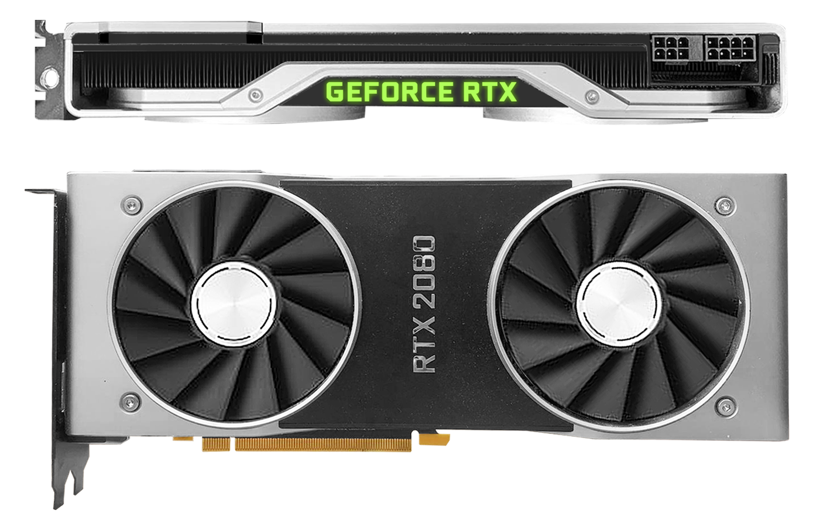
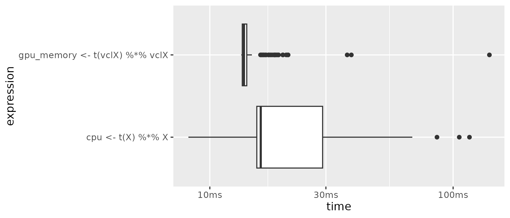

# Hardware: Computing Resources

In order to better understand how we can use the available computing resources most efficiently in an analytics task, we first need to get an idea of what we mean by capacity and *big* regarding the most important hardware components. We then look at each of these components (and additional specialized components) through the lens of Big Data. That is, for each component, we look at how it can become a crucial bottleneck when processing large amounts of data and what we can do about it in R. First we focus on mass storage and memory, then on the CPU, and finally on new alternatives to the CPU. 


## Mass storage 

In a simple computing environment, the mass storage device (hard disk) is where the data to be analyzed is stored. So, in what units do we measure the size of datasets and consequently the mass storage capacity of a computer? The smallest unit of information in computing/digital data is called a *bit*\index{Bit} (from *bi*nary dig*it*; abbrev. 'b') and can take one of two (symbolic) values, either a `0` or a `1` ("off" or "on"). Consider, for example, the decimal number `139`. Written in the binary system, `139` corresponds to the binary number `10001011`. In order to store this number on a hard disk, we require a capacity of 8 bits, or one *byte*\index{Byte} (1 byte = 8 bits; abbrev. 'B'). Historically, one byte encoded a single character of text (e.g., in the ASCII character encoding system). When thinking of a given dataset in its raw/binary representation, we can simply think of it as a row of `0`s and `1`s.

Bigger units for storage capacity usually build on bytes, for example:

 - $1 \text{ kilobyte (KB)} = 1000^{1}   \approx 2^{10}   \text{ bytes}$
 - $1 \text{ megabyte (MB)} = 1000^{2}   \approx 2^{20}   \text{ bytes}$
 - $1 \text{ gigabyte (GB)} = 1000^{3}   \approx 2^{30}   \text{ bytes}$

Currently, a common laptop or desktop computer has several hundred GBs of mass storage capacity. The problems related to a lack of mass storage capacity in Big Data analytics are likely the easiest to understand. Suppose you collect large amounts of data from an online source such as the Twitter. At some point, R will throw an error and stop the data collection procedure as the operating system will not allow R to use up more disk space. The simplest solution to this problem is to clean up your hard disk: empty the trash, archive files in the cloud or onto an external drive and delete them on the main disk, etc. In addition, there are some easy-to-learn tricks to use from within R to save some disk space.

### Avoiding redundancies

Different formats for structuring data stored on disk use up more or less space. A simple example is the comparison of JSON (JavaScript Object Notation)\index{JSON (JavaScript Object Notation)} and CSV (Comma Separated Values)\index{CSV (Comma Separated Values)}, both data structures that are widely used to store data for analytics purposes. JSON is much more flexible in that it allows the definition of arbitrarily complex hierarchical data structures (and even allows for hints at data types). However, this flexibility comes with some overhead in the usage of special characters to define the structure. Consider the following JSON excerpt of an economic time series fetched from the Federal Reserve's [FRED API](https://fred.stlouisfed.org/docs/api/fred/series_observations.html#example_json).


```
{
    "realtime_start": "2013-08-14",
    "realtime_end": "2013-08-14",
    "observation_start": "1776-07-04",
    "observation_end": "9999-12-31",
    "units": "lin",
    "output_type": 1,
    "file_type": "json",
    "order_by": "observation_date",
    "sort_order": "asc",
    "count": 84,
    "offset": 0,
    "limit": 100000,
    "observations": [
        {
            "realtime_start": "2013-08-14",
            "realtime_end": "2013-08-14",
            "date": "1929-01-01",
            "value": "1065.9"
        },
        {
            "realtime_start": "2013-08-14",
            "realtime_end": "2013-08-14",
            "date": "1930-01-01",
            "value": "975.5"
        },
        ...,
        {
            "realtime_start": "2013-08-14",
            "realtime_end": "2013-08-14",
            "date": "2012-01-01",
            "value": "15693.1"
        }
    ]
}
```

The JSON format is very practical here in separating metadata (such as what time frame is covered by this dataset, etc.) in the first few lines on top from the actual data in `"observations"` further down. However, note that due to this structure, the key names like `"date"`, and `"value"` occur for each observation in that time series. In addition, `"realtime_start"` and `"realtime_end"` occur both in the metadata section and again in each observation. Each of those occurrences costs some bytes of storage space on your hard disk but does not add any information once you have parsed and imported the time series into R. The same information could also be stored in a more efficient way on your hard disk by simply storing the metadata in a separate text file and the actual observations in a CSV file (in a table-like structure):

```
"date","value"
"1929-01-01", "1065.9"
"1930-01-01", "975.5"

...,

"2012-01-01", 15693.1"
```

In fact, in this particular example, storing the data in JSON format would take up more than double the hard-disk space as CSV. Of course, this is not to say that one should generally store data in CSV files. In many situations, you might really have to rely on JSON's flexibility to represent more complex structures. However, in practice it is very much worthwhile to think about whether you can improve storage efficiency by simply storing raw data in a different format.

Another related point to storing data in CSV files is to remove redundancies by splitting the data into several tables/CSV files, whereby each table contains the variables exclusively describing the type of observation in it. For example, when analyzing customer data for marketing purposes, the dataset stored in one CSV file might be at the level of individual purchases. That is, each row contains information on what has been purchased on which day by which customer as well as additional variables describing the customer (such as customer ID, name, address, etc.). Instead of keeping all of this data in one file, we could split it into two files, where one only contains the order IDs and corresponding customer IDs as well as attributes of individual orders (but not additional attributes of the customers themselves), and the other contains the customer IDs and all customer attributes. Thereby, we avoid redundancies in the form of repeatedly storing the same values of customer attributes (like name and address) for each order.^[This concept of organizing data into several tables is the basis of relational database management systems, which we will look at in more detail in Chapter 5. However, the basic idea is also very useful for storing raw data efficiently even if there is no intention to later build a database and run SQL queries on it.]


### Data compression 
\index{Compression}

Data compression\index{Compression} essentially follows from the same basic idea of avoiding redundancies in data storage as the simple approaches discussed above. However, it happens on a much more fundamental level. Data compression algorithms encode the information contained in the original representation of the data with fewer bits. In the case of lossless compression\index{Lossless Compression}, this results in a new data file containing the exact same information but taking up less space on disk. In simple terms, compression replaces repeatedly occurring sequences with shorter expressions and keeps track of replacements in a table. Based on the table, the file can then be de-compressed to recreate the original representation of the data. For example, consider the following character string.

```
"xxxxxyyyyyzzzz"
```

The same data could be represented with fewer bits as:


```
"5x6y4z"
```

which needs fewer than half the number of bits to be stored (but contains the same information).

There are several easy ways to use your mass storage capacity more efficiently with data compression in R. Most conveniently, some functions to import/export data in R directly allow for reading and writing of compressed formats. For example, the `fread()`\index{fread()}/`fwrite()`\index{fwrite()} functions provided in the `data.table`\index{data.table Package} package will automatically use the GZIP\index{GZIP} (de-)compression utility when writing to (reading from) a CSV file with a `.gz` file extension in the file name.

```{r warning=FALSE, message=FALSE}
# load packages
library(data.table)

# load example data from basic R installation
data("LifeCycleSavings")

# write data to normal csv file and check size
fwrite(LifeCycleSavings, file="lcs.csv")
file.size("lcs.csv")

# write data to a GZIPped (compressed) csv file and check size
fwrite(LifeCycleSavings, file="lcs.csv.gz")
file.size("lcs.csv.gz")

# read/import the compressed data
lcs <- data.table::fread("lcs.csv.gz")
```
Alternatively, you can also use other types of data compression as follows.

```{r}
# common ZIP compression (independent of data.table package)
write.csv(LifeCycleSavings, file="lcs.csv")
file.size("lcs.csv")
zip(zipfile = "lcs.csv.zip", files =  "lcs.csv")
file.size("lcs.csv.zip")

# unzip/decompress and read/import data
lcs_path <- unzip("lcs.csv.zip")
lcs <- read.csv(lcs_path)


```

Note that data compression is subject to a time–memory trade-off. Compression and de-compression are computationally intensive and need time. When using compression to make more efficient use of the available mass storage capacity, think about how frequently you expect the data to be loaded into R as part of the data analysis tasks ahead and for how long you will need to keep the data stored on your hard disk. Importing GBs of compressed data can be uncomfortably slower than importing from an uncompressed file.

So far, we have only focused on data size in the context of mass storage capacity. But what happens once you load a large dataset into R (e.g., by means of `read.csv()`)? A program called a "parser"\index{Parser} is executed that reads the raw data from the hard disk and creates a representation of that data in the R environment, that is, in random access memory (RAM). All common computers have more GBs of mass storage available than GBs of RAM. Hence, new issues of hardware capacity loom at the stage of data import, which brings us to the next subsection.


## Random access memory (RAM)
\index{Random Access Memory (RAM)}

Currently, a common laptop or desktop computer has 8–32 GB of RAM capacity. These are more-or-less the numbers you should keep in the back of your mind for the examples/discussions that follow. That is, we will consider a dataset as "big" if it takes up several GBs in RAM (and therefore might overwhelm a machine with 8GB RAM capacity).

There are several types of problems that you might run into in practice when attempting to import and analyze a dataset of the size close to or larger than your computer’s RAM capacity. Importing the data might take much longer than expected, your computer might freeze during import (or later during the analysis), R/Rstudio might crash, or you might get an error message hinting at a lack of RAM. How can you anticipate such problems, and what can you do about them?

Many of the techniques and packages discussed in the following chapters are in one way or another solutions to these kinds of problems. However, there are a few relatively simple things to keep in mind before we go into the details.

1. The same data stored on the mass storage device (e.g., in a CSV file) might take up more or less space in RAM. This is due to the fact that the data is (technically speaking) structured differently in a CSV or JSON file than in, for example, a data table or a matrix in R. For example, it is reasonable to anticipate that the example JSON file with the economic time series data will take up less space as a time series object in R (in RAM) than it does on the hard disk (for one thing simply due to the fact that we will not keep the redundancies mentioned before). 

2. The import might work well, but some parts of the data analysis script might require much more memory to run through even without loading additional data from disk. A classic example of this is regression analysis\index{Regression} performed with, for example, `lm()` in R. As part of the OLS estimation procedure, `lm` will need to create the model matrix (usually denoted $X$). Depending on the model you want to estimate, the model matrix might actually be larger than the data frame containing the dataset. In fact, this can happen quite easily if you specify a fixed effects model in which you want to account for the fixed effects via dummy variables (for example, for each country except for one).^[For example, if you specify something like `lm(y~x1 + x2 + country, data=mydata)` and `country` is a categorical variable (factor).] Again, the result can be one of several: an error message hinting at a lack of memory, a crash, or the computer slowing down significantly. Anticipating these types of problems is very tricky since memory problems are often caused at a lower level of a function from the package that provides you with the data analytics routine you intend to use. Accordingly, error messages can be rather cryptic. 

3. Keep in mind that you have some leeway in how much space imported data takes up in R by considering data structures and data types. For example, you can use factors instead of character vectors when importing categorical variables into R (the default in `read.csv`), and for some operations it makes sense to work with matrices instead of data frames.

Finally, recall the lessons regarding memory usage from the section "Writing efficient R code" in Chapter 1.  


## Combining RAM and hard disk: Virtual memory
\index{Virtual Memory}

What if all the RAM in our computer is not enough to store all the data we want to analyze?

Modern operating systems (OSs) have a way of dealing with such a situation. Once all RAM is used up by the currently running programs, the OS allocates parts of the memory back to the hard disk, which then works as *virtual memory*. Figure 4.2 illustrates this point.

```{r vm, echo=FALSE, out.width = "60%", fig.align='center', fig.cap= "(ref:vm)", purl=FALSE}
include_graphics("img/virtual_memory.png")
```

(ref:vm) Virtual memory. Overall memory is mapped to RAM and parts of the hard disk.

For example, when we implement an R-script that imports one file after another into the R environment, ignoring the RAM capacity of our computer, the OS will start *paging*\index{Paging} data to the virtual memory. This happens 'under the hood' without explicit instructions by the user. We will quite likely notice that the computer slows down a lot when this happens.

While this default usage of virtual memory by the OS is helpful for running several applications at the same time, each taking up a moderate amount of memory, it is not a really useful tool for processing large amounts of data in one application (R). However, the underlying idea of using both RAM and mass storage simultaneously in order to cope with a lack of memory is very useful in the context of Big Data Analytics.

Several R packages have been developed that exploit the idea behind virtual memory explicitly for analyzing large amounts of data. The basic idea behind these packages is to map a dataset to the hard disk when loading it into R. The actual data values are stored in chunks on the hard disk, while the structure/metadata of the dataset is loaded into R. 


## CPU and parallelization
\index{Central Processing Unit (CPU)}
\index{Parallelization}

The actual processing of the data is done in the computer's central processing unit (CPU). Consequently, the performance of the CPU has a substantial effect on how fast a data analytics task runs. A CPU's performance is usually denoted by its *clock rate*\index{Clock Rate} measured in gigaherz (GHz)\index{Gigaherz (GHz)}. In simple terms, a CPU with a clock rate of 4.8 GHz can execute 4.8 billion basic operations per second. Holding all other aspects constant, you can thus expect an analytics task to run faster if it runs on a computer with higher CPU clock rate. As an alternative to scaling up the CPU, we can exploit the fact that modern CPUs have several *cores*\index{CPU Cores}. In the normal usage of a PC, the operating system makes use of these cores to run several applications smoothly *in parallel* (e.g., you listen to music on Spotify while browsing the web and running some analytics script in RStudio in the background). 

Modern computing environments such as R allow us to explicitly run parts of the same analytics task in parallel, that is, on several CPU cores at the same time. Following the same logic, we can also connect several computers (each with several CPU cores) in a cluster computer and run the program in parallel on all of these computing nodes. Both of these approaches are generally referred to as *parallelization*, and both are supported in several R packages.

An R program run in parallel typically involves the following steps.

- First, several instances of R are running at the same time (across one machine with multiple CPU cores or across a cluster computer). One of the instances (i.e., the *master* instance) breaks the computation into batches and sends those to the other instances.
- Second, each of the instances processes its batch and sends the results back to the master instance.
- Finally, the master instance combines the partial results into the final result and returns it to the user.

To illustrate this point, consider the following econometric problem: you have a customer [dataset](https://www.kaggle.com/jackdaoud/marketing-data?select=marketing_data.csv) with detailed data on customer characteristics, past customer behavior, and information on online marketing campaigns. Your task is to figure out which customers are more likely to react positively to the most recent online marketing campaign. The aim is to optimize personalized marketing campaigns in the future based on insights gained from this exercise. In a first step you take a computationally intensive "brute force" approach: you run all possible regressions with the dependent variable `Response` (equal to 1 if the customer took the offer in the campaign and 0 otherwise). In total you have 21 independent variables; thus you need to run $2^{20}=1,048,576$ logit regressions (this is without considering linear combinations of covariates etc.). Finally, you want to select the model with the best fit according to deviance.

A simple sequential implementation to solve this problem could look like this (for the sake of time, we cap the number of regression models to N=10).

```{r}
# you can download the dataset from 
# https://www.kaggle.com/jackdaoud/marketing-data?
# select=marketing_data.csv

# PREPARATION -----------------------------
# packages
library(stringr)

# import data
marketing <- read.csv("data/marketing_data.csv")
# clean/prepare data
marketing$Income <- as.numeric(gsub("[[:punct:]]",
                                    "",
                                    marketing$Income)) 
marketing$days_customer <- 
     as.Date(Sys.Date())- 
     as.Date(marketing$Dt_Customer, "%m/%d/%y")
marketing$Dt_Customer <- NULL

# all sets of independent vars
indep <- names(marketing)[ c(2:19, 27,28)]
combinations_list <- lapply(1:length(indep),
                            function(x) combn(indep, x,
                                              simplify = FALSE))
combinations_list <- unlist(combinations_list, 
                            recursive = FALSE)
models <- lapply(combinations_list,
                 function(x) paste("Response ~", 
                                   paste(x, collapse="+")))

# COMPUTE REGRESSIONS --------------------------
N <- 10 #  N <- length(models) for all
pseudo_Rsq <- list()
length(pseudo_Rsq) <- N
for (i in 1:N) {
  # fit the logit model via maximum likelihood
  fit <- glm(models[[i]],
             data=marketing,
             family = binomial())
  # compute the proportion of deviance explained by 
  # the independent vars (~R^2)
  pseudo_Rsq[[i]] <- 1-(fit$deviance/fit$null.deviance)
}

# SELECT THE WINNER ---------------
models[[which.max(pseudo_Rsq)]]

```

Alternatively, a sequential implementation could be based on an apply-type function like `lapply()`. As several of the approaches to parallelize computation with R build either on loops or an apply-type syntax, let us also briefly introduce the sequential lapply-implementation of the task above as a point of reference.


```{r}
# COMPUTE REGRESSIONS --------------------------
N <- 10 #  N <- length(models) for all
run_reg <- 
     function(model, data, family){
          # fit the logit model via maximum likelihood
          fit <- glm(model, data=data, family = family)
          # compute and return the proportion of deviance explained by 
          # the independent vars (~R^2)
          return(1-(fit$deviance/fit$null.deviance))
     }

pseudo_Rsq_list <-lapply(models[1:N], run_reg, data=marketing, family=binomial() )
pseudo_Rsq <- unlist(pseudo_Rsq_list)

# SELECT THE WINNER ---------------
models[[which.max(pseudo_Rsq)]]

```


### Naive multi-session approach
\index{Multi-Session Parallelization}

There is actually a simple way of doing this "manually" on a multi-core PC, which intuitively illustrates the point of parallelization (although it would not be a very practical approach): you write an R script that loads the dataset, runs the first $n$ of the total of $N$ regressions, and stores the result in a local text file. Next, you run the script in your current RStudio session, open an additional RStudio session, and run the script with the next $n$ regressions, and so on until all cores are occupied with one RStudio session. At the end you collect all of the results from the separate text files and combine them to get the final result. Depending on the problem at hand, this could indeed speed up the overall task, and it is technically speaking a form of "multi-session" approach. However, as you have surely noticed, this is unlikely to be a very practical approach.


### Multi-session approach with futures
\index{Multi-Session Parallelization}

There is a straightforward way to implement the very basic (naive) idea of running parts of the task in separate R sessions. The `future`\index{future Package} package (see @bengtsson_2021 for details) provides a lightweight interface (API) to use futures^[In simple terms, futures are a programming concept that allows for the asynchronous execution of a task. A future is a placeholder object that represents the result of an asynchronous operation. The future object can be used to check the status of the asynchronous operation and to retrieve the result of the operation when it is completed. By using futures, tasks can be broken down into smaller tasks that can be executed in parallel, resulting in faster completion times.].\index{Futures} An additional set of packages (such as `future.apply`) that build on the `future`\index{future Package} package, provides high-level functionality to run your code in parallel without having to change your (sequential, usual) R code much. In order to demonstrate the simplicity of this approach, let us re-write the sequential implementation through `lapply()` from above for parallelization through the `future` package. All we need to do is to load the `future` and `future.apply`\index{future.apply Package} packages [@bengtsson_2021] and then simply replace `lapply(...)` with `future_lapply(...)`.

```{r message=FALSE, warning=FALSE}

# SET UP ------------------

# load packages
library(future)
library(future.apply)
# instruct the package to resolve
# futures in parallel (via a SOCK cluster)
plan(multisession)

# COMPUTE REGRESSIONS --------------------------
N <- 10 #  N <- length(models) for all
pseudo_Rsq_list <- future_lapply(models[1:N],
                                 run_reg,
                                 data=marketing,
                                 family=binomial() )
pseudo_Rsq <- unlist(pseudo_Rsq_list)

# SELECT THE WINNER ---------------
models[[which.max(pseudo_Rsq)]]

```


### Multi-core and multi-node approach
\index{Multi-Core Parallelization}

There are several additional approaches to parallelization in R. With the help of some specialized packages, we can instruct R to automatically distribute the workload to different cores (or different computing nodes in a cluster computer), control and monitor the progress in all cores, and then automatically collect and combine the results from all cores. The `future`-package and the packages building on it provide in themselves different approaches to writing such scripts.^[See https://www.futureverse.org/packages-overview.html for an overview of the *futureverse*, and https://www.futureverse.org/#ref-bengtsson-future for a set of simple examples of using `future` in different ways (with different syntaxes/coding styles).] Below, we look at two additional ways of implementing parallelization with R that are based on other underlying frameworks than `future`.

#### Parallel for-loops using socket
\index{Socket}
Probably the most intuitive approach to parallelizing a task in R is the `foreach` package\index{foreach Package} [@foreach]. It allows you to write a `foreach` statement that is very similar to the for-loop syntax in R. Hence, you can straightforwardly "translate" an already implemented sequential approach with a common for-loop to a parallel implementation. 

```{r message=FALSE, warning=FALSE}
# COMPUTE REGRESSIONS IN PARALLEL (MULTI-CORE) --------------------------

# packages for parallel processing
library(parallel)
library(doSNOW)

# get the number of cores available
ncores <- parallel::detectCores()
# set cores for parallel processing
ctemp <- makeCluster(ncores)
registerDoSNOW(ctemp)

# prepare loop
N <- 10000 #  N <- length(models) for all
# run loop in parallel
pseudo_Rsq <-
  foreach ( i = 1:N, .combine = c) %dopar% {
    # fit the logit model via maximum likelihood
    fit <- glm(models[[i]], 
               data=marketing,
               family = binomial())
    # compute the proportion of deviance explained by 
    # the independent vars (~R^2)
    return(1-(fit$deviance/fit$null.deviance))
}

# SELECT THE WINNER ---------------
models[[which.max(pseudo_Rsq)]]

```


With relatively few cases, this approach is not very fast due to the overhead of "distributing" variables/objects from the master process to all cores/workers. In simple terms, the socket approach means that the cores do not share the same variables/the same environment, which creates overhead. However, this approach is usually very stable and runs on all platforms.


#### Parallel lapply using forking
\index{Forking}

Finally, let us look at an implementation based on forking (here, implemented in the `parallel` package \index{parallel Package} by [@rfoundation2021]. In the fork approach, each core works with the same objects/variables in a shared environment, which makes this approach very fast. However, depending on what exactly is being computed, sharing an environment can cause problems.^[Also, this approach does not work on Windows machines (see `?mclapply` for details).] If you are not sure whether your setup might run into issues with forking, it would be better to rely on a non-fork approach.^[Note that you can use the forking approach also to resolve futures. By setting `plan(multicore)` instead of `plan(multisession)` when working with the `future` package, parallelization based on futures will be run via forking (again, this will not work on Windows machines).]

```{r}
# COMPUTE REGRESSIONS IN PARALLEL (MULTI-CORE) ---------------


# prepare parallel lapply (based on forking, 
# here clearly faster than foreach)
N <- 10000 #  N <- length(models) for all
# run parallel lapply
pseudo_Rsq <- mclapply(1:N,
                       mc.cores = ncores,
                       FUN = function(i){
                         # fit the logit model 
                         fit <- glm(models[[i]],
                                    data=marketing,
                                    family = binomial())
                         # compute the proportion of deviance 
                         # explained  by the independent vars (~R^2)
                         return(1-(fit$deviance/fit$null.deviance))
                         })

# SELECT THE WINNER, SHOW FINAL OUTPUT ---------------

best_model <- models[[which.max(pseudo_Rsq)]]
best_model

```


## GPUs for scientific computing
\index{Graphics Processing Unit (GPU)}

The success of the computer games industry in the late 1990s/early 2000s led to an interesting positive externality for scientific computing. The ever more demanding graphics of modern computer games and the huge economic success of the computer games industry set incentives for hardware producers to invest in research and development of more powerful 'graphics cards', extending a normal PC/computing environment with additional computing power solely dedicated to graphics. At the heart of these graphic cards are so-called GPUs (graphics processing units), microprocessors specifically optimized for graphics processing. Figure \@ref(fig:rtx) depicts a modern graphics card similar to those commonly built into today's 'gaming' PCs. 


```{r rtx, echo=FALSE, out.width = "60%", fig.align='center', fig.cap= "(ref:rtx)",  purl=FALSE}

```


(ref:rtx) Illustration of a Nvidia GEFORCE RTX 2080 graphics card with a modern GPU (illustration by MarcusBurns1977 under CC BY 3.0 license).

<!-- (ref:rtx) Illustration of a Nvidia GEFORCE RTX 2080 graphics card with a modern graphic processing unit (GPU) (illustration by [MarcusBurns1977](https://www.deviantart.com/marcusburns1977) under [CC BY 3.0 license](https://creativecommons.org/licenses/by/3.0/)). -->


Why did the hardware industry not simply invest in the development of more powerful CPUs to deal with the more demanding PC games? The main reason is that the architecture of CPUs is designed not only for efficiency but also flexibility. That is, a CPU needs to perform well in all kinds of computations, some parallel, some sequential, etc. Computing graphics is a comparatively narrow domain of computation, and designing a processing unit architecture that is custom-made to excel just at this one task is thus much more cost efficient. Interestingly, this graphics-specific architecture (specialized in highly parallel numerical [floating point] workloads) turns out to also be very useful in some core scientific computing tasks – in particular, matrix multiplications (see @fatahalian_etal2004 for a detailed discussion of why that is the case). A key aspect of GPUs is that they are composed of several multiprocessor units, of which each in turn has several cores. GPUs can thus perform computations with hundreds or even thousands of threads in parallel. The figure below illustrates this point by showing the typical architecture of an NVIDIA GPU\index{NVIDIA GPU}.


```{r gpuarchitecture, echo=FALSE, out.width = "99%", fig.align='center',  fig.cap= "(ref:gpuarchitecture)", purl=FALSE}
include_graphics("img/gpu_details.png")
```

(ref:gpuarchitecture) Illustration of a graphics processing unit's components/architecture. The GPU consists of several Texture Processing Clusters (TPC), which in turn consist of several Streaming Multiprocessors (SM; the primary unit of parallelism in the GPU) that contain ten Streaming Processors (SP; cores, responsible for executing a single thread), shared memory (can be accessed by multiple SPs simultaneously), instruction cache (I-Cache; responsible for storing and managing the instructions needed to execute a program), constant cache (C-Cache; store constant data that is needed during program execution), and a multi-threaded issue component (MT issue; responsible for scheduling and managing the execution of multiple threads simultaneously).

While initially, programming GPUs for scientific computing required a very good understanding of the hardware, graphics card producers have realized that there is an additional market for their products (in particular with the recent rise of deep learning) and now provide several high-level APIs to use GPUs for tasks other than graphics processing. Over the last few years, more high-level software has been developed that makes it much easier to use GPUs in parallel computing tasks. The following subsections show some examples of such software in the R environment.^[Note that while these examples are easy to implement and run, setting up a GPU for scientific computing can still involve many steps and some knowledge of your computer's system. The examples presuppose that all installation and configuration steps (GPU drivers, CUDA, etc.) have already been completed successfully.]


### GPUs in R

<!-- ## Installation -->

<!-- This is for pop OS machines. Install drivers etc. for NVIDIA card -->
<!-- ```{bash eval=FALSE} -->
<!-- # sudo apt install tensorflow-cuda-latest -->
<!-- ``` -->

<!-- Install OpenCL -->

<!-- ```{bash eval=FALSE} -->
<!-- # sudo apt install tensorflow-cuda-latest -->
<!-- ``` -->


<!-- Install `gpuR` in R (`install.packages("gpuR")`). -->


The `gpuR`\index{gpuR Package} package [@gpuR] provides basic R functions to compute with GPUs from within the R environment.^[See https://github.com/cdeterman/gpuR/wiki for installation instructions regarding the dependencies. Once the package dependencies are installed you can install the `gpuR`-package directly from GitHub: `devtools::install_github("cdeterman/gpuR")` (make sure the `devtools`-package is installed before doing this).] In the following example we compare the performance of a CPU with a GPU for a matrix multiplication exercise. For a large $N\times P$ matrix $X$, we want to compute $X^tX$.


In a first step, we load the `gpuR` package.^[As with setting up GPUs on your machine in general, installing all prerequisites to make `gpuR` work on your local machine can be a bit of work and can depend a lot on your system.] Note the output to the console. It shows the type of GPU identified by `gpuR`. This is the platform on which `gpuR` will compute the GPU examples. In order to compare the performances, we also load the `bench` package.

```{r  warning=FALSE, message=FALSE }
# load package
library(bench)
library(gpuR)

```


Note how loading the `gpuR` package\index{gpuR Package} triggers a check of GPU devices and outputs information on the detected GPUs as well as the lower-level software platform to run GPU computations. Next, we initialize a large matrix filled with pseudo-random numbers, representing a dataset with $N$ observations and $P$ variables.

```{r}
# initialize dataset with pseudo-random numbers
N <- 10000  # number of observations
P <- 100 # number of variables
X <- matrix(rnorm(N * P, 0, 1), nrow = N, ncol =P)

```

For the GPU examples to work, we need one more preparatory step. GPUs\index{Graphics Processing Unit (GPU)} have their own memory, which they can access faster than they can access RAM\index{Random Access Memory (RAM)}. However, this GPU memory\index{GPU Memory} is typically not very large compared to the memory CPUs\index{Central Processing Unit (CPU)} have access to. Hence, there is a potential trade-off between losing some efficiency but working with more data or vice versa.^[If we instruct the GPU to use its own memory but the data does not fit in it, the program will result in an error.] Here, we transfer the matrix to GPU memory with `vclMatrix()`\index{vclMatrix()}.^[Alternatively, with `gpuMatrix()`\index{gpuMatrix()} we can create an object representing matrix `X` for computation on the GPU, while only pointing the GPU to the matrix and without actually transferring data to the GPU's memory\index{GPU Memory}.]. 

```{r}
# prepare GPU-specific objects/settings
# transfer matrix to GPU (matrix stored in GPU memory)
vclX <- vclMatrix(X, type = "float")  
```

Now we run the two examples, first, based on standard R, using the CPU, and then, computing on the GPU and using GPU memory. In order to make the comparison fair, we force `bench::mark()`\index{mark()} to run at least 200 iterations per variant.

```{r}
# compare three approaches
gpu_cpu <- bench::mark(
  
  # compute with CPU 
  cpu <-t(X) %*% X,
  
  # GPU version, in GPU memory 
  # (vclMatrix formation is a memory transfer)
  gpu <- t(vclX) %*% vclX,
 
check = FALSE, memory = FALSE, min_iterations = 200)
```

The performance comparison is visualized with boxplots.

```{r eval=FALSE}
plot(gpu_cpu, type = "boxplot")
```

```{r out.width="75%", fig.align='center', echo=FALSE}

```


The theoretically expected pattern becomes clearly visible. When using the GPU\index{Graphics Processing Unit (GPU)} + GPU memory\index{GPU Memory}, the matrix operation is substantially faster than the common CPU\index{Central Processing Unit (CPU)} computation. However, in this simple example of only one matrix operation, the real strength of GPU computation vs. CPU computation does not really become visible. In Chapter 13, we will look at a computationally much more intensive application of GPUs in the domain of deep learning\index{Deep Learning} (which relies heavily on matrix multiplications).


## The road ahead: Hardware made for machine learning
\index{Tensor Processing Unit (TPU)}
Due to the high demand for more computational power in the domain of training complex neural network models (for example, in computer vision), Google has recently developed a new hardware platform specifically designed to work with complex neural networks using TensorFlow: Tensor Processing Units (TPUs)\index{Tensor Processing Unit (TPU)}. TPUs were designed from the ground up to improve performance in dense vector and matrix computations with the aim of substantially increasing the speed of training deep learning models implemented with TensorFlow\index{TensorFlow} [@tensorflow2015-whitepaper]. 

```{r tpu, echo=FALSE, out.width = "40%", fig.align='center', purl=FALSE, fig.cap= "(ref:tpu)",}
include_graphics("img/TPU.png")
```

(ref:tpu) Illustration of a tensor processing unit (TPU).


While initially only used internally by Google, the Google Cloud platform\index{Google Cloud Platform (GCP)} now offers cloud TPUs to the general public. 


## Wrapping up

- Be aware of and avoid redundancies in data storage. Consider, for example, storing data in CSV-files\index{CSV (Comma Separated Values)} instead of JSON-files\index{JSON (JavaScript Object Notation)} (if there is no need to store hierarchical structures). 
- File compression is a more general strategy to avoid redundancies and save mass storage space. It can help you store even large datasets on disk. However, reading and saving compressed files takes longer, as additional processing is necessary. As a rule of thumb, store the raw datasets (which don't have to be accessed that often) in a compressed format.
- Standard R for data analytics expects the datasets to be imported and available as R objects in the R environment (i.e., in RAM). Hence, the step of importing large datasets to R with the conventional approaches is aimed to parsing and loading the entire dataset into RAM\index{Random Access Memory (RAM)}, which might fail if your dataset is larger than the available RAM\index{Random Access Memory (RAM)}. 
- Even if a dataset is not too large to fit into RAM, running data analysis scripts on it might then lead to R reaching RAM limits due to the creation of additional R objects in RAM needed for the computation. For example, when running regressions in the conventional way in R, R will generate, among other objects, an object containing the model matrix. However, at this point your original dataset object will still also reside in RAM\index{Random Access Memory (RAM)}. Not uncommonly, R would then crash or slow down substantially.
- The reason R might slow down substantially when working with large datasets in RAM is that your computer's operating system (OS) has a default approach of handling situations with a lack of available RAM: it triggers *paging*\index{Paging} between the RAM and a dedicated part of the hard disk called *virtual memory*\index{Virtual Memory}. In simple terms, your computer starts using parts of the hard disk as an extension of RAM. However, reading/writing from/to the hard disk is much slower than from/to RAM, so your entire data analytics script (and any other programs running at the same time) will slow down substantially.
- Based on the points above, when working locally with a large dataset, recognize why your computer is slowing down or why R is crashing. Consider whether the dataset could theoretically fit into memory. Clarify whether analyzing the already imported data triggers the OS's virtual memory mechanism. 
- Taken together, your program might run slower than expected due to a lack of RAM (and thus the paging) and/or due to a very high computational burden on the CPU – for example, bootstrapping the standard errors of regression coefficients.
- By default essentially all basic R functions use one CPU\index{Central Processing Unit (CPU)} thread/core for computation. If RAM is not an issue, setting up repetitive tasks to run in parallel (i.e., using more than one CPU thread/core at a time) can substantially speed up your program. Easy-to-use solutions to do this are `foreach` for a parallel version of `for`-loops and `mclapply`\index{mclapply()} for a parallel version of `lapply`\index{lapply()}.
- Finally, if your analytics script builds extensively on matrix multiplication, consider implementing it for processing on your GPU\index{Graphics Processing Unit (GPU)} via the `gpuR` package\index{gpuR Package}. Note, though, that this approach presupposes that you have installed and set up your GPU\index{Graphics Processing Unit (GPU)} with the right drivers to use it not only for graphics but also for scientific computation.


## Still have insufficient computing resources?

When working with very large datasets (i.e., terabytes of data), processing the data on one common computer might not work due to a lack of memory or would be way too slow due to a lack of computing power (CPU cores)\index{Central Processing Unit (CPU)}. The architecture or basic hardware setup of a common computer is subject to a limited amount of RAM\index{Random Access Memory (RAM)} and a limited number of CPUs/CPU cores\index{Central Processing Unit (CPU)}. Hence, simply scaling up might not be sufficient. Instead, we need to scale out. In simple terms, this means connecting several computers (each with its own RAM\index{Random Access Memory (RAM)}, CPU\index{Central Processing Unit (CPU)}, and mass storage) in a network, distributing the dataset across all computers ("nodes") in this network, and working on the data simultaneously across all nodes. In the next chapter, we look into how such ``distributed systems''\index{Distributed System} basically work, what software frameworks are commonly used to work on distributed systems, and how we can interact with this software (and the distributed system) via R and SQL.


