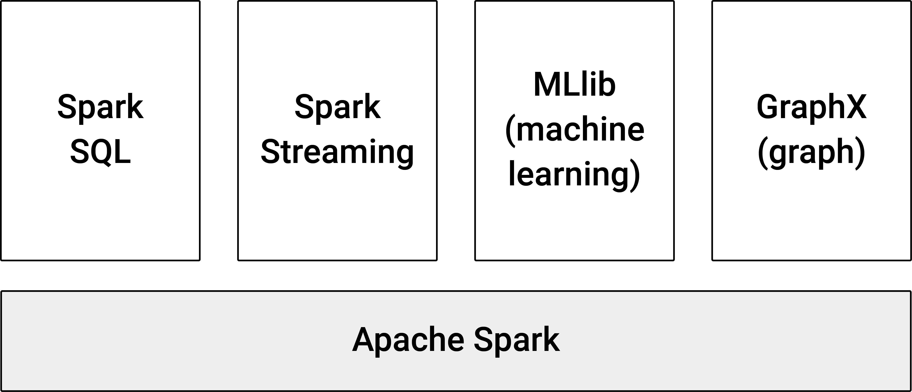

# Distributed Systems

When we connect several computers in a network to jointly process large amounts of data, such a computing system is commonly referred to as a "distributed system". From a technical standpoint the key difference between a distributed system and the more familiar parallel system\index{Parallel System} (e.g., our desktop computer with its multi core CPU) is that in distributed systems the different components do not share the same memory (and storage). Figure \@ref(fig:distributedsystems) illustrates this point.\index{Distributed System}


```{r distributedsystems, echo=FALSE, out.width = "99%", fig.align='center', fig.cap="(ref:distributedsystems)", purl=FALSE}
include_graphics("img/distributed_system.jpg")
```

(ref:distributedsystems) Panel A illustrates a distributed system\index{Distributed System}, in contrast to the illustration of a parallel system\index{Parallel System} in Panel B.


In a distributed system\index{Distributed System}, the dataset is literally split up into pieces that then reside separately on different nodes. This requires an additional layer of software (that coordinates the distribution/loading of data as well as the simultaneous processing) and different approaches (different programming models) to defining computing/data analytics tasks. Below, we will look at each of these aspects in turn.


## MapReduce
\index{MapReduce}

A broadly used programming model for processing Big Data on distributed systems is called MapReduce\index{MapReduce}. It essentially consists of two procedures and is conceptually very close to the "split-apply-combine"\index{Split-Apply-Combine} strategy in data analysis. First, the Map function sorts/filters the data (on each node/computer). Then, a Reduce function aggregates the sorted/filtered data. Thereby, all of these processes are orchestrated to run across many nodes of a cluster computer. Finally, the master node collects the results and returns them to the user.

Let us illustrate the basic idea behind MapReduce\index{MapReduce} with a simple example. Suppose you are working on a text mining task in which all the raw text in thousands of digitized books (stored as text files) need to be processed. In a first step, you want to compute word frequencies (count the number of occurrences of specific words in all books combined). 

For simplicity, let us only focus on the following very simple and often referred to MapReduce word count example^[See, e.g., https://commons.wikimedia.org/wiki/File:WordCountFlow.JPG for an illustration of the same example.]:

<center>
Text in book 1:

*Apple Orange Mango*
&nbsp;

*Orange Grapes Plum*
&nbsp;

</center> 


<center>
Text in book 2:

*Apple Plum Mango*
&nbsp;

*Apple Apple Plum*
&nbsp;

</center> 


The MapReduce procedure is then as follows: 

- First, the data is loaded from the original text files. 
- Each line of text is then passed to individual mapper\index{Mapper} instances, which separately split the lines of text into key–value pairs. In the example above, the first key-value pair of the first document/line would then be *Apple,1*.
- Then the system sorts and shuffles all key–value pairs across all instances; next, the reducer\index{Reducer} aggregates the sorted/shuffled key–value pairs (here: counts the number of word occurrences). In the example above, this means all values with key *Apple* are summed up, resulting in *Apple,4*.
- Finally, the master instance collects all the results and returns the final output.

The result would be as follows:

<center>
Text in book 2:

*Apple,4*
&nbsp;

*Grapes,1*
&nbsp;

*Mango,2*
&nbsp;

*Orange,2*
&nbsp;

*Plum,3*
&nbsp;


</center> 

From this simple example, a key aspect of MapReduce should become clear: for the key tasks of mapping and reducing, the data processing on one node/instance can happen completely independently of the processing on the other instances. Note that this is not as easily achievable for every data analytics task as it is for computing word frequencies.  


:::: {.infobox data-latex=""}
::: {.center data-latex=""}

**Aside: MapReduce concept illustrated in R**
:::

In order to better understand the basic concept behind the MapReduce framework on a distributed system, let's look at how we can combine the  functions `map()`\index{map()} and `reduce()`\index{reduce()} in R to implement the basic MapReduce example shown above (this is just to illustrate the underlying idea, *not* to suggest that MapReduce actually is simply an application of the classical `map` and `reduce (fold)` functions in functional programming).^[For a more detailed discussion of what `map` and `reduce` *actually* have to do with MapReduce, see https://medium.com/@jkff/mapreduce-is-not-functional-programming-39109a4ba7b2.] The overall aim of the program is to count the number of times each word is repeated in a given text. The input to the program is thus a text, and the output is a list of key–value pairs with the unique words occurring in the text as keys and their respective number of occurrences as values.

In the code example, we will use the following text as input.

```{r}
# initialize the input text (for simplicity as one text string)
input_text <-
"Apple Orange Mango
Orange Grapes Plum
Apple Plum Mango
Apple Apple Plum"

```


*Mapper*

The Mapper first splits the text into lines and then splits the lines into key–value pairs, assigning to each key the value `1`. For the first step we use `strsplit()`\index{strsplit()}, which takes a character string as input and splits it into a list of sub-strings according to the matches of a sub-string (here `"\n"`, indicating the end of a line).

```{r}
# Mapper splits input into lines
lines <- as.list(strsplit(input_text, "\n")[[1]])
lines[1:2]
```

In a second step, we apply our own function (`map_fun()`) to each line of text via `Map()`. `map_fun()` splits each line into words (keys) and assigns a value of `1` to each key.

```{r}

# Mapper splits lines into key–value pairs
map_fun <-
     function(x){
          
          # remove special characters
          x_clean <- gsub("[[:punct:]]", "", x)
          # split line into words
          keys <- unlist(strsplit(x_clean, " "))
          # initialize key–value pairs
          key_values <- rep(1, length(keys))
          names(key_values) <- keys
          
          return(key_values)
     }

kv_pairs <- Map(map_fun, lines)

# look at the result
kv_pairs[1:2]
```


*Reducer*

The Reducer first sorts and shuffles the input from the Mapper and then reduces the key–value pairs by summing up the values for each key.

```{r}
# order and shuffle
kv_pairs <- unlist(kv_pairs)
keys <- unique(names(kv_pairs))
keys <- keys[order(keys)]
shuffled <- lapply(keys,
                    function(x) kv_pairs[x == names(kv_pairs)])
shuffled[1:2]
```

Now we can sum up the keys to get the word count for the entire input.

```{r}
sums <- lapply(shuffled, Reduce, f=sum)
names(sums) <- keys
sums[1:2]
```

<!-- ### Simpler example: Compute the total number of words -->

<!-- ```{r} -->
<!-- # assigns the number of words per line as value -->
<!-- map_fun2 <-  -->
<!--      function(x){ -->
<!--           # remove special characters -->
<!--           x_clean <- gsub("[[:punct:]]", "", x) -->
<!--           # split line into words, count no. of words per line -->
<!--           values <- length(unlist(strsplit(x_clean, " "))) -->
<!--           return(values) -->
<!--      } -->
<!-- # Mapper -->
<!-- mapped <- Map(map_fun2, lines) -->
<!-- mapped -->

<!-- # Reducer -->
<!-- reduced <- Reduce(sum, mapped) -->
<!-- reduced -->
<!-- ``` -->


:::: 


## Apache Hadoop
\index{Apache Hadoop}

Hadoop MapReduce is the most widely known and used implementation of the MapReduce framework. A decade ago, Big Data Analytics with really large datasets often involved directly interacting with/working in Hadoop to run MapReduce jobs. However, over the last few years various higher-level interfaces have been developed that make the usage of MapReduce\index{MapReduce}/Hadoop\index{Apache Hadoop} by data analysts much more easily accessible. The purpose of this section is thus to give a lightweight introduction to the underlying basics that power some of the code examples and tutorials discussed in the data analytics chapters toward the end of this book.  

<!-- ```{r hadoop, echo=FALSE, out.width = "90%", fig.align='center', purl=FALSE} -->
<!-- include_graphics("img/hadoop.png") -->
<!-- ``` -->


### Hadoop word count example

To get an idea of what running a Hadoop job looks like, we run the same simple word count example introduced above on a local Hadoop installation. The example presupposes a local installation of Hadoop version 2.10.1 (see Appendix C for details) and can easily be run on a completely normal desktop/laptop computer running Ubuntu Linux. As a side remark, this actually illustrates an important aspect of developing MapReduce\index{MapReduce}scripts in Hadoop\index{Apache Hadoop} (and many of the software packages building on it): the code can easily be developed and tested locally on a small machine and only later transferred to the actual Hadoop cluster to be run on the full dataset.


The basic Hadoop\index{Apache Hadoop} installation comes with a few templates for very typical map/reduce programs.^[More sophisticated programs need to be custom made, written in Java\index{Java}.] Below we replicate the same word-count example as shown in simple R code above. 

In a first step, we create an input directory where we store the input file(s) to feed to Hadoop.

```{bash eval=FALSE}
# create directory for input files (typically text files)
mkdir ~/input
```

Then we add a text file containing the same text as in the example above.

```{bash eval=FALSE}
echo "Apple Orange Mango
Orange Grapes Plum
Apple Plum Mango
Apple Apple Plum" >>  ~/input/text.txt

```

Now we can run the MapReduce/Hadoop word count as follows, storing the results in a new directory called `wordcount_example`. We use the already-implemented Hadoop\index{Apache Hadoop} script to run a word count job, MapReduce\index{MapReduce} style. This is where we rely on the already implemented word-count example provided with the Hadoop installation (located in `/usr/local/hadoop/share/hadoop/mapreduce/hadoop-mapreduce-examples-2.10.1.jar`).

```{bash eval=FALSE, linewidth=50}
# run mapreduce word count
/usr/local/hadoop/bin/hadoop jar \
/usr/local/hadoop/share/hadoop/mapreduce/hadoop-mapreduce-examples-2.10.1.jar \
wordcount 
~/input ~/wc_example
```

What this line says is: Run the Hadoop program called `wordcount` implemented in the jar-file `hadoop-mapreduce-examples-2.10.1.jar`; use the files in directory `~/input` containing the raw text as input, and store the final output in directory `~/wc_example`. 

```{bash }
cat ~/wc_example/*
```

What looks rather simple in this example can get very complex once you want to write an entire data analysis script with all kinds of analysis for Hadoop. Also, Hadoop was designed for batch processing and does not offer a simple interface for interactive sessions. All of this makes it rather impractical for a typical analytics workflow as we know it from working with R. This is where [Apache Spark](https://spark.apache.org/)\index{Apache Spark} [@Spark] comes to the rescue.

## Apache Spark
\index{Apache Spark}

Spark [@Spark] is a data analytics engine specifically designed for processing large amounts of data on cluster computers. It partially builds on the broader Apache Hadoop framework for handling storage and resource management, but it is often faster than Hadoop MapReduce by an order of magnitude. In addition, it offers many more easy-to-use high-level interfaces for typical analytics tasks than Hadoop.  In contrast to Hadoop\index{Apache Hadoop}, Spark\index{Apache Spark}
 is specifically made for interactively developing and running data analytics scripts and is therefore more easily accessible to people with an applied econometrics background but no substantial knowledge in MapReduce and/or cluster computing. In particular, it comes with several high-level operators that make it rather easy to implement analytics tasks. As we will see in later chapters, it is very easy to use interactively from within R (and other languages like Python\index{Python}, SQL\index{Structured Query Language (SQL)}, and Scala\index{Scala}). This makes the platform much more accessible and worthwhile for empirical economic research, even for relatively simple econometric analyses. 

The following figure illustrates the basic components of Spark\index{Apache Spark}. The main functionality includes memory management, task scheduling, and the implementation of Spark's capabilities to handle and manipulate data distributed across many nodes in parallel. Several built-in libraries extend the core implementation, covering specific domains of practical data analytics tasks (querying structured data via SQL, processing streams of data, machine learning, and network/graph analysis). The last two provide various common functions/algorithms frequently used in data analytics/applied econometrics, such as generalized linear regression, summary statistics, and principal component analysis.

<!-- ```{r sparkstack, echo=FALSE, out.width = "60%", fig.align='center', fig.cap= "(ref:sparkstack)", purl=FALSE} -->
<!--  -->
<!-- ``` -->

<!-- (ref:sparkstack) Basic Spark stack (based on https://spark.apache.org/images/spark-stack.png). -->

At the heart of Big Data Analytics with Spark\index{Apache Spark}
 is the fundamental data structure called 'resilient distributed dataset' (RDD)\index{Resilient Distributed Dataset (RDD)}. When loading/importing data into Spark, the data is automatically distributed across the cluster in RDDs\index{Resilient Distributed Dataset (RDD)} (~ as distributed collections of elements), and manipulations are then executed in parallel on these RDDs\index{Resilient Distributed Dataset (RDD)}. However, the entire Spark framework also works locally on a simple laptop or desktop computer. This is a great advantage when learning Spark and when testing/debugging an analytics script on a small sample of the real dataset. 


## Spark with R 

There are two prominent packages for using Spark\index{Apache Spark} in connection with R: `SparkR`\index{SparkR Package} [@SparkR] and RStudio's `sparklyr`\index{sparklyr Package} [@sparklyr]. The former is in some ways closer to Spark's Python API; the latter is closer to the `dplyr`-type of data handling (and is compatible with the `tidyverse` [@tidyverse]).^[See https://cosminsanda.com/posts/a-compelling-case-for-sparkr/ for a more detailed comparison and discussion of advantages of either package.] For the very simple introductory examples below, either package could have been used equally well. For the general introduction we focus on `SparkR`\index{SparkR Package} and later have a look at a simple regression example based on `sparklyr`.

To install and use Spark from the R shell, only a few preparatory steps are needed. The following examples are based on installing/running Spark on a Linux machine with the `SparkR`\index{SparkR Package} package. `SparkR`\index{SparkR Package} depends on Java (version 8). Thus, we first should make sure the right Java version is installed. If several Java versions are installed, we might have to select version 8 manually via the following terminal command (Linux): 


```{bash eval=FALSE}

# might have to switch to java version 8 first
sudo update-alternatives --config java 

```

With the right version of Java running, we can install `SparkR`\index{SparkR Package} from GitHub (needs the `devtools` package [@devtools]) `devtools::install_github("cran/SparkR")`. After installing `SparkR`\index{SparkR Package}, the call `SparkR::install.spark()` will download and install Apache Spark to a local directory.^[Note that after the installation, the location of Spark is printed to the R console. Alternatively, you can also first install the `sparklyr` package and then run `sparklyr::spark_install()` to install Spark. In the data analysis examples later in the book, we will work both with `SparkR`\index{SparkR Package} and `sparklyr`.] Now we can start an interactive SparkR session from the terminal with

```{bash, eval=FALSE}
$ SPARK-HOME/bin/sparkR
```

where `SPARK-HOME` is a placeholder for the path to your local Spark installation (printed to the console after running `SparkR::install.spark()`). Or simply run SparkR from within RStudio by loading `SparkR`\index{SparkR Package} and initiating Spark with `sparkR.session()`.

```{r warning=FALSE, message=FALSE, eval=FALSE}
# to install use
# devtools::install_github("cran/SparkR")
# load packages
library(SparkR)
# start session
sparkR.session()

```


```{r echo=FALSE, include=FALSE, message=FALSE, warning=FALSE}
# install.packages("SparkR")
# or, if temporarily not available on CRAN:
#if (!require('devtools')) install.packages('devtools')
#devtools::install_github('apache/spark@v2.x.x', subdir='R/pkg') # replace x.x with the version of your spark installation

# load packages
library(SparkR)

# start session
sparkR.session(sparkHome = "/home/umatter/.cache/spark/spark-3.1.2-bin-hadoop2.7")

```


By default this starts a local stand-alone session (no connection to a cluster computer needed). While the examples below are all intended to run on a local machine, it is straightforward to connect to a remote Spark cluster and run the same examples there.^[Simply set the `master` argument of `sparkR.session()` to the URL of the Spark master node of the remote cluster. Importantly, the local Spark and Hadoop versions should match the corresponding versions on the remote cluster.]

### Data import and summary statistics

First, we want to have a brief look at how to perform the first few steps of a typical econometric analysis: import data and compute summary statistics. We will analyze the already familiar `flights.csv` dataset. The basic Spark installation provides direct support to import common data formats such as CSV and JSON via the `read.df()` function (for many additional formats, specific Spark libraries are available). To import `flights.csv`, we set the `source` argument to `"csv"`.

```{r}

# Import data and create a SparkDataFrame 
# (a distributed collection of data, RDD)
flights <- read.df("data/flights.csv", source = "csv", header="true")

# inspect the object
class(flights)
dim(flights)

```

By default, all variables have been imported as type `character`. For several variables this is, of course, not the optimal data type to compute summary statistics. We thus first have to convert some columns to other data types with the `cast` function.

```{r}
flights$dep_delay <- cast(flights$dep_delay, "double")
flights$dep_time <- cast(flights$dep_time, "double")
flights$arr_time <- cast(flights$arr_time, "double")
flights$arr_delay <- cast(flights$arr_delay, "double")
flights$air_time <- cast(flights$air_time, "double")
flights$distance <- cast(flights$distance, "double")
```


Suppose we only want to compute average arrival delays per carrier for flights with a distance over 1000 miles. Variable selection and filtering of observations is implemented in `select()` and `filter()` (as in the `dplyr` package\index{dplyr Package}). 


```{r}
# filter
long_flights <- select(flights, "carrier", "year", "arr_delay", "distance")
long_flights <- filter(long_flights, long_flights$distance >= 1000)
head(long_flights)
```

Now we summarize the arrival delays for the subset of long flights by carrier. This is the 'split-apply-combine' approach applied in `SparkR`\index{SparkR Package}.

```{r}
# aggregation: mean delay per carrier
long_flights_delays<- summarize(groupBy(long_flights, long_flights$carrier),
                      avg_delay = mean(long_flights$arr_delay))
head(long_flights_delays)
```

Finally, we want to convert the result back into a usual `data.frame` (loaded in our current R session) in order to further process the summary statistics (output to LaTeX table, plot, etc.). Note that as in the previous aggregation exercises with the `ff` package, the computed summary statistics (in the form of a table/df) are obviously much smaller than the raw data. However, note that converting a `SparkDataFrame` back into a native R object generally means all the data stored in the RDDs constituting the `SparkDataFrame` object is loaded into local RAM. Hence, when working with actual Big Data on a Spark cluster, this type of operation can quickly overflow local RAM.


```{r}
# Convert result back into native R object
delays <- collect(long_flights_delays)
class(delays)
delays
```


## Spark with SQL  
\index{spark-sql}
Instead of interacting with Spark via R, you can do the same via SQL. This can be very convenient at the stage of data exploration and data preparation. Also note that this is a very good example of how knowing some SQL can be very useful when working with Big Data even if you are not interacting with an actual relational database.^[Importantly, this also means that we cannot use SQL commands related to configuring such databases, such as `.tables` etc. Instead we use SQL commands to directly query data from JSON or CSV files.] 

To directly interact with Spark via SQL, open a terminal window, switch to the `SPARK-HOME` directory,


```{bash eval=FALSE}
cd SPARK-HOME
```

and enter the following command:

```{bash, eval=FALSE}

$ bin/spark-sql
```

where `SPARK-HOME` is again the placeholder for the path to your local Spark installation (printed to the console after running `SparkR::install.spark()`). This will start up Spark and connect to it via Spark's SQL interface. You will notice that the prompt in the terminal changes (similar to when you start `sqlite`). 

Let's run some example queries. The Spark installation comes with several data and script examples. The example datasets are located at `SPARK-HOME/examples/src/main/resources`. For example, the file `employees.json` contains the following records in JSON format:

```{json}
{"name":"Michael", "salary":3000}
{"name":"Andy", "salary":4500}
{"name":"Justin", "salary":3500}
{"name":"Berta", "salary":4000}
```


We can query this data directly via SQL commands by referring to the location of the original JSON file. 


**Select all observations**

```{sql eval=FALSE}

SELECT * 
FROM json.`examples/src/main/resources/employees.json`
;

```

```
Michael 3000
Andy    4500
Justin  3500
Berta   4000
Time taken: 0.099 seconds, Fetched 4 row(s)
```

**Filter observations**

```{sql eval=FALSE}

SELECT * 
FROM json.`examples/src/main/resources/employees.json`
WHERE salary <4000
;

```

```
Michael 3000
Justin  3500
Time taken: 0.125 seconds, Fetched 2 row(s)
```

**Compute the average salary**

```{sql eval=FALSE}

SELECT AVG(salary) AS mean_salary 
FROM json.`examples/src/main/resources/employees.json`;

```

```
3750.0
Time taken: 0.142 seconds, Fetched 1 row(s)
```


## Spark with R + SQL

Most conveniently, you can combine the SQL query features of Spark and SQL\index{Structured Query Language (SQL)} with running R on Spark\index{Apache Spark}. First, initiate the Spark session in RStudio and import the data as a Spark data frame.

```{r warning=FALSE, message=FALSE, eval=TRUE}
# to install use
# devtools::install_github("cran/SparkR")
# load packages
library(SparkR)
# start session
sparkR.session()
# read data 
flights <- read.df("data/flights.csv", source = "csv", header="true")

```

Now we can make the Spark data frame accessible for SQL queries by registering it as a temporary table/view with `createOrReplaceTempView()` and then run SQL queries on it from within the R session via the `sql()`-function. `sql()` will return the results as a Spark data frame (this means the result is also located on the cluster and hardly affects the master node's memory). 

```{r}
# register the data frame as a table
createOrReplaceTempView(flights, "flights" )

# now run SQL queries on it
query <- 
"SELECT DISTINCT carrier,
year,
arr_delay,
distance
FROM flights
WHERE 1000 <= distance"

long_flights2 <- sql(query)
head(long_flights2)

```


## Wrapping up

- At the core of a vertical scaling strategy are so-called *distributed systems*\index{Distributed System} – several computers connected in a network to jointly process large amounts of data.
- In contrast to standard parallel-computing, the different computing nodes in a distributed system do not share the same physical memory. Each of the nodes/computers in the system has its own CPU\index{Central Processing Unit (CPU)}, hard disk\index{Hard Disk}, and RAM\index{Random Access Memory (RAM)}. This architecture requires a different computing paradigm to run the same data analytics job across all nodes (in parallel).
- A commonly used paradigm to do this is MapReduce\index{MapReduce}, which is implemented in software called Apache Hadoop.
- The core idea of MapReduce is to split a problem/computing task on a large dataset into several components, each of which focuses on a smaller subset of the dataset. The task components are then distributed across the cluster, so that each component is handled by one computer in the network. Finally, each node returns its result to the master node (the computer coordinating all activities in the cluster), where the partial results are combined into the overall result.
- A typical example of a MapReduce\index{MapReduce} job is the computation of term frequencies in a large body of text. Here, each node computes the number of occurrences of specific words in a subset of the overall body of text; the individual results are then summed up per unique word.
- Apache Hadoop is a collection of open-source software tools to work with massive amounts of data on a distributed system (a network of computers). Part of Hadoop is the Hadoop MapReduce implementation to run MapReduce\index{MapReduce} jobs on a Hadoop\index{Apache Hadoop} cluster.
- Apache Spark\index{Apache Spark} is an analytics engine for large-scale data processing on local machines or clusters. It improves upon several shortcomings of the previous Hadoop/MapReduce framework, in particular with regard to iterative tasks (such as in machine learning).


