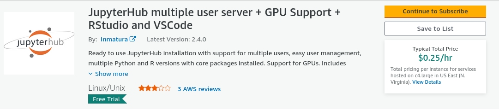
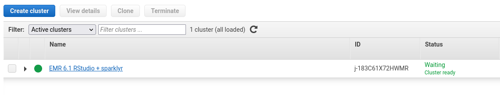

# Cloud Computing

In this chapter, we first look at what cloud computing\index{Cloud Computing}
 basically is and what platforms provide cloud computing services. We then focus on *scaling up* in the cloud. For the sake of simplicity, we will primarily focus on how to use cloud instances provided by one of the providers, Amazon Web Services (AWS). However, once you are familiar with setting things up on AWS, also using Google Cloud, Azure, etc. will be easy. Most of the core services are provided by all providers, and once you understand the basics, the different dashboards will look quite familiar. In a second step, we look at a prominent approach to *scaling out* by setting up a Spark cluster in the cloud.

## Cloud computing basics and platforms

So far we have focused on the available computing resources on our local machines (desktop/laptop) and how to use them optimally when dealing with large amounts of data and/or computationally demanding tasks. A key aspect of this has been to understand why our local machine is struggling with a computing task when there is a large amount of data to be processed and then identifying potential avenues to use the available resources more efficiently, for example, by using one of the following approaches:

 - Computationally intensive tasks (but not pushing RAM to the limit): parallelization, using several CPU cores (nodes) in parallel.
 - Memory-intensive tasks (data still fits into RAM): efficient memory allocation.
 - Memory-intensive tasks (data does not fit into RAM): efficient use of virtual memory (use parts of mass storage device as virtual memory).
 - Storage: efficient storage (avoid redundancies).
 
In practice, datasets might be too large for our local machine even if we take all of the techniques listed above into account. That is, a parallelized task might still take ages to complete because our local machine has too few cores available, a task involving virtual memory would use up way too much space on our hard disk, etc. 

In such situations, we have to think about horizontal and vertical scaling beyond our local machine. That is, we outsource tasks to a bigger machine (or a cluster of machines) to which our local computer is connected (typically, over the internet). While only one or two decades ago most organizations had their own large centrally hosted machines (database servers, cluster computers) for such tasks, today they often rely on third-party solutions *'in the cloud'*. That is, specialized companies provide computing resources (usually, virtual servers) that can be easily accessed via a broadband internet connection and rented on an hourly basis (or even by the minute or second). Given the obvious economies of scale in this line of business, a few large players have emerged who effectively dominate most of the global market:
\index{Cloud Computing Platforms}

 - [Amazon Web Services (AWS)](https://aws.amazon.com/) \index{Amazon Web Services (AWS)}
 - [Microsoft Azure](https://azure.microsoft.com/en-us/) \index{Microsoft Azure}
 - [Google Cloud Platform (GCP)](https://cloud.google.com/) \index{Google Cloud Platform (GCP)}
 - [IBM Cloud](https://www.ibm.com/cloud/) \index{IBM Cloud}
 - [Alibaba Cloud](https://www.alibabacloud.com/) \index{Alibaba Cloud}
 - [Tencent Cloud](https://intl.cloud.tencent.com/) \index{Tencent Cloud}

In the following subsections and chapters, we will primarily rely on services provided by AWS and GCP. In order to try out the code examples and tutorials, make sure to have an AWS account as well as a Google account (which can then easily be linked to GCP). For the AWS account, go to `https://aws.amazon.com/` and create an account. You will have to enter credit card details for either cloud platform when setting up/linking accounts. Importantly, you will only be charged for the time you use an AWS service. However, even when using some cloud instances, several of AWS's cloud products offer a free tier to test and try out products. The following examples rely whenever possible on free-tier instances; if not, it is explicitly indicated that running the example in the cloud will generate some costs on your account. For the GCP account, have your Google login credentials ready, and visit `https://cloud.google.com/` to register your Google account with GCP. Again, credit card details are needed to set up an account, but many of the services can be used for free to a certain extent (to learn and try out code).


## Transitioning to the cloud

When logged in to AWS and GCP, you will notice the breadth of services offered by these platforms. There are more than 10 main categories of services, with many subcategories and products in each. It is easy to get lost from just browsing through them. Rest assured that for the purpose of data analytics/applied econometrics, many of these services are irrelevant. Our motivation to use the cloud is to extend our computational resources to use our analytics scripts on large datasets, not to develop and deploy web applications or business analytics dashboards. With this perspective, a small selection of services will make the cloud easily accessible for daily analytics workflows. 

When we use services from AWS or GCP to *scale up* (vertical scaling)\index{Vertical Scaling} the available resources, the transition from our local implementation of a data analytics task to the cloud implementation is often rather simple. Once we have set up a cloud instance and figured out how to communicate with it, we typically can run the exact same R script locally and in the cloud. This is usually the case for parallelized tasks (simply run the same script on a machine with more cores), in-memory tasks (rent a machine with more RAM but still use `data.table()`\index{data.table()}, etc.), and highly parallelized tasks to be run on GPUs\index{Graphics Processing Unit (GPU)}. The transition from a local implementation to horizontal scaling (*scaling out*)\index{Horizontal Scaling} in the cloud will require slightly more preparatory steps. However, in this domain we will directly build on the same (or very similar) software tools that we have used locally in previous chapters. For example, instead of connecting R to a local SQLite\index{SQLite} database, we set up a MySQL database on AWS RDS\index{AWS RDS} and then connect in essentially the same way our local R session with this database in the cloud.


## Scaling up in the cloud: Virtual servers
\index{Virtual Server}
\index{EC2}

In the following pages we look at a very common scheme to deal with a lack of local computing resources: flexibly renting a type of virtual server often referred to as "Elastic Cloud Computing (EC2)"\index{EC2} instance. Specifically, we will look at how to scale up with AWS EC2\index{EC2} and R/RStudio Server\index{RStudio Server}. One of the easiest ways to set up an AWS EC2\index{EC2} instance for R/RStudio Server\index{RStudio Server} is to use [Louis Aslett's Amazon Machine Image (AMI)](https://www.louisaslett.com/RStudio_AMI/)\index{Amazon Machine Image (AMI)}. This way you do not need to install R/Rstudio Server\index{RStudio Server} yourself. Simply follow these five steps:

- Depending on the region in which you want to create your EC2 instance, click on the corresponding AMI link in https://www.louisaslett.com/RStudio_AMI/. For example, if you want to create the instance in Frankfurt, click on [ami-076abd591c4335092](https://console.aws.amazon.com/ec2/home?region=eu-central-1#launchAmi=ami-076abd591c4335092). You will be automatically directed to the AWS page where you can select the type of EC2 instance you want to create. By default, the free tier T2.micro instance is selected (I recommend using this type of instance if you simply want to try out the examples below).

- After selecting the instance type, click on "Review and Launch". On the opened page, select "Edit security groups". There should be one entry with `SSH`\index{SSH} selected in the drop-down menu. Click on this drop-down menu and select `HTTP`\index{HTTP} (instead of `SSH`\index{SSH}). Click again on "Review and Launch" to confirm the change. 

- Then, click "Launch" to initialize the instance. From the pop-up concerning the key pair, select "Proceed without a key pair" from the drop-down menu, and check the box below ("I acknowledge ..."). Click "Launch" to confirm. A page opens. Click on "View" instances to see all of your instances and their status. Wait until "Status check" is "2/2 checks passed" (you might want to refresh the instance overview or browser window). 

- Click on the instance ID of your newly launched instance and copy the public IPv4\index{IPv4} address, open a new browser window/tab, type in `http://`,  paste the IP address, and hit enter (the address in your browser bar will be something like `http://3.66.120.150`; `http`, not `https`!) . 

- You should see the login-interface to RStudio on your cloud instance. The username is `rstudio`, and the password is the instance ID of your newly launched instance (it might take a while to load R/Rstudio). Once RStudio\index{RStudio} is loaded, you are ready to go. 

*NOTE*: the instructions above help you set up your own EC2\index{EC2} instance with R/RStudio\index{RStudio} to run some example scripts and tryout R on EC2. For more serious/professional (long-term) usage of an EC2\index{EC2} instance, I strongly recommend setting it up manually and improving the security settings accordingly! The above setup will theoretically result in your instance being accessible for anyone in the Web (something you might want to avoid).

### Parallelization with an EC2 instance
\index{EC2}
This short tutorial illustrates how to scale the computation up by running it on an AWS EC2\index{EC2} instance. Thereby, we build on the techniques discussed in the previous chapter. Note that our EC2\index{EC2} instance is a Linux machine. When running R on a Linux\index{Linux} machine, there is sometimes an additional step to install R packages (at least for most of the packages): R packages need to be compiled before they can be installed. The command to install packages is exactly the same (`install.packages()`\index{install.packages()}), and normally you only notice a slight difference in the output shown on the R console during installation (and the installation process takes a little longer than what you are used to). In some cases you might also have to install additional dependencies directly in Linux. Apart from that, using R via RStudio Server\index{RStudio Server} in the cloud looks/feels very similar if not identical to when using R/RStudio locally.

**Preparatory steps**

If your EC2 instance with RStudio Server\index{RStudio Server} is not running yet, do the following. In the AWS console, navigate to EC2, select your EC2 instance (with RStudio Server\index{RStudio Server} installed), and click on "Instance state/Start instance". You will have to wait until you see "2/2 checks passed". Then, open a new browser window, enter the address of your EC2/RStudio Server\index{RStudio Server} instance (see above, e.g., `http://3.66.120.150`), and log in to RStudio. First, we need to install the `parallel`\index{parallel Package} [@rfoundation2021] and `doSNOW`\index{doSNOW Package} [@doSNOW] packages. In addition we will rely on the `stringr` package\index{stringr Package} [@stringr].

```{r, eval=FALSE}
# install packages for parallelization
install.packages("parallel", "doSNOW", "stringr")
```

Once the installations have finished, you can load the packages and verify the number of cores available on your EC2\index{EC2} instance as follows. If you have chosen the free tier T2.micro instance type when setting up your EC2\index{EC2} instance, you will see that you only have one core available. Do not worry. It is reasonable practice to test your parallelization script with a few iterations on a small machine before bringing out the big guns. The specialized packages we use for parallelization here do not mind if you have one or 32 cores; the same code runs on either machine (obviously not very fast with only one core).

```{r eval=FALSE}
# load packages 
library(parallel)
library(doSNOW)

# verify no. of cores available
n_cores <- detectCores()
n_cores
```

Finally, we have to upload the data that we want to process as part of the parallelization task. To this end, in RStudio Server\index{RStudio Server}, navigate to the file explorer in the lower right-hand corner. The graphical user interfaces of a local RStudio installation and RStudio Server\index{RStudio Server} are almost identical. However, you will find in the file explorer pane an "Upload" button to transfer files from your local machine to the EC2 instance. In this demonstration, we will work with the previously introduced `marketing_data.csv` dataset. You can thus click on "Upload" and upload it to the current target directory (the home directory of RStudio Server\index{RStudio Server}). As soon as the file is uploaded, you can work with it as usual (as on the local RStudio\index{RStudio} installation). To keep things as in the local examples, use the file explorer to create a new `data` folder, and move `marketing_data.csv` in this new folder. The screenshot in Figure \@ref(fig:ec2rstudioserver) shows a screenshot of the corresponding section.

```{r ec2rstudioserver, echo=FALSE, out.width = "50%", fig.align='center', fig.cap= "(ref:ec2rstudioserver)", purl=FALSE}
include_graphics("img/screenshot_rstudio_server_upload.png")
```

(ref:ec2rstudioserver) File explorer and Upload button on RStudio Server\index{RStudio Server}.

In order to test if all is set up properly to run in parallel on our EC2\index{EC2} instance, open a new R script in RStudio Server\index{RStudio Server} and copy/paste the preparatory steps and the simple parallelization example from Section 4.5 into the R script. 


```{r eval=FALSE}
# PREPARATION -----------------------------

# packages
library(stringr)

# import data
marketing <- read.csv("data/marketing_data.csv")
# clean/prepare data
marketing$Income <- as.numeric(gsub("[[:punct:]]", "", marketing$Income)) 
marketing$days_customer <- as.Date(Sys.Date())- 
  as.Date(marketing$Dt_Customer, "%m/%d/%y")
marketing$Dt_Customer <- NULL

# all sets of independent vars
indep <- names(marketing)[ c(2:19, 27,28)]
combinations_list <- lapply(1:length(indep),
                            function(x) combn(indep, x, simplify = FALSE))
combinations_list <- unlist(combinations_list, recursive = FALSE)
models <- lapply(combinations_list,
                 function(x) paste("Response ~", paste(x, collapse="+")))
```


**Test parallelized code**

Now, we can start testing the code on EC2\index{EC2} without registering the one core for cluster processing. This way, `%dopart%` will automatically resort to running the code sequentially.  Make sure to set `N` to 10 (or another small number) for this test.

```{r eval=FALSE}
# set cores for parallel processing
# ctemp <- makeCluster(ncores)
# registerDoSNOW(ctemp)

# prepare loop
N <- 10 # just for illustration, the actual code is N <- length(models)
# run loop in parallel
pseudo_Rsq <-
  foreach ( i = 1:N, .combine = c) %dopar% {
    # fit the logit model via maximum likelihood
    fit <- glm(models[[i]], data=marketing, family = binomial())
    # compute the proportion of deviance explained 
    #by the independent vars (~R^2)
    return(1-(fit$deviance/fit$null.deviance))
}
```


Once the test has run through successfully, we are ready to scale up and run the actual workload in parallel in the cloud.


**Scale up and run in parallel**

First, switch back to the AWS EC2\index{EC2} console and stop the instance by selecting the tick-mark in the corresponding row, and click on "Instance state/stop instance". Once the Instance state is "Stopped", click on "Actions/Instance settings/change instance type". You will be presented with a drop-down menu from which you can select the new instance type and confirm. The example below is based on selecting the `t2.2xlarge` (with 8 vCPU\index{Central Processing Unit (CPU)} cores and 32MB of RAM\index{Random Access Memory (RAM)}). Now you can start the instance again, log in to RStudio Server\index{RStudio Server} (as above), and run the script again – but this time with the following lines not commented out (in order to make use of all eight cores):


```{r eval=FALSE}

# set cores for parallel processing
ctemp <- makeCluster(ncores)
registerDoSNOW(ctemp)

```


In order to monitor the usage of computing resources on your instance, switch to the Terminal\index{Terminal} tab, type in `htop`\index{htop}, and hit enter. This will open the interactive process viewer called [htop](https://htop.dev/)\index{htop}. Figure \@ref(fig:ec2rstudioserverhtop) shows the output of htop for the preparatory phase of the parallel task implemented above. The output confirms the available resources provided by a `t2.2xlarge` EC2\index{EC2} instance (with 8 vCPU cores\index{Central Processing Unit (CPU)}  and 32MB of RAM\index{Random Access Memory (RAM)}). When using the default free tier T2.micro instance, you will notice in the htop output that only one core is available.


```{r ec2rstudioserverhtop, echo=FALSE, out.width = "90%", fig.align='center', fig.cap= "(ref:ec2rstudioserverhtop)", purl=FALSE}
include_graphics("img/ec2_rstudioserver_htop.png")
```

(ref:ec2rstudioserverhtop) Monitor resources and processes with htop\index{htop}.


## Scaling up with GPUs
\index{Graphics Processing Unit (GPU)}

As discussed in Chapter 4, GPUs can help speed up highly parallelizable tasks such as matrix multiplications. While using a local GPU\index{Graphics Processing Unit (GPU)}
/graphics card for statistical analysis has become easier due to more easily accessible software layers around the GPUs\index{Graphics Processing Unit (GPU)}
, it still needs solid knowledge regarding the installation of specific GPU drivers and changing of basic system settings. Many users specializing in the data analytics side rather than the computer science/hardware side of Big Data Analytics might not be comfortable with making such installations/changes on their desktop computers or might not have the right type of GPU/graphics card in their device for such changes. In addition, for many users it might not make sense to have a powerful GPU\index{Graphics Processing Unit (GPU)}
 in their local machine, if they only occasionally use it for certain machine learning or parallel computing tasks. In recent years, many cloud computing platforms have started providing virtual machines with access to GPUs\index{Graphics Processing Unit (GPU)}
, in many cases with additional layers of software and/or pre-installed drivers, allowing users to directly run their code on GPUs\index{Graphics Processing Unit (GPU)}
 in the cloud. Below, we briefly look at two of the most easy-to-use options to run code on GPUs\index{Graphics Processing Unit (GPU)}
 in the cloud: using Google Colab\index{Google Colab} notebooks with GPUs\index{Graphics Processing Unit (GPU)}
 and setting up RStudio\index{RStudio} on virtual machines in a special EC2 tier with GPU\index{Graphics Processing Unit (GPU)}
 access on AWS.


### GPUs on Google Colab
\index{Google Colab}
Google Colab provides a very easy way to run R code on GPUs\index{Graphics Processing Unit (GPU)} from Google Cloud\index{Google Cloud Platform (GCP)}. All you need is a Google account. Open a new browser window, go to https://colab.to/r, and log in with your Google account if prompted to do so. Colab will open a [Jupyter notebook](https://en.wikipedia.org/wiki/Project_Jupyter)\index{Jupyter Notebook} with an R runtime. Click on "Runtime/Change runtime type", and in the drop-down menu under 'Hardware accelerator', select the option 'GPU'.

```{r colabr, echo=FALSE, out.width = "50%", fig.align='center', fig.cap= "(ref:colabr)", purl=FALSE}
include_graphics("img/colab_r_gpu.png")
```

(ref:colabr) Colab notebook with R runtime and GPUs.


Then, you can install the packages for which you wish to use GPU acceleration (e.g., `gpuR`, `keras`, and `tensorflow`), and the code relying on GPU processing will be run on GPUs (or even [TPUs](https://en.wikipedia.org/wiki/Tensor_Processing_Unit))\index{TPU}. At the following link you can find a Colab notebook set up for running a [simple image classification tutorial](https://tensorflow.rstudio.com/tutorials/beginners/basic-ml/tutorial_basic_classification/) with keras on TPUs: [bit.ly/bda_colab](https://bit.ly/bda_colab). 


### RStudio and EC2 with GPUs on AWS

To start a ready-made EC2 instance with GPUs and RStudio installed, open a browser window and navigate to this service provided by Inmatura on the AWS Marketplace: https://aws.amazon.com/marketplace/pp/prodview-p4gqghzifhmmo. Click on "Subscribe".


```{r ec2gpusetup1, echo=FALSE, out.width = "80%", fig.align='center', fig.cap= "(ref:ec2gpusetup1)", purl=FALSE}

```

(ref:ec2gpusetup1) JupyterHub AMI provided by Inmatura on the AWS Marketplace to run RStudio Server\index{RStudio Server} with GPUs on AWS EC2.


After the subscription request is processed, click on "Continue to Configuration" and "Continue to Launch". To make use of a GPU, select, for example,  `g2.2xlarge` type under "EC2 Instance Type". If necessary, create a new key pair under Key Pair Settings; otherwise keep all the default settings as they are. Then, at the bottom, click on *Launch*. This will launch a new EC2 \index{EC2} instance with a GPU\index{Graphics Processing Unit (GPU)} and with RStudio server\index{RStudio Server} (as part of JupyterHub) installed.^[Note that due to high demand for GPUs on AWS, you might not be able to launch the instance of the preferred type in the preferred region. You will see a corresponding error message after clicking on launch. It might well be the case that simply navigating back to the Configuration page and changing the region of the instance resolves this issue (as not all instances of the preferred type might be in use in other regions).] 

```{r ec2gpusetup2, echo=FALSE, out.width = "60%", fig.align='center', fig.cap= "(ref:ec2gpusetup2)", purl=FALSE}
include_graphics("img/ec2_gpu2.png")
```

(ref:ec2gpusetup2) Launch JupyterHub with RStudio Server\index{RStudio Server} and GPUs on AWS EC2.


Once you have successfully launched your EC2 instance, JupyterHub is programmed to automatically initiate on port 80. You can access it using the following link: http://<instance-ip>, where the `<instance-ip>` is the public IP address of the newly launched instance (you will find this on the EC2 dashboard). The default username is set as 'jupyterhub-admin', and the default password is identical to your EC2 instance ID. If you need to verify this, you can find it in your EC2 dashboard. For example, it could appear similar to 'i-0b3445939c7492'.^[It is strongly recommended to change the password afterward. In order to do that, click on "Tools" and select "shell". Then type "password" into the shell/terminal, and enter the current password (the instance_id); then enter the new password, hit enter, and enter the new password again to confirm. For further information or help, consult the comprehensive documentation available at: https://aws.inmatura.com/ami/jupyterhub/.] 


## Scaling out: MapReduce in the cloud

Many cloud computing providers offer specialized services for MapReduce tasks in the cloud. Here we look at a comparatively easy-to-use solution provided by AWS, called Elastic MapReduce (AWS EMR)\index{AWS EMR}. It allows you to set up a Hadoop cluster in the cloud within minutes and requires essentially no additional configuration if the cluster is being used for the kind of data analytics tasks discussed in this book. 

Setting up a default AWS EMR\index{AWS EMR} cluster via the AWS console is straightforward. Simply go to `https://console.aws.amazon.com/elasticmapreduce/`, click on "Create cluster", and adjust the default selection of settings if necessary. Alternatively, we can set up an EMR cluster via the AWS command-line interface (CLI)\index{AWS Command-Line Interface (CLI)}. In the following tutorials, we will work with AWS EMR\index{AWS EMR} via R/Rstudio (specifically, via the package `sparklyr`\index{sparklyr Package}). By default, RStudio is not part of the EMR cluster set-up. However, AWS EMR\index{AWS EMR} offers a very flexible way to install/configure additional software on virtual EMR clusters via so-called "bootstrap" scripts. These scripts can be shared on AWS S3\index{Simple Storage Service (S3)} and used by others, which is what we do in the following cluster set-up via the AWS command-line interface (CLI).^[Specifically, we will use the bootstrap script provided by the AWS Big Data Blog, which is stored here: s3://aws-bigdata-blog/artifacts/aws-blog-emr-rstudio-sparklyr/rstudio_sparklyr_emr6.sh] 

In order to run the cluster set up via AWS CLI\index{AWS Command-Line Interface (CLI)}, shown below, you need an SSH\index{SSH} key to later connect to the EMR\index{AWS EMR} cluster. If you do not have such an SSH\index{SSH} key for AWS yet, follow these instructions to generate one: https://docs.aws.amazon.com/cloudhsm/classic/userguide/generate_ssh_key.html. In the example below, the key generated in this way is stored in a file called `sparklyr.pem`.^[If you simply copy and paste the CLI command below to set up an EMR cluster, make sure to name your key file `sparklyr.pem`. Otherwise, make sure to change the part in the command referring to the key file accordingly.]

The following command (`aws emr create-cluster`) initializes our EMR\index{AWS EMR} cluster with a specific set of options (all of these options can also be modified via the AWS console in the browser). `--applications Name=Hadoop Name=Spark Name=Hive Name=Pig Name=Tez Name=Ganglia` specifies which type of basic applications (that are essential to running different types of MapReduce tasks) should be installed on the cluster. Unless you really know what you are doing, do not change these settings. `--name "EMR 6.1 RStudio + sparklyr` simply specifies what the newly initialized cluster should be called (this name will then appear on your list of clusters in the AWS console). More relevant for what follows is the line specifying what type of virtual servers (EC2 \index{EC2} instances)\index{EC2} should be used as part of the cluster:  `--instance-groups InstanceGroupType=MASTER,InstanceCount=1,InstanceType=m3.2xlarge` specifies that the one master node (the machine distributing tasks and coordinating the MapReduce procedure) is an instance of type `m3.2xlarge`; `InstanceGroupType=CORE,InstanceCount=2,InstanceType=m3.2xlarge` specifies that there are two slave nodes in this cluster, also of type `m1.medium`.^[Working with one master node of type `m3.2xlarge` and two slave nodes of the same type only makes sense for test purposes. For an actual analysis task with many gigabytes or terabytes of data, you might want to choose larger instances.] `--bootstrap-action Path=s3://aws-bigdata-blog/artifacts/aws-blog-emr-rstudio-sparklyr/rstudio _sparklyr_emr6.sh,Name="Install RStudio"` tells the set-up application to run the corresponding bootstrap script on the cluster in order to install the additional software (here RStudio).

Finally, there are two important aspects to note: First, in order to initialize the cluster in this way, you need to have an SSH\index{SSH} key pair (for your EC2\index{EC2} instances) set up, which you then instruct the cluster to use with `KeyName=`. That is, `KeyName="sparklyr"` means that the user already has created an SSH key pair called `sparklyr`\index{sparklyr Package} and that this is the key pair that will be used with the cluster nodes for SSH connections. Second, the `--region` argument defines in which AWS region the cluster should be created. Importantly, in this particular case, the bootstrap script used to install RStudio on the cluster is stored in the `us-east-1` region; hence we also need to set up the cluster in this region: `--region us-east-1` (otherwise the set-up will fail as the set-up application will not find the bootstrap script and will terminate with an error!).

```{r wrap-hook1, echo=FALSE, warning=FALSE, message=FALSE}
library(knitr)
hook_output = knit_hooks$get('output')
knit_hooks$set(output = function(x, options) {
  # this hook is used only when the linewidth option is not NULL
  if (!is.null(n <- options$linewidth)) {
    x = xfun::split_lines(x)
    # any lines wider than n should be wrapped
    if (any(nchar(x) > n)) x = strwrap(x, width = n)
    x = paste(x, collapse = '\n')
  }
  hook_output(x, options)
})
```

```{bash eval=FALSE, linewidth=40}
aws emr create-cluster \
--release-label emr-6.1.0 \
--applications Name=Hadoop Name=Spark Name=Hive Name=Pig \
Name=Tez Name=Ganglia \
--name "EMR 6.1 RStudio + sparklyr"  \
--service-role EMR_DefaultRole \
--instance-groups InstanceGroupType=MASTER,InstanceCount=1,\ 
InstanceType=m3.2xlarge,InstanceGroupType=CORE,\
InstanceCount=2,InstanceType=m3.2xlarge \
--bootstrap-action \
Path='s3://aws-bigdata-blog/artifacts/
aws-blog-emr-rstudio-sparklyr/rstudio_sparklyr_emr6.sh',\
Name="Install RStudio" --ec2-attributes InstanceProfile=EMR_EC2_DefaultRole,\
KeyName="sparklyr" 
--configurations '[{"Classification":"spark",
"Properties":{"maximizeResourceAllocation":"true"}}]' \
--region us-east-1
```


Setting up this cluster with all the additional software and configurations from the bootstrap script will take around 40 minutes. You can always follow the progress in the AWS console. Once the cluster is ready, you will see something like this:


```{r emrsetup, echo=FALSE, out.width = "99%", fig.align='center', fig.cap= "(ref:emrsetup)", purl=FALSE}

```

(ref:emrsetup) AWS EMR\index{AWS EMR} console indicating the successful set up of the EMR cluster.

In order to access RStudio\index{RStudio} on the EMR\index{AWS EMR} cluster's master node via a secure SSH\index{SSH} connection, follow these steps:

- First, follow the prerequisites to connect to EMR via SSH\index{SSH}: https://docs.aws.amazon.com/emr/latest/ManagementGuide/emr-connect-ssh-prereqs.html.

- Then initialize the SSH\index{SSH} tunnel to the EMR\index{AWS EMR} cluster as instructed here: https://docs.aws.amazon.com/emr/latest/ManagementGuide/emr-ssh-tunnel.html. 

- Protect your key-file (`sparklyr.pem`) by navigating to the location of the key-file on your computer in the terminal and run `chmod 600 sparklyr.pem` before connecting. Also make sure your IP address is still the one you have entered in the previous step (you can check your current IP address by visiting https://whatismyipaddress.com/).
- In a browser tab, navigate to the AWS EMR\index{AWS EMR} console, click on the newly created cluster, and copy the "Master public DNS". In the terminal, connect to the EMR cluster via SSH by running `ssh -i sparklyr.pem -ND 8157 hadoop@master-node-dns` (if you have protected the key-file as superuser, i.e., `sudo chmod`, you will need to use `sudo ssh` here; make sure to replace `master-node-dns` with the actual DNS copied from the AWS EMR\index{AWS EMR} console). The terminal will be busy, but you won't see any output (if all goes well). 
- In your Firefox browser, install the [FoxyProxy add-on](https://addons.mozilla.org/en-US/firefox/addon/foxyproxy-standard/). Follow these instructions to set up the proxy via FoxyProxy: https://docs.aws.amazon.com/emr/latest/ManagementGuide/emr-connect-master-node-proxy.html.
- Select the newly created Socks5 proxy in FoxyProxy.
- Go to http://localhost:8787/ and enter with username `hadoop` and password `hadoop`. 

Now you can run `sparklyr`\index{sparklyr Package} on the AWS EMR\index{AWS EMR} cluster. After finishing working with the cluster, make sure to terminate it via the EMR console. This will shut down all EC2 \index{EC2} instances that are part of the cluster (and hence AWS will stop charging you for this). Once you have connected and logged into RStudio on the EMR cluster's master node, you can connect the Rstudio session to the Spark cluster as follows:


<!-- ```{r echo=FALSE, message=FALSE, warning=FALSE} -->
<!-- # load packages -->
<!-- library(sparklyr) -->
<!-- # connect rstudio session to cluster -->
<!-- sc <- spark_connect(master = "local") -->

<!-- ``` -->


```{r eval=FALSE}
# load packages
library(sparklyr)
# connect rstudio session to cluster
sc <- spark_connect(master = "yarn")

```


After using the EMR Spark cluster, make sure to terminate the cluster in the AWS EMR\index{AWS EMR} console to avoid additional charges. This automatically terminates all the EC2 \index{EC2} machines linked to the cluster.


## Wrapping up

- Cloud computing\index{Cloud Computing} refers to the on-demand availability of computing resources. While many of today's cloud computing services go beyond the scope of the common data analytics tasks discussed in this book, a handful of specific services can be very efficient in providing you with the right solution if local computing resources are not sufficient, as summarized in the following bullet points.
- *EC2 (elastic cloud computing)*\index{EC2}: scale your analysis up with a virtual server/virtual machine\index{Virtual Server} in the cloud. For example, rent an EC2\index{EC2} instance for a couple of minutes in order to run a massively parallel task on 36 cores.
- *GPUs in the cloud*: Google Colab\index{Google Colab} offers an easy-to-use interface to run your machine-learning code on GPUs, for example, in the context of training neural nets.
- *AWS RDS*\index{AWS RDS} offers a straightforward way to set up an SQL database in the cloud without any need for database server installation and maintenance.
- *AWS EMR*\index{AWS EMR} allows you to flexibly set up and run your Spark/`sparkly`\index{sparklyr Package} or Hadoop\index{Apache Hadoop} code on a cluster of EC2\index{EC2}  machines in the cloud. 

