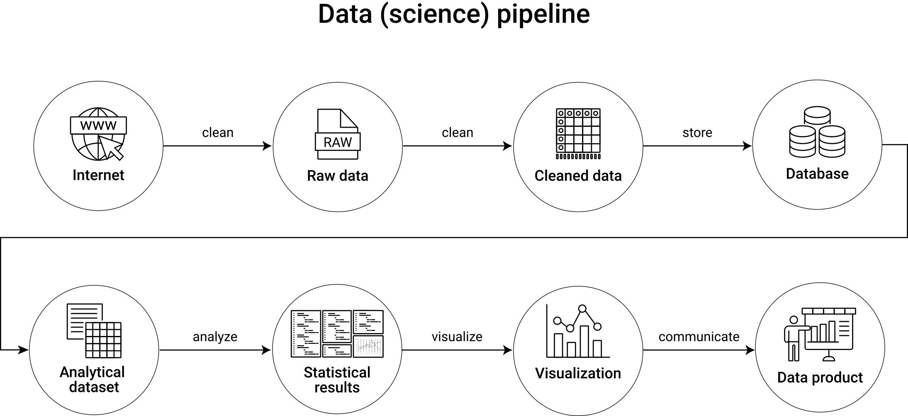
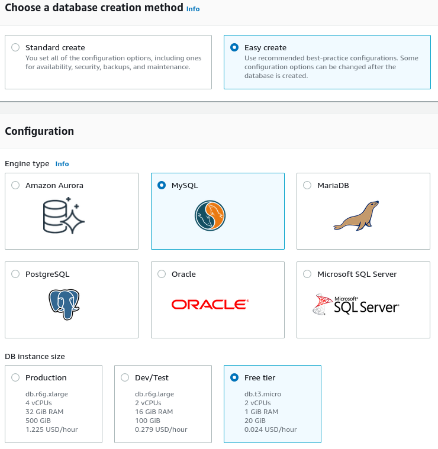
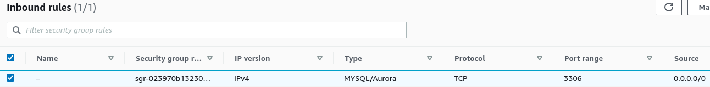
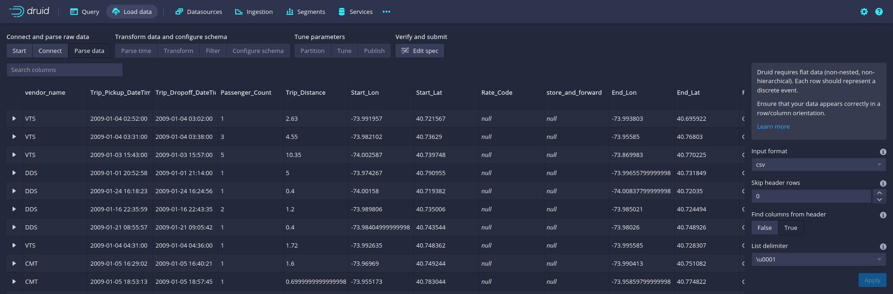

# (PART) Components of Big Data Analytics {-} 

# Introduction {.unnumbered}  


>"Men at some time are masters of their fates. 
The fault, dear Brutus, is not in our stars, 
but in ourselves, that we are underlings."[@shakespeare2020julius]

Working with the complexity and size of Big Data is rarely as overwhelming and intimidating as when collecting and preparing the data for analysis.
Even when working with small datasets, collecting and preparing data for analysis can easily consume more than two-thirds of an analytics project's time.
Larger datasets make the time-consuming tasks preceding the actual statistical analysis even more difficult, as the common tools and workflows for dealing with large datasets at the beginning of a project become overwhelmed and rendered useless. 

In this part we aim to tackle these challenges by combining the conceptual basics of part I with the platform basics in part II and look at each practical step involved in analyzing Big Data in the context of applied econometrics/business analytics. Thereby, the focus is primarily on how to handle Big Data in order to gather, prepare, combine, filter, visualize, and summarize it for analytics purposes. That is, we cover all core practical tasks necessary before running more sophisticated econometric analyses or machine learning algorithms on the data. Each of these core tasks is summarized in a separate chapter, whereby the sequence of chapters follows a typical workflow/process in applied data science, usually referred to as *data pipeline*\index{Data Pipeline}. 

The data pipeline concept is useful to illustrate and organize the process from gathering/extracting the raw data from various data sources to the final analytics output. The concept of data pipelines thus helps us to structure all steps involved in a meaningful way. Figure \@ref(fig:datapipeline) illustrates the data pipeline idea, which is consistent with the order and content of how the chapters in this book cover all the tasks involved in the first steps of a Big Data Analytics project. Initial, intermediate and final data entities are displayed as nodes in the flow diagram, and tasks/activities between these entities are displayed as arrows.   

```{r datapipeline, echo=FALSE, out.width = "99%", fig.align='center', fig.cap= "(ref:datapipeline)", purl=FALSE}

```

(ref:datapipeline) Illustration of a generic data pipeline in a data analytics project.

In many domains of modern data science, data pipelines also involve loops, indicating that certain parts of the overall process are iterative and repeated several times to further optimize and maintain the final data product. Such a perspective is typical in a context where the final data product is a dashboard or a (component of a) web application that is at some point deployed and runs in production. For the perspective of this book, we intentionally follow an acyclical concept of the data pipeline, representative of data projects in business analytics and applied economic research, in which raw data needs to be collected, processed, and analyzed with the aim of delivering statistical insights summarized in a report or presentation. In that sense, each chapter in this part builds on the previous one, and I recommend going through these chapters sequentially.

Note, though, that in your work it might make sense to slightly re-arrange some parts of the workflow suggested by the generic data pipeline illustrated here. In particular, you might want to first systematically collect and store all of the needed data and then only selectively load and transform/clean parts of this data for analysis (an approach usually referred to as  *Extract-Load-Transform (ELT)*\index{Extract-Load-Transform (ELT)}, or, in contrast, you might want to directly clean all the gathered data and store all of the cleaned/prepared data in a cleanly structured database before turning to any analytics steps (as the pipeline illustration above would suggest, and which is typically referred to as *Extract-Transform-Load (ETL)*\index{Extract-Transform-Load (ETL)}).


:::: {.infobox data-latex=""}
::: {.center data-latex=""}
**Aside: ETL vs. ELT**
:::

In traditional business analytics, a company's raw/unstructured data was typically handled and prepared by IT specialists and then provided in a final clean/transformed analytic dataset to the data analysts. Such a process can generally be described as *Extract-Transform-Load (ETL)*\index{Extract-Transform-Load (ETL)}. In ETL the data analyst is only presented with the final well-structured database containing all variables and observations (e.g., in a traditional SQL database). The data pipeline illustration above basically follows the ETL idea in the sense that raw data is gathered/extracted, then cleaned, and then stored in a structured format before it is queried and analyzed. With large amounts of data from various sources with frequent updating (as is typical for Big Data), this process is rather slow and might be inefficient in the sense that parts of the raw data might in the end not play an important role in the data analytics project. 

Nowadays, with data analysts and data scientists being increasingly familiar with data technologies and how to handle raw/unstructured data, a more flexible process called *Extract-Load-Transform (ELT)*\index{Extract-Load-Transform (ELT)} is followed. In ELT, raw data is extracted and then ingested into/stored in more flexible frameworks than traditional SQL databases that allow for more diverse data structures, such as data warehouses, or do not require the data to be structured, such as data lakes. The transformation of the data for analytics purposes is then done on demand and practically often involves the same person later analyzing the data. 

Importantly, for the perspective on data analytics in this book, either process involves the components illustrated in the pipeline above in one way or another. However, the order of the individual steps varies between ETL\index{Extract-Transform-Load (ETL)} and ELT\index{Extract-Load-Transform (ELT)}. 


::::


# Data Collection and Data Storage
\index{Data Storage}

The first steps of a data analytics project typically deal with the question of how to collect, organize, and store the raw data for further processing. In this chapter, we cover several approaches to how to practically implement these steps in the context of observational data, as they commonly occur in applied econometrics and business analytics. Thereby, the focus lies on several important aspects of how to implement these steps locally and then introduces several useful cloud tools to store and query large amounts of data for analytics purposes. 


## Gathering and compilation of raw data

The NYC Taxi & Limousine Commission (TLC) provides detailed data on all trip records, including pick-up and drop-off times/locations. When combining all available trip records from 2009 to 2018, we get a rather large dataset of over 200GB. The code examples below illustrate how to collect and compile the entire dataset. In order to avoid long computing times, the code examples shown below are based on a small sub-set of the actual raw data (however, all examples involving virtual memory are in theory scalable to the extent of the entire raw dataset).

The raw data consists of several monthly Parquet\index{Parquet} files and can be downloaded via the [TLC's website](https://www1.nyc.gov/site/tlc/about/tlc-trip-record-data.page). The following short R script automates the downloading of all available trip-record files. *NOTE*: Downloading all files can take several hours and will occupy over 200GB!


```{r wrap-hook, echo=FALSE, warning=FALSE, message=FALSE, eval=FALSE}
library(knitr)
hook_output = knit_hooks$get('output')
knit_hooks$set(output = function(x, options) {
  # this hook is used only when the linewidth option is not NULL
  if (!is.null(n <- options$linewidth)) {
    x = xfun::split_lines(x)
    # any lines wider than n should be wrapped
    if (any(nchar(x) > n)) x = strwrap(x, width = n)
    x = paste(x, collapse = '\n')
  }
  hook_output(x, options)
})
hook_message = knit_hooks$get('message')
knit_hooks$set(output = function(x, options) {
  # this hook is used only when the linewidth option is not NULL
  if (!is.null(n <- options$linewidth)) {
    x = xfun::split_lines(x)
    # any lines wider than n should be wrapped
    if (any(nchar(x) > n)) x = strwrap(x, width = n)
    x = paste(x, collapse = '\n')
  }
  hook_message(x, options)
})
hook_warning = knit_hooks$get('warning')
knit_hooks$set(output = function(x, options) {
  # this hook is used only when the linewidth option is not NULL
  if (!is.null(n <- options$linewidth)) {
    x = xfun::split_lines(x)
    # any lines wider than n should be wrapped
    if (any(nchar(x) > n)) x = strwrap(x, width = n)
    x = paste(x, collapse = '\n')
  }
  hook_warning(x, options)
})
hook_source = knit_hooks$get('source')
knit_hooks$set(output = function(x, options) {
  # this hook is used only when the linewidth option is not NULL
  if (!is.null(n <- options$linewidth)) {
    x = xfun::split_lines(x)
    # any lines wider than n should be wrapped
    if (any(nchar(x) > n)) x = strwrap(x, width = n)
    x = paste(x, collapse = '\n')
  }
  hook_source(x, options)
})
```


```{r eval=FALSE, tidy=TRUE, tidy.opts=list(arrow=TRUE, width.cutoff=60)}

# Fetch all TLC trip records
# Data source: 
# https://www1.nyc.gov/site/tlc/about/tlc-trip-record-data.page
# Input: Monthly Parquet files from urls

# SET UP -----------------

# packages
library(R.utils) # to create directories from within R

# fix vars
BASE_URL <- "https://d37ci6vzurychx.cloudfront.net/trip-data/"
FILE <- "yellow_tripdata_2018-01.parquet"
URL <- paste0(BASE_URL, FILE)
OUTPUT_PATH <- "data/tlc_trips/"
START_DATE <- as.Date("2009-01-01")
END_DATE <- as.Date("2018-06-01")


# BUILD URLS -----------

# parse base url
base_url <- gsub("2018-01.parquet", "", URL)
# build urls
dates <- seq(from= START_DATE,
                   to = END_DATE,
                   by = "month")
year_months <- gsub("-01$", "", as.character(dates))
data_urls <- paste0(base_url, year_months, ".parquet")
data_paths <- paste0(OUTPUT_PATH, year_months, ".parquet")

# FETCH AND STACK CSVS ----------------

mkdirs(OUTPUT_PATH)
# download all csvs in the data range
for (i in 1:length(data_urls)) {
     
     # download to disk
     download.file(data_urls[i], data_paths[i])
}


```


## Stack/combine raw source files

In a next step, we parse and combine the downloaded data. Depending on how you want to further work with the gathered data, one or another storage format might be more convenient. For the sake of illustration (and the following examples building on the downloaded data), we store the downloaded data in one CSV file. To this end, we make use of the `arrow` package\index{arrow Package} [@richardson_etal2022], an R interface to the Apache Arrow\index{Apache Arrow} C++\index{C++} library (a platform to work with large-scale columnar data). The aim of the exercise is to combine the downloaded Parquet\index{Parquet} files into one compressed CSV\index{CSV (Comma Separated Values)} file, which will be more easily accessible for some of the libraries used in further examples.

We start by installing the `arrow` package\index{arrow Package}  in the following way.

```{r eval=FALSE}
# install arrow
Sys.setenv(LIBARROW_MINIMAL = "false") # to enable working with compressed files
install.packages("arrow") # might take a while

```

The setting `LIBARROW_MINIMAL= "false"` ensures that the installation of arrow is not restricted to the very basic functionality of the package. Specifically, for our context it will be important that the `arrow`\index{arrow Package}  installation allows for the reading of compressed files.

```{r message=FALSE, warning=FALSE}

# SET UP ---------------------------

# load packages
library(arrow)
library(data.table)
library(purrr)

# fix vars
INPUT_PATH <- "data/tlc_trips/"
OUTPUT_FILE <- "data/tlc_trips.parquet"
OUTPUT_FILE_CSV <- "data/tlc_trips.csv"

# list of paths to downloaded Parquet files
all_files <- list.files(INPUT_PATH, full.names = TRUE)

# LOAD, COMBINE, STORE ----------------------

# read Parquet files
all_data <- lapply(all_files, read_parquet, as_data_frame = FALSE)

# combine all arrow tables into one
combined_data <- lift_dl(concat_tables)(all_data)

# write combined dataset to csv file
write_csv_arrow(combined_data,
                file = OUTPUT_FILE_CSV, 
                include_header = TRUE)

```
Note that in the code example above we use `purr::lift_dl()`\index{lift\_dl()} to facilitate the code. The `arrow` function `concat_tables`\index{concat\_tables()} combines several table objects into one table.


:::: {.infobox data-latex=""}
::: {.center data-latex=""}
**Aside: CSV import and memory allocation, read.csv vs. fread**
:::

\index{CSV Import}

The time needed for the simple step of importing rather large CSV files can vary substantially in R, depending on the function/package used. The reason is that there are different ways to allocate RAM when reading data from a CSV file. Depending on the amount of data to be read in, one or another approach might be faster. We first investigate the RAM\index{Random Access Memory (RAM)} allocation in R with `mem_change()`\index{mem\_change()} and `mem_used()`\index{mem\_used()}.

```{r}

# SET UP -----------------

# fix variables
DATA_PATH <- "data/flights.csv"
# load packages
library(pryr) 
# check how much memory is used by R (overall)
mem_used()

# DATA IMPORT ----------------
# check the change in memory due to each step
# and stop the time needed for the import
system.time(flights <- read.csv(DATA_PATH))
mem_used()

# DATA PREPARATION --------
flights <- flights[,-1:-3]
# check how much memory is used by R now
mem_used()
```

The last result is rather interesting. The object `flights` must have been larger right after importing it than at the end of the script. We have thrown out several variables, after all. Why does R still use that much memory? R does not by default 'clean up' memory unless it is really necessary (meaning no more memory is available). In this case, R still has much more memory available from the operating system; thus there is no need to 'collect the garbage' yet. However, we can force R to collect the garbage on the spot with `gc()`. This can be helpful to better keep track of the memory needed by an analytics script.

```{r}
gc()
```


Now, let's see how we can improve the performance of this script with regard to memory allocation. Most memory is allocated when importing the file. Obviously, any improvement of the script must still result in importing all the data. However, there are different ways to read data into RAM. `read.csv()`\index{read.csv()} reads all lines of a csv file consecutively. In contrast, `data.table::fread()`\index{fread()} first 'maps' the data file into memory and only then actually reads it in line by line. This involves an additional initial step, but the larger the file, the less relevant is this first step in the total time needed to read all the data into memory. By switching on the `verbose` option, we can actually see what `fread` is doing.

```{r freadverbose, linewidth=50, eval=FALSE}
# load packages
library(data.table)

# DATA IMPORT ----------------
system.time(flights <- fread(DATA_PATH, verbose = TRUE))

```

```{r freadnonverbose, linewidth=50, eval=TRUE, echo=FALSE}
# load packages
library(data.table)

# DATA IMPORT ----------------
system.time(flights <- fread(DATA_PATH, verbose = FALSE))

```


The output displayed on the console shows what is involved in steps `[1]` to `[12]` of the parsing/import procedure. Note in particular the following line under step `[7]` in the procedure:

```
Estimated number of rows: 30960501 / 92.03 = 336403
 Initial alloc = 370043 rows (336403 + 9%) using 
 bytes/max(mean-2*sd,min) clamped between [1.1*estn, 2.0*estn]
```

This is the result of the above-mentioned preparatory step in the form of sampling. The `fread` CSV parser first estimates how large the dataset likely is and then creates an additional allocation (in this case of `370043 rows`). Only after this are the rows actually imported into RAM. The summary of the time allocated for the different steps shown at the bottom of the output nicely illustrates that the preparatory steps of memory mapping\index{Memory Mapping} and allocation are rather fast compared with the time needed to actually read the data into RAM. Given the size of the dataset, `fread`'s\index{fread()} approach to memory allocation results in a much faster import of the dataset than `read.csv`'s\index{read.csv()} approach.


::::


## Efficient local data storage


<!-- So far, we have primarily been concerned with situations in which a dataset is too large to fit into RAM, making the analysis of this data either impossible or very slow (inefficient) when using standard tools. Thus, we have explored concepts and tools that help us use the available RAM (and virtual memory) most efficiently for data analysis tasks. -->


In this section, we are concerned with a) how we can store large datasets permanently on a mass storage device in an efficient way (here, efficient can be understood as 'not taking up too much space') and b) how we can load (parts of) this dataset in an efficient way (here, efficient~fast) for analysis.

We look at this problem in two situations: 

 - The data needs to be stored locally (e.g., on the hard disk of our laptop).
 - The data can be stored on a server 'in the cloud'.

Various tools have been developed over the last few years to improve the efficiency of storing and accessing large amounts of data, many of which go beyond the scope implied by this book's perspective on applied data analytics. Here, we focus on the basic concept of *SQL/Relational Database Management Systems (RDBMSs)*\index{Relational Database Management Systems (RDBMSs)}, as well as a few alternatives that can be summarized under the term *NoSQL ('non-SQL', sometimes 'Not only SQL')*\index{NoSQL} database systems. Conveniently (and contrary to what the latter name would suggest), most of these tools can be worked with by using basic SQL queries to load/query data. 

The relational database system follows the relational data model, in which the data is organized in several tables that are connected via some unique data record identifiers (keys). Such systems, for example, SQLite\index{SQLite} introduced in Chapter 3, have been used for a long time in all kinds of business and analytics contexts. They are well-tried and stable and have a large and diverse user base. There are many technicalities involved in how they work under the hood, but for our purposes three characteristics are most relevant:

 1. All common RDBMSs\index{Relational Database Management Systems (RDBMSs)}, like SQLite\index{SQLite} and MySQL\index{MySQL}, are *row-based* databases\index{Row-Based Databases}. That is, data is thought of as observations/data records stored in rows of a table. One record consists of one row. 
 2. They are typically made for storing clean data in a *clearly defined set of tables*, with clearly defined properties. The organizing of data in various tables has (at least for our perspective here) the aim of avoiding redundancies and thereby using the available storage space more efficiently.
 3. Rows are *indexed* according to the unique identifiers of tables (or one or several other variables in a table). This allows for fast querying of specific records and efficient merging/joining of tables.
 
While these particular features work very well also with large amounts of data, particularly for exploration and data preparation (joining tables), in the age of Big Data they might be more relevant for operational databases (in the back-end of web applications, or simply the operational database of a business) than for the specific purpose of data analytics. 

On the one hand, the data basis of an analytics project might be simpler in terms of the number of tables involved. On the other hand, Big Data, as we have seen, might come in less structured and/or more complex forms than traditional table-like/row-based data. *NoSQL*\index{NoSQL} databases have been developed for the purposes of storing more complex/less structured data, which might not necessarily be described as a set of tables connected via keys, and for the purpose of fast analysis of large amounts of data. Again, three main characteristics of these types of databases are of particular relevance here:

 1. Typically, *NoSQL*\index{NoSQL} databases are not row-based, but follow a *column-based*\index{Column-Based Databases}, document-based, key-value-based, or graph-based data model. In what follows, the column-based model is most relevant.
 2. *NoSQL* databases are designed for horizontal scaling. That is, scaling such a database out over many nodes of a computing cluster is usually straightforward.
 3. They are optimized to give quick answers based on summarizing large amounts of data, such as frequency counts and averages (sometimes by using approximations rather than exact computations.)

Figure \@ref(fig:columnvsrow) illustrates the basic concept of row-based vs. column-based data storage.


```{r columnvsrow, echo=FALSE, out.width = "99%", fig.align='center', fig.cap="(ref:columnvsrow)", purl=FALSE}
include_graphics("img/column_v_rowbased.png")
```

(ref:columnvsrow) Schematic illustration of columnar vs. row-based data storage.


:::: {.infobox data-latex=""}
::: {.center data-latex=""}
**Aside: Row-based vs. column-based databases**
:::


Conceptually, in a *row-based database*\index{Row-Based Databases} individual values (cells) are contained in rows, which means changing one value requires updating a row. Row-based databases (e.g., SQLite) are thus designed for efficient data reading and writing when users often access many columns but rather few observations. For example, for an operational database in the back-end of a web application such as an online shop, a row-based approach makes sense because hundreds or thousands of users (customers in that case) constantly add or query small amounts of data. In contrast, changing a value in *column-based* databases\index{Column-Based Databases} means changing a column. Accessing all values in a particular column is much faster in comparison to row-based databases. 

This means that column-based databases are useful when users tend to query rather few columns but massive numbers of observations, which is typically rather the case in an analytics context. Some well-known data warehouse and data lake systems are therefore based on this principle (e.g., Google BigQuery). However, if analytics tasks involve a lot of (out-of-memory) table joins, column-based solutions are likely to be slower than row-based solutions. 

::::

In the following, we have a close look at using both column-based and row-based tools. Thereby we will particularly highlight the practical differences between using column-based and row-based data storage solutions. 


### RDBMS basics

RDBMSs\index{Relational Database Management Systems (RDBMSs)} have two key features that tackle the two efficiency concerns mentioned above:

- The *relational data model*\index{Relational Data Model}: The overall dataset is split by columns (covariates) into tables in order to reduce the storage of redundant variable-value repetitions. The resulting database tables are then linked via key-variables (unique identifiers). Thus (simply put), each type of entity on which observations exist resides in its own database table. Within this table, each observation has its unique ID. Keeping the data in such a structure is very efficient in terms of storage space used. 

- *Indexing*\index{Indexing (SQL)}: The key-columns of the database tables are indexed, meaning (in simple terms) ordered on disk. Indexing a table takes time, but it has to be performed only once (unless the content of the table changes). The resulting index is then stored on disk as part of the database. These indices substantially reduce the number of disk accesses required to query/find specific observations. Thus, they make the loading of specific parts of the data for analysis much more efficient.

The loading/querying of data from an RDBMS\index{Relational Database Management Systems (RDBMSs)} typically involves the selection of specific observations (rows) and covariates (columns) from different tables. Due to the indexing, observations are selected efficiently, and the defined relations between tables (via keys) facilitate the joining of columns to a new table (the queried data).


### Efficient data access: Indices and joins in SQLite

So far we have only had a look at the very basics of writing SQL code. Let us now further explore SQLite\index{SQLite} as an easy-to-use and easy-to-set-up relational database solution. In a second step we then look at how to connect to a local SQLite\index{SQLite} database from within R. First, we switch to the Terminal tab in RStudio, set up a new database called `air.sqlite`, and import the csv-file `flights.csv` (used in previous chapters) as a first table.

```{bash echo=TRUE, eval=FALSE, purl=FALSE, purl=FALSE}
# switch to data directory
cd data
# create database and run sqlite
sqlite3 air.sqlite

```


```{sql connection=con, eval = FALSE, purl=FALSE, purl=FALSE}
-- import csvs
.mode csv
.import flights.csv flights
```


```{r echo=FALSE, message=FALSE, purl=FALSE, purl=FALSE}
library(DBI)
# set up a connection for the examples
con_air <- dbConnect(RSQLite::SQLite(), "data/air_final.sqlite")
```

We check whether everything worked out well via the `.tables` and `.schema` commands.


```{sql connection=con_air, eval = FALSE, purl=FALSE}
.tables
.schema flights
```

In `flights`, each row describes a flight (the day it took place, its origin, its destination, etc.). It contains a covariate `carrier` containing the unique ID of the respective airline/carrier carrying out the flight as well as the covariates `origin` and `dest`. The latter two variables contain the unique IATA-codes of the airports from which the flights departed and where they arrived, respectively. In `flights` we thus have observations at the level of individual flights.

Now we extend our database in a meaningful way, following the relational data model idea. First we download two additional CSV files containing data that relate to the flights table:

- [`airports.csv`](http://stat-computing.org/dataexpo/2009/airports.csv): Describes the locations of US Airports (relates to `origin` and `dest`).
- [`carriers.csv`](http://stat-computing.org/dataexpo/2009/carriers.csv): A listing of carrier codes with full names (relates to the `carrier`-column in `flights`).


```{r echo=FALSE, eval=FALSE, purl=FALSE}
# ASA source
URL_AIRPORTS <- "http://stat-computing.org/dataexpo/2009/airports.csv"
URL_CARRIERS <- "http://stat-computing.org/dataexpo/2009/carriers.csv"

# download
download.file(URL_AIRPORTS, destfile = "data/airports.csv", quiet = TRUE)
download.file(URL_CARRIERS, destfile = "data/carriers.csv", quiet = TRUE)

# re-format (facilitates import)
library(data.table)
fwrite(fread("data/airports.csv"), "data/airports.csv")
fwrite(fread("data/carriers.csv"), "data/carriers.csv")

```


In this code example, the two CSVs have already been downloaded to the `materials/data`-folder.

```{sql connection=con_air, eval = FALSE, purl=FALSE}
-- import airport data
.mode csv
.import airports.csv airports
.import carriers.csv carriers

-- inspect the result
.tables
.schema airports
.schema carriers
```

Now we can run our first query involving the relation between tables. The aim of the exercise is to query flights data (information on departure delays per flight number and date, from the `flights` table) for all `United Air Lines Inc.` flights (information from the `carriers` table) departing from `Newark Intl` airport (information from the `airports` table). In addition, we want the resulting table ordered by flight number. For the sake of the exercise, we only show the first 10 results of this query (`LIMIT 10`).


```{sql connection=con_air, eval = TRUE, purl=FALSE, output.var="flights_join"}
SELECT 
year,
month, 
day,
dep_delay,
flight
FROM (flights INNER JOIN airports ON flights.origin=airports.iata) 
INNER JOIN carriers ON flights.carrier = carriers.Code
WHERE carriers.Description = 'United Air Lines Inc.'
AND airports.airport = 'Newark Intl'
ORDER BY flight
LIMIT 10;

```


```{r}
flights_join
```


Note that this query has been executed without indexing any of the tables first. Thus SQLite\index{SQLite} could not take any 'shortcuts' when matching the ID columns in order to join the tables for the query output. That is, SQLite\index{SQLite} had to scan all the columns to find the matches. Now we index the respective ID columns and re-run the query.


```{sql connection=con_air, eval = FALSE, purl=FALSE}
CREATE INDEX iata_airports ON airports (iata);
CREATE INDEX origin_flights ON flights (origin);
CREATE INDEX carrier_flights ON flights (carrier);
CREATE INDEX code_carriers ON carriers (code);

```


Note that SQLite\index{SQLite} optimizes the efficiency of the query without our explicit instructions. If there are indices it can use to speed up the query, it will do so.

```{sql connection=con_air, eval = TRUE, purl=FALSE, output.var="doublejoin_example"}
SELECT 
year,
month, 
day,
dep_delay,
flight
FROM (flights INNER JOIN airports ON flights.origin=airports.iata) 
INNER JOIN carriers ON flights.carrier = carriers.Code
WHERE carriers.Description = 'United Air Lines Inc.'
AND airports.airport = 'Newark Intl'
ORDER BY flight
LIMIT 10;

```

```{r echo=FALSE, warning=FALSE}
doublejoin_example
```


You can find the final `air.sqlite` database, including all the indices and tables, as `materials/data/air_final.sqlite` in the book's code repository.

## Connecting R to an RDBMS
\index{Relational Database Management Systems (RDBMSs)}

The R-package `RSQLite`\index{RSQLite Package} [@RSQLite] embeds SQLite\index{SQLite} in R. That is, it provides functions that allow us to use SQLite\index{SQLite} directly from within R. You will see that the combination of SQLite\index{SQLite} with R is a simple but very practical approach to working with very efficiently (and locally) stored datasets. In the following example, we explore how `RSQLite`\index{RSQLite Package} can be used to set up and query the `air.sqlite` database shown in the example above.


### Creating a new database with `RSQLite`
\index{RSQLite Package}

Similarly to the raw SQLite\index{SQLite} syntax, we connect to a database that does not exist yet actually creates this (empty database). Note that for all interactions with the database from within R, we need to refer to the connection (here: `con_air`).

```{r}
# load packages
library(RSQLite)

# initialize the database
con_air <- dbConnect(SQLite(), "data/air.sqlite")
```

### Importing data

With `RSQLite`\index{RSQLite Package} we can easily add `data.frame`s as SQLite\index{SQLite} tables to the database.

```{r eval=FALSE}

# import data into current R session
flights <- fread("data/flights.csv")
airports <- fread("data/airports.csv")
carriers <- fread("data/carriers.csv")

# add tables to database
dbWriteTable(con_air, "flights", flights)
dbWriteTable(con_air, "airports", airports)
dbWriteTable(con_air, "carriers", carriers)

```

### Issuing queries

Now we can query the database from within R. By default, `RSQLite`\index{RSQLite Package} returns the query results as `data.frame`s. Queries are simply character strings written in SQLite\index{SQLite}.

```{r eval=FALSE}
# define query
delay_query <-
"SELECT 
year,
month, 
day,
dep_delay,
flight
FROM (flights INNER JOIN airports ON flights.origin=airports.iata) 
INNER JOIN carriers ON flights.carrier = carriers.Code
WHERE carriers.Description = 'United Air Lines Inc.'
AND airports.airport = 'Newark Intl'
ORDER BY flight
LIMIT 10;
"

# issue query
delays_df <- dbGetQuery(con_air, delay_query)
delays_df

# clean up
dbDisconnect(con_air)

```

```{r echo=FALSE}
# clean up
unlink("data/air.sqlite")
```

When done working with the database, we close the connection to the database with `dbDisconnect(con)`\index{dbDisconnect()}. 


## Cloud solutions for (big) data storage

As outlined in the previous section, RDBMSs\index{Relational Database Management Systems (RDBMSs)} are a very practical tool for storing the structured data of an analytics project locally in a database. A local SQLite\index{SQLite} database can easily be set up and accessed via R, allowing one to write the whole data pipeline – from data gathering to filtering, aggregating, and finally analyzing – in R. In contrast to directly working with CSV\index{CSV (Comma Separated Values)} files, using SQLite\index{SQLite} has the advantage of organizing the data access much more efficiently in terms of RAM\index{Random Access Memory (RAM)}. Only the final result of a query is really loaded fully into R's memory.

If mass storage space is too sparse or if RAM is nevertheless not sufficient, even when organizing data access via SQLite, several cloud solutions come to the rescue. Although you could also rent a traditional web server and host a SQL database there, this is usually not worthwhile for a data analytics project. In the next section we thus look at three important cases of how to store data as part of an analytics project: *RDBMS in the cloud*, a serverless *data warehouse*\index{Data Warehouse} solution for large datasets called *Google BigQuery*\index{Google BigQuery}, and a simple storage service to use as a *data lake*\index{Data Lake} called *AWS S3*\index{Simple Storage Service (S3)}. All of these solutions are discussed from a data analytics perspective, and for all of these solutions we will look at how to make use of them from within R.


### Easy-to-use RDBMS in the cloud: AWS RDS

Once we have set up the RStudio server on an EC2\index{EC2} instance, we can run the SQLite\index{SQLite} examples shown above on it. There are no additional steps needed to install SQLite\index{SQLite}. However, when using RDBMSs\index{Relational Database Management Systems (RDBMSs)} in the cloud, we typically have a more sophisticated implementation than SQLite\index{SQLite} in mind. Particularly, we want to set up an actual RDBMS\index{Relational Database Management Systems (RDBMSs)} server running in the cloud to which several clients can connect (e.g., via RStudio Server). 

AWS's Relational Database Service (RDS)\index{Relational Database Service (RDS)} provides an easy way to set up and run a SQL database in the cloud. The great advantage for users new to RDBMS/SQL\index{Relational Database Management Systems (RDBMSs)} is that you do not have to manually set up a server (e.g., an EC2\index{EC2} instance) and install/configure the SQL server. Instead, you can directly set up a fully functioning relational database in the cloud. 

As a first step, open the AWS console and search for/select "RDS" in the search bar. Then, click on "Create database" in the lower part of the landing page.


```{r rdscreate, echo=FALSE, out.width = "90%", fig.align='center', fig.cap= "(ref:rdscreate)", purl=FALSE}
include_graphics("img/aws_rds_create.png")
```

(ref:rdscreate) Create a managed relational database on AWS RDS.

On the next page, select "Easy create", "MySQL"\index{MySQL}, and the "Free tier" DB instance size. Further down you will have to set the database instance identifier, the user name, and a password.

```{r rdseasy, echo=FALSE, out.width = "70%", fig.align='center', fig.cap= "(ref:rdseasy)", purl=FALSE}

```

(ref:rdseasy) Easy creation of an RDS MySQL DB.


Once the database instance is ready, you will see it in the databases overview. Click on the DB identifier (the name of your database shown in the list of databases), and click on modify (button in the upper-right corner). In the "Connectivity" panel under "Additional configuration", select *Publicly accessible* (this is necessary to interact with the DB from your local machine), and save the settings. Back on the overview page of your database, under "Connectivity & security", click on the link under the VPC security groups, scroll down and select the "Inbound rules" tab. Edit the inbound rule to allow any IP4 inbound traffic.^[Note that this is not generally recommended. Only do this to get familiar with the service and to test some code.] 


```{r rdsinboundrules, echo=FALSE, out.width = "99%", fig.align='center', fig.cap= "(ref:rdsinboundrules)", purl=FALSE}

```

(ref:rdsinboundrules) Allow all IP4 inbound traffic (set Source to `0.0.0.0/0`).


<!-- Now we can connect to the instance via the `RMySQL`\index{RMySQL Package} package [@RMySQL]. Before loading data, we first have to initialize a new database (in contrast, this is done automatically when connecting to a SQLite database). -->


```{r message=FALSE, warning=FALSE, echo=FALSE, eval=FALSE}
# load packages
library(RMySQL)

# fix vars
RDS_ENDPOINT <- readLines("_keys/aws_rds.txt")[1]
PW <- readLines("_keys/aws_rds.txt")[2]

# connect to DB
con_rds <- dbConnect(RMySQL::MySQL(),
                 host=RDS_ENDPOINT,
                 port=3306,
                 username="admin",
                 password=PW)

# create a new database on the MySQL RDS instance
dbSendQuery(con_rds, "CREATE DATABASE IF NOT EXISTS air")

# disconnect and re-connect directly to the new DB
dbDisconnect(con_rds)
con_rds <- dbConnect(RMySQL::MySQL(),
                 host=RDS_ENDPOINT,
                 port=3306,
                 username="admin",
                 dbname="air",
                 password=PW)

```


```{r message=FALSE, warning=FALSE, eval=FALSE}
# load packages
library(RMySQL)
library(data.table)

# fix vars
# replace this with the Endpoint shown in the AWS RDS console
RDS_ENDPOINT <- "MY-ENDPOINT" 
# replace this with the password you have set when initiating the RDS DB on AWS
PW <- "MY-PW" 

# connect to DB
con_rds <- dbConnect(RMySQL::MySQL(),
                 host=RDS_ENDPOINT,
                 port=3306,
                 username="admin",
                 password=PW)

# create a new database on the MySQL RDS instance
dbSendQuery(con_rds, "CREATE DATABASE air")

# disconnect and re-connect directly to the new DB
dbDisconnect(con_rds)
con_rds <- dbConnect(RMySQL::MySQL(),
                 host=RDS_ENDPOINT,
                 port=3306,
                 username="admin",
                 dbname="air",
                 password=PW)
```


`RMySQL`\index{RMySQL} and `RSQLite` both build on the `DBI`\index{DBI Package} package, which generalizes how we can interact with SQL-type databases via R. This makes it straightforward to apply what we have learned so far by interacting with our local SQLite\index{SQLite} database to interactions with other databases. As soon as the connection to the new database is established, we can essentially use the same R functions as before to create new tables and import data.


```{r eval=FALSE}
# import data into current R session
flights <- fread("data/flights.csv")
airports <- fread("data/airports.csv")
carriers <- fread("data/carriers.csv")

# add tables to database
dbWriteTable(con_rds, "flights", flights)
dbWriteTable(con_rds, "airports", airports)
dbWriteTable(con_rds, "carriers", carriers)
```

Finally, we can query our RDS MySQL database on AWS.

```{r eval=FALSE}
# define query
delay_query <-
"SELECT 
year,
month, 
day,
dep_delay,
flight
FROM (flights INNER JOIN airports ON flights.origin=airports.iata) 
INNER JOIN carriers ON flights.carrier = carriers.Code
WHERE carriers.Description = 'United Air Lines Inc.'
AND airports.airport = 'Newark Intl'
ORDER BY flight
LIMIT 10;
"

# issue query
delays_df <- dbGetQuery(con_rds, delay_query)
delays_df

# clean up
dbDisconnect(con_rds)

```


## Column-based analytics databases

As outlined in the discussion of row-based vs. column-based databases above, many data analytics tasks focus on few columns but many rows, hence making column-based databases the better option for large-scale analytics purposes. [Apache Druid](https://druid.apache.org/)\index{Apache Druid} [@Druid] is one such solution that has particular advantages for the data analytics perspective taken in this book. It can easily be run on a local machine (Linux and Mac/OSX), or on a cluster in the cloud, and it easily allows for connections to external data, for example, data stored on Google Cloud Storage. Moreover, it can be interfaced by `RDruid`\index{RDruid} [@RDruid] to run Druid queries from within R, or, yet again, Druid can be directly queried via SQL.

To get started with Apache Druid\index{Apache Druid}, navigate to [https://druid.apache.org/](https://druid.apache.org/). Under [downloads](https://druid.apache.org/downloads.html) you will find a link to download the latest stable release (at the time of writing this book: 25.0.0). On the Apache Druid landing page, you will also find a link [Quickstart](https://druid.apache.org/docs/latest/tutorials/index.html) with all the details regarding the installation and set up. Importantly, as of the time of writing this book, only Linux and MacOSX are supported (Windows is not supported).


### Installation and start up

On Linux, follow these steps to set up Apache Druid on your machine. First, open a terminal and download the Druid binary to the location in which you want to work with Druid. First, we download and unpack the current Apache Druid version via the terminal.

```{bash echo=FALSE, eval=FALSE}
# download druid binary
# (replace 25.0.0 with another version number to download another version)
wget https://dlcdn.apache.org/druid/25.0.0/apache-druid-25.0.0-bin.tar.gz
# unpack 
tar -xzf apache-druid-25.0.0-bin.tar.gz
# clean up
rm apache-druid-25.0.0-bin.tar.gz

```

Using Druid in its most basic form is then straightforward. Simply navigate to the unpacked folder and run  `./bin/start-micro-quickstart`.

```{bash, eval=FALSE}
# navigate to local copy of druid
cd apache-druid-25.0.0
# start up druid (basic/minimal settings)
./bin/start-micro-quickstart

```


### First steps via Druid's GUI


Once all Druid services are running, open a new browser window and navigate to `http://localhost:8888`. This will open Druid's graphical user interface (GUI). The GUI provides easy-to-use interfaces to all basic Druid services, ranging from the loading of data to querying via Druid's SQL. Figure \@ref(fig:druidstart) highlights the GUI buttons mentioned in the instructions below.

```{r druidstart, echo=FALSE, out.width = "99%", fig.align='center', fig.cap= "(ref:druidstart)", purl=FALSE}
include_graphics("img/druidstart.png")
```

(ref:druidstart) Apache Druid GUI starting page. White boxes highlight buttons for the Druid services discussed in the main text (from left to right): the query editor (run Druid SQL queries on any of the loaded data sources directly here); the data load service (use this to import data from local files); and the Datasources console (lists all currently available data sources).

#### Load data into Druid

In a first step, we will import the TLC taxi trips dataset from the locally stored CSV file. To do so, click on *Load data/Batch - classic*, then click on *Start new batch spec*, and then select *Local disk* and *Connect*. On the right side of the Druid GUI, a menu will open. In the `Base directory` field, enter the path to the local directory in which you have stored the TLC taxi trips CSV file used in the examples above (`../data/`).^[Importantly, recall that with this set up, Druid is currently running from within the `apache-druid-25.0.0`-directory. Hence, unless you have copied your data into this directory, you will have to explicitly point to data files outside of this directory (via `../`).] In the `File filter` field, enter `tlc_trips.csv`.^[The Druid service to load data by default allows you to point to various files here via the wildcard character (`*`). As we have stored all the taxi trip example data in one CSV file, we can directly point to this one file.] Finally click on the *Apply* button. 


```{r druidparse, echo=FALSE, out.width = "99%", fig.align='center', fig.cap= "(ref:druidparse)", purl=FALSE}

```

(ref:druidparse) Apache Druid GUI: CSV parse menu for classic batch data ingestion.

The first few lines of the raw data will appear in the Druid console. In the lower-right corner of the console, click on *Next: Parse data*. Druid will automatically guess the delimiter used in the CSV (following the examples above, this is `,`) and present the first few parsed rows.

If all looks good, click on *Next: Parse time* in the lower-right corner of the console. Druid is implemented to work particularly fast on time-series and panel data. To this end, it expects you to define a main time-variable in your dataset, which then can be used to index and partition your overall dataset to speed up queries for specific time frames. Per default, Druid will suggest using the first column that looks like a time format (in the TLC-data, this would be column 2, the pick-up time of a trip, which seems very reasonable for the sake of this example). We move on with a click on *Next: Transform* in the lower right corner. Druid allows you, right at the step of loading data, to add or transform variables/columns. As we do not need to change anything at this point, we continue with *Next: Filter* in the lower-right corner. At this stage you can filter out rows/observations that you are sure should not be included in any of the queries/analyses performed later via Druid.


For this example, we do not filter out any observations and continue via *Next: Configure schema* in the lower-right corner. Druid guesses the schema/data types for each column based on sampling the first few observations in the dataset. Notice, for example, how Druid considers `vendor_name` to be a `string` and `Trip_distance` to be a `double` (a 64-bit floating point number). In most applications of Druid for the data analytics perspective of this book, the guessed data types will be just fine. We will leave the data types as-is and keep the original column/variable names. You can easily change names of variables/columns by double-clicking on the corresponding column name, which will open a menu on the right-hand side of the console. With this, all the main parameters to load the data are defined. What follows has to do with optimizing Druid's\index{Apache Druid} performance.

Once you click on *Next: Partition* in the lower-right corner, you will have to choose the primary partitioning, which is always based on time (again, this has to do with Druid being optimized to work on large time-series and panel datasets). Basically, you need to decide whether the data should be organized into chunks per year, month, week, etc. For this example, we will segment the data according to months. To this end, from the drop-down menu under `Segment granularity`, choose `month`. For the rest of the parameters, we keep the default values. Continue by clicking on *Next: Tune* (we do not change anything here) and then on *Next: Publish*. In the menu that appears, you can choose the name under which the TLC taxi trips data should be listed in the *Datasources* menu on your local Druid installation, once all the data is loaded/processed. Thinking of SQL queries when working with Druid, the `Datasource name` is what you then will use in the `FROM` statement of a Druid SQL query (in analogy to a table name in the case of RDBMSs\index{Relational Database Management Systems (RDBMSs)} like SQLite\index{SQLite}). We keep the suggested name `tlc_trips`. Thus, you can click on *Edit spec* in the lower-right corner. An editor window will open and display all your load configurations as a JSON file. Only change anything at this step if you really know what you are doing. Finally, click on *Submit* in the lower-right corner. This will trigger the loading of data into Druid. As in the case of the RDBMS\index{Relational Database Management Systems (RDBMSs)} covered above, the data ingestion or data loading process primarily involves indexing and writing data to disk. It does not mean importing data to RAM\index{Random Access Memory (RAM)}. Since the CSV\index{CSV (Comma Separated Values)} file used in this example is rather large, this process can take several minutes on a modern laptop computer.

Once the data ingestion is finished, click on the *Datasources* tab in the top menu bar to verify the ingestion. The `tlc_trips` dataset should now appear in the list of data sources in Druid.

```{r druiddatasources, echo=FALSE, out.width = "99%", fig.align='center', fig.cap= "(ref:druiddatasources)", purl=FALSE}
include_graphics("img/druiddatasources.png")
```

(ref:druiddatasources) Apache Druid: Datasources console.


#### Query Druid via the GUI SQL console

Once the data is loaded into Druid, we can directly query it via the SQL console in Druid's GUI. To do this, navigate in Druid to *Query*. To illustrate the strengths of Druid as an analytic database, we run an extensive data aggregation query. Specifically, we count the number of cases (trips) per vendor and split the number of trips per vendor further by payment type.

```
SELECT
vendor_name,
Payment_Type,
COUNT(*) AS Count_trips
FROM tlc_trips
GROUP BY vendor_name, Payment_Type
```

Note that for such simple queries, Druid SQL is essentially identical to the SQL dialects covered in previous chapters and subsections, which makes it rather simple for beginners to start productively engaging with Druid. SQL queries can directly be entered in the query tab; a click on *Run* will send the query to Druid, and the results are shown right below.


```{r druidquery, echo=FALSE, out.width = "99%", fig.align='center', fig.cap= "(ref:druidquery)", purl=FALSE}
include_graphics("img/druidquery.png")
```

(ref:druidquery) Apache Druid query console with Druid-SQL example: count the number of cases per vendor and payment type.

Counting the number of taxi trips per vendor name and payment type implies using the entire dataset of over 27 million rows (1.5GB). Nevertheless, Druid needs less than a second and hardly any RAM to compute the results.

### Query Druid from R

Apache provides high-level interfaces to Druid for several languages common in data science/data analytics. The `RDruid` package provides such a Druid connector for R. The package can be installed from GitHub via the `devtools` package.

```{r eval=FALSE}
# install devtools if necessary
if (!require("devtools")) {
     install.packages("devtools")}

# install RDruid
devtools::install_github("druid-io/RDruid")
```

The `RDruid` package provides several high-level functions to issue specific Druid queries; however, the syntax might not be straightforward for beginners, and the package has not been further developed for many years. 

Thanks to Druid's basic architecture as a web application, however, there is a simple alternative to the `RDruid` package. Druid accepts queries via HTTP POST calls (with SQL queries embedded in a JSON file sent in the HTTP body). The data is then returned as a compressed JSON string in the HTTP response to the POST request. We can build on this to implement our own simple `druid()` function to query Druid from R.

```{r warning=FALSE, message=FALSE}
# create R function to query Druid (locally)
druid <- 
     function(query){
          # dependencies
          require(jsonlite)
          require(httr)
          require(data.table)
          
          # basic POST body
          base_query <-  
          '{
          "context": {
          "sqlOuterLimit": 1001,
          "sqlQueryId": "1"},
          "header": true,
          "query": "",
          "resultFormat": "csv",
          "sqlTypesHeader": false,
          "typesHeader": false
          }'
          param_list <- fromJSON(base_query)
          # add SQL query
          param_list$query <- query
          
          # send query; parse result
          resp <- POST("http://localhost:8888/druid/v2/sql", 
                       body = param_list, 
                       encode = "json")
          parsed <- fread(content(resp, as = "text", encoding = "UTF-8"))
          return(parsed)
     }

```


Now we can send queries to our local Druid installation. Importantly, Druid needs to be started up in order to make this work. In the example below we start up Druid from within R via `system("apache-druid-25.0.0/bin/start-micro-quickstart")` (make sure that the working directory is set correctly before running this). Then, we send the same query as in the Druid GUI example from above.


```{r warning=FALSE, message=FALSE}
# start Druid
system("apache-druid-25.0.0/bin/start-micro-quickstart",
       intern = FALSE, 
       wait = FALSE)
Sys.sleep(30) # wait for Druid to start up

# query tlc data
query <-
'
SELECT
vendor_name,
Payment_Type,
COUNT(*) AS Count_trips
FROM tlc_trips
GROUP BY vendor_name, Payment_Type
' 
result <- druid(query)

# inspect result
result

```


## Data warehouses 
\index{Data Warehouse}

Unlike  RDBMSs\index{Relational Database Management Systems (RDBMSs)}, the main purpose of data warehouses is usually analytics and not the provision of data for everyday operations. Generally, data warehouses contain well-organized and well-structured data, but are not as stringent as RMDBS when it comes to organizing data in relational tables. Typically, they build on a table-based logic, but allow for nesting structures and more flexible storage approaches. They are designed to contain large amounts of data (via horizontal scaling) and are usually column-based. From the perspective of Big Data Analytics taken in this book, there are several suitable and easily accessible data warehouse\index{Data Warehouse} solutions provided in the cloud. In the following example, we will introduce one such solution called *Google BigQuery*\index{Google BigQuery}.


### Data warehouse for analytics: Google BigQuery example
\index{Data Warehouse}
Google BigQuery is flexible regarding the upload and export of data and can be set up straightforwardly for a data analytics project with hardly any set up costs. The pricing schema is usage-based. Unless you store massive amounts of data on it, you will only be charged for the volume of data processed. Moreover, there is a straightforward R-interface to Google BigQuery\index{Google BigQuery} called [`bigrquery`](https://bigrquery.r-dbi.org/), which allows for the same R/SQL-syntax as R's interfaces to traditional relational databases. 


**Get started with `bigrquery`**

To get started with Google BigQuery\index{Google BigQuery} and `bigrquery`\index{bigrquery Package} [@bigrquery], go to https://cloud.google.com/bigquery. Click on "Try Big Query" (if new to this) or "Go to console" (if used previously). Create a Google Cloud project to use BigQuery\index{Google BigQuery} with. Note that, as in general for Google Cloud\index{Google Cloud Platform (GCP)} services, you need to have a credit card registered with the project to do this. However, for learning and testing purposes, Google Cloud\index{Google Cloud Platform (GCP)} offers 1TB of free queries per month. All the examples shown below combined will not exceed this free tier. Finally, run `install.packages("bigrquery")` in R.

To set up an R session to interface with BigQuery,\index{Google BigQuery} you need to indicate which Google BigQuery\index{Google BigQuery} project you want to use for the billing (the `BILLING` variable in the example below), as well as the Google BigQuery\index{Google BigQuery} project in which the data is stored that you want to query (the `PROJECT` variable below). This distinction is very useful because it easily allows you to query data from a large array of publicly available datasets on BigQuery. In the set up example code below, we use this option in order to access an existing and publicly available dataset (provided in the `bigquery-public-data` project) called `google_analytics_sample`. In fact, this dataset provides the raw Google Analytics data used in the Big-P example discussed in Chapter 2.

Finally, all that is left to do is to connect to BigQuery\index{Google BigQuery} via the already familiar `dbConnect()`\index{dbConnect()} function provided in `DBI`.^[The `bigrquery` package provides a DBI-driver for BigQuery\index{Google BigQuery}. For more advanced usage of `bigrquery`\index{bigrquery Package}, the package also provides lower-level functions to directly interact with the BigQuery API.] When first connecting to and querying BigQuery\index{Google BigQuery} with your Google Cloud\index{Google Cloud Platform (GCP)} account, a browser window will open, and you will be prompted to grant `bigrquery`\index{bigrquery Package} access to your account/project. To do so, you will have to be logged in to your Google account\index{Google Account}. See the **Important details** section on https://bigrquery.r-dbi.org/ for details on the authentication.  

```{r eval=FALSE, echo=FALSE}
# documents raw data processing

# load packages, credentials
library(bigrquery)
library(data.table)
library(DBI)

# fix vars
# the project ID on BigQuery (billing must be enabled):
BILLING <- "bda-examples" 
# the project name on BigQuery:
PROJECT <- "bigquery-public-data" 
DATASET <- "google_analytics_sample"

# connect to DB on BigQuery
con <- dbConnect(
     bigrquery::bigquery(),
     project = PROJECT,
     dataset = DATASET,
     billing = BILLING
)
```


```{r eval=FALSE, echo=TRUE}

# load packages, credentials
library(bigrquery)
library(data.table)
library(DBI)

# fix vars
# the project ID on BigQuery (billing must be enabled)
BILLING <- "bda-examples" 
# the project name on BigQuery
PROJECT <- "bigquery-public-data" 
DATASET <- "google_analytics_sample"

# connect to DB on BigQuery
con <- dbConnect(
     bigrquery::bigquery(),
     project = PROJECT,
     dataset = DATASET,
     billing = BILLING
)
```


**Get familiar with BigQuery**

The basic query syntax is now essentially identical to what we have covered in the RDBMS\index{Relational Database Management Systems (RDBMSs)} examples above.^[Minor but relevant exceptions are that `SQLite`, `MySQL`, and `BigQuery` do not provide all the same SQL commands. However, for all core operations to query and summarize data, the SQL syntax is essentially identical.] In this first query, we count the number of times a Google merchandise shop visit originates from a given web domain on August 1, 2017 (hence the query to table `ga_sessions_20170801`). Note the way we refer to the specific table (in the `FROM` statement of the query below): `bigquery-public-data` is the pointer to the BigQuery project, `google_analytics_sample` is the name of the data warehouse, and `ga_sessions_20170801` is the name of the specific table we want to query data from. Finally, note the argument `page_size=15000` as part of the familiar `dbGetQuery()` function. This ensures that `bigrquery` does not exceed the limit of volume per second for downloads via the Google BigQuery API (on which `bigrquery` builds).

```{r eval=FALSE}

# run query
query <-
"
SELECT DISTINCT trafficSource.source AS origin,
COUNT(trafficSource.source) AS no_occ
FROM `bigquery-public-data.google_analytics_sample.ga_sessions_20170801`
GROUP BY trafficSource.source
ORDER BY no_occ DESC;
"
ga <- as.data.table(dbGetQuery(con, query, page_size=15000))
head(ga)
```

Note the output displayed in the console. `bigrquery` indicates how much data volume was processed as part of the query (which indicates what will be charged to your billing project), 


**Upload data to BigQuery**

Storing your entire raw dataset on BigQuery is straightforward with `bigrquery`\index{bigrquery Package}. In the following simple example, we upload the previously gathered and locally stored TLC taxi trips data. To do so, we first create and connect to a new dataset on BigQuery. To keep things simple, we initialize the new dataset in the same project used for the billing.

```{r eval=FALSE}
# name of the dataset to be created
DATASET <- "tlc"

# connect and initialize a new dataset
con <- dbConnect(
     bigrquery::bigquery(),
     project = BILLING,
     billing = BILLING,
     dataset = DATASET
)
```

In a first step, we create the dataset to which we then can add the table. 

```{r eval=FALSE, echo=FALSE, message=FALSE, warning=FALSE}
tlc_ds <- bq_dataset(BILLING, DATASET)

if (bq_dataset_exists(tlc_ds)){
     bq_dataset_delete(tlc_ds)
}
```


```{r eval=FALSE}
tlc_ds <- bq_dataset(BILLING, DATASET)
bq_dataset_create(tlc_ds)
```


We then load the TLC dataset into R via `fread()` and upload it as a new table to your project/dataset on BigQuery via `bigrquery`. For the sake of the example, we only upload the first 10,000 rows.

```{r eval=FALSE}
# read data from csv
tlc <- fread("data/tlc_trips.csv.gz", nrows = 10000)
# write data to a new table
dbWriteTable(con, name = "tlc_trips", value = tlc)

```

Alternatively, you can easily upload data via the Google BigQuery console in the browser. Go to [https://console.cloud.google.com/bigquery](https://console.cloud.google.com/bigquery), select (or create) the project you want to upload data to, then in the *Explorer* section click on *+ ADD DATA*, and select the file you want to upload. You can either upload the data from disk, from Google Cloud Storage, or from a third-party connection. Uploading the data into BigQuery via Google Cloud Storage is particularly useful for large datasets.

Finally, we can test the newly created dataset/table with the following query


```{r eval=FALSE}
test_query <-
"
SELECT * 
FROM tlc.tlc_trips
LIMIT 10
"
test <- dbGetQuery(con, test_query)
```


**Tutorial: Retrieve and prepare Google Analytics data**

The following tutorial illustrates how the raw data for the Big-P example in Chapter 2 was collected and prepared via Google BigQuery and R. Before we get started, note an important aspect of a data warehouse solution like BigQuery in contrast to common applications of RDBS. As data warehouses are used in a more flexible way than relational databases, it is not uncommon to store data files/tables containing the same variables separately in various tables, for example to store one table per day or year of a panel dataset. On Google BigQuery, this partitioning of datasets into several components can additionally make sense for cost reasons. Suppose you want to only compute summary statistics for certain variables over a given time frame. If all observations of a large dataset are stored in one standard BigQuery table, such a query results in processing GBs or TBs of data, as the observations from the corresponding time frame need to be filtered out of the entire dataset. Partitioning the data into several subsets helps avoid this, as BigQuery has several features that allow the definition of SQL queries to be run on partitioned data. The publicly available Google Analytics dataset is organized in such a partitioned way. The data is stored in several tables (one for each day of the observation period), whereby the last few characters of the table name contain the date of the corresponding observation day (such as the one used in the example above: `ga_sessions_20170801`). If we want to combine data from several of those tables, we can use the wildcard character (`*`) to indicate that the BigQuery should consider all tables matching the table name up to the `*`:  `FROM bigquery-public-data.google_analytics_sample.ga_sessions_*`. 


We proceed by first connecting the R session with GoogleBigQuery.


```{r include=TRUE, eval=FALSE}
# fix vars
# the project ID on BigQuery (billing must be enabled)
BILLING <- "YOUR-BILLING-PROJECT-ID"
# the project name on BigQuery
PROJECT <- "bigquery-public-data" 
DATASET <- "google_analytics_sample"

# connect to DB on BigQuery
con <- dbConnect(
     bigrquery::bigquery(),
     project = PROJECT,
     dataset = DATASET,
     billing = BILLING
)

```


The query combines all Google Analytics data recorded from the beginning of 2016 to the end of 2017 via `WHERE _TABLE_SUFFIX BETWEEN '20160101' AND '20171231'`. This gives us all the raw data used in the Big-P analysis shown in Chapter 2. 

```{r include=TRUE, eval=FALSE}

# run query
query <-
"
SELECT  
totals.visits, 
totals.transactions, 
trafficSource.source, 
device.browser, 
device.isMobile, 
geoNetwork.city, 
geoNetwork.country, 
channelGrouping
FROM `bigquery-public-data.google_analytics_sample.ga_sessions_*`
WHERE _TABLE_SUFFIX BETWEEN '20160101' AND '20171231';
"
ga <- as.data.table(dbGetQuery(con, query, page_size=15000))

```

Finally, we use `data.table` and basic R to prepare the final analytic dataset and write it on disk.

```{r include=TRUE, eval=FALSE }

# further cleaning and coding via data.table and basic R
ga$transactions[is.na(ga$transactions)] <- 0
ga <- ga[ga$city!="not available in demo dataset",]
ga$purchase <- as.integer(0<ga$transactions)
ga$transactions <- NULL
ga_p <- ga[purchase==1]
ga_rest <- ga[purchase==0][sample(1:nrow(ga[purchase==0]), 45000)]
ga <- rbindlist(list(ga_p, ga_rest))
potential_sources <- table(ga$source)
potential_sources <- names(potential_sources[1<potential_sources])
ga <- ga[ga$source %in% potential_sources,]

# store dataset on local hard disk
fwrite(ga, file="data/ga.csv")

# clean up 
dbDisconnect(con)
```

Note how we combine BigQuery as our data warehouse with basic R for data preparation. Solutions like BigQuery are particularly useful for this kind of approach as part of an analytics project: Large operations such as the selection of columns/variables from large-scale data sources are handled within the warehouse in the cloud, and the refinement/cleaning steps can then be implemented locally on a much smaller subset.^[Since in this example the queried subset is not particularly large, it is easier to perform the data preparation locally in R. However, in other situations it might make sense to use SQL in BigQuery more extensively for data preparation tasks that would require a lot of RAM.]


```{r include=FALSE, purl=FALSE, eval=FALSE}
# documents raw data processing

# load packages, credentials (if not loaded yet)
# library(bigrquery)
# library(data.table)
# library(DBI)

# set options
# avoid HTTP2 framing layer error when downloading results from Google BigQuery
# https://github.com/cloudyr/googleCloudStorageR/issues/71#issuecomment-332781571
# httr::set_config(httr::config(http_version = 0))
# avoid problems with too many pages when downloading results
# https://stackoverflow.com/a/63351689
options(scipen = 20)

# fix vars
BILLING <- readLines("../../../../projects/websearch_polarization/_keys/bq_billing.txt") # the project ID on BigQuery (billing must be enabled)
PROJECT <- readLines("../../../../projects/websearch_polarization/_keys/bq_project.txt") # the project name on BigQuery
DATASET <- "tables"

# connect to DB on BigQuery
con <- dbConnect(
     bigrquery::bigquery(),
     project = PROJECT,
     dataset = DATASET,
     billing = BILLING
)


# run query
#query <- "SELECT * FROM `bigquery-public-data.google_analytics_sample.ga_sessions_20170801`"
query <-
"
SELECT  
totals.visits, 
totals.transactions, 
trafficSource.source, 
device.browser, 
device.isMobile, 
geoNetwork.city, 
geoNetwork.country, 
channelGrouping
FROM `bigquery-public-data.google_analytics_sample.ga_sessions_*`
WHERE _TABLE_SUFFIX BETWEEN '20160101' AND '20171231';
"
ga <- as.data.table(dbGetQuery(con, query, page_size=15000))

# further cleaning and coding via data.table and basic R
ga$transactions[is.na(ga$transactions)] <- 0
ga <- ga[ga$city!="not available in demo dataset",]
ga$purchase <- as.integer(0<ga$transactions)
ga$transactions <- NULL
ga_p <- ga[purchase==1]
ga_rest <- ga[purchase==0][sample(1:nrow(ga[purchase==0]), 45000)]
ga <- rbindlist(list(ga_p, ga_rest))
potential_sources <- table(ga$source)
potential_sources <- names(potential_sources[1<potential_sources])
ga <- ga[ga$source %in% potential_sources,]

# store dataset on local hard disk
fwrite(ga, file="data/ga.csv")

# clean up
dbDisconnect(con)

```

Note the wildcard character (`*`) in the query is used to fetch data from several partitions of the overall dataset.


## Data lakes and simple storage service
\index{Data Lake}
\index{Simple Storage Service (S3)}

Broadly speaking a data lake is where all your data resides (these days, this is typically somewhere in the cloud). The data is simply stored in whatever file format and in simple terms organized in folders and sub-folders. In the same data lake you might thus store CSV files, SQL database dumps, log files, image files, raw text, etc. In addition, you typically have many options to define access rights to files, including to easily make them accessible for download to the public. For a simple data analytics project in the context of economic research or business analytics, the data lake in the cloud concept is a useful tool to store all project-related raw data files. On the one hand you avoid running into troubles with occupying gigabytes or terabytes of your local hard disk with files that are relevant but only rarely imported/worked with. On the other hand you can properly organize all the raw data for reproducibility purposes and easily share the files with colleagues (and eventually the public). For example, you can use one main folder (one "bucket") for an entire analytics project, store all the raw data in one sub-folder (for reproduction purposes), and store all the final analytic datasets in another sub-folder for replication purposes and more frequent access as well as sharing across a team of co-workers.

There are several types of cloud-based data lake solutions available, many of which are primarily focused on corporate data storage and provide a variety of services (for example, AWS Lake Formation or Azure Data Lake) that might go well beyond the data analytics perspective taken in this book. However, most of these solutions build in the end on a so-called simple storage service such as AWS S3 or Google Cloud Storage, which build the core of the lake – the place where the data is actually stored and accessed. In the following, we will look at how to use such a simple storage service (AWS S3) as a data lake in simple analytics projects.^[Essentially, all other major cloud computing providers offer very similar services with very similar features to AWS S3. Conceptually, you could thus easily use one of these other services. The examples here focus on AWS S3 primarily for simplicity (as we have already set up AWS credentials etc.), and the straightforward way to connect to AWS S3 via R.]

Finally, we will look at a very interesting approach to combine the concept of a data lake with the concept of a data warehouse. That is, we briefly look at solutions of how some analytics tools (specifically, a tool called Amazon Athena\index{Amazon Athena}) can directly be used to query/analyze the data stored in the simple storage service. 


### AWS S3 with R: First steps

For the following first steps with AWS S3\index{Simple Storage Service (S3)} and R, you will need an AWS account (the same as above for EC2) and IAM credentials from your AWS account with the right to access S3.^[There are many ways to create these credentials, and many ideas about which ones to use. A very simple and reasonable instruction how to do this can be found here: https://binaryguy.tech/aws/s3/create-iam-user-to-access-s3/.] Finally, you will have to install the `aws.s3` package\index{aws.s3 Package} in R in order to access S3\index{Simple Storage Service (S3)} via R: `install.packages("aws.s3")`.

To initiate an R session in which you connect to S3\index{Simple Storage Service (S3)}, `aws.s3`\index{aws.s3 Package} [@aws.s3] must be loaded and the following environment variables must be set:     

- `AWS_ACCESS_KEY_ID`: your access key ID (of the keypair with rights to use S3)
- `AWS_SECRET_KEY`: your access key (of the keypair with rights to use S3)
- `REGION`: the region in which your S3 buckets are/will be located (e.g., `"eu-central-1"`)


```{r eval=FALSE}
# load packages
library(aws.s3)

# set environment variables with your AWS S3 credentials
Sys.setenv("AWS_ACCESS_KEY_ID" = AWS_ACCESS_KEY_ID,
           "AWS_SECRET_ACCESS_KEY" = AWS_SECRET_KEY,
           "AWS_DEFAULT_REGION" = REGION)
```


In a first step, we create a project bucket (the main repository for our project) to store all the data of our analytics project. All the raw data can be placed directly in this main folder. Then, we add one sub-folder to this bucket:  `analytic_data` (for the cleaned/prepared datasets underlying the analyses in the project).^[Note that, technically, the explicit creation of folders is not necessary, as S3\index{Simple Storage Service (S3)} uses slashes (`/`) in file names on S3\index{Simple Storage Service (S3)} to make them appear to be in a particular folder. However, when using the AWS S3 console in the browser, defining folders explicitly can make more sense from the user's perspective.]

```{r eval=FALSE}

# fix variable for bucket name
BUCKET <- "tlc-trips"
# create project bucket
put_bucket(BUCKET)
# create folders
put_folder("raw_data", BUCKET)
put_folder("analytic_data", BUCKET)

```


### Uploading data to S3

Now we can start uploading the data to the bucket (and the sub-folder). For example, to remain within the context of the TLC taxi trips data, we upload the original Parquet\index{Parquet} files directly to the bucket and the prepared CSV file to `analytic_data`. For large files (larger than 100MB) it is recommended to use the multipart option (upload of file in several parts; `multipart=TRUE`).

```{r eval=FALSE}
# upload to bucket
# final analytic dataset
put_object(
  file = "data/tlc_trips.csv", # the file you want to upload
  object = "analytic_data/tlc_trips.csv", # name of the file in the bucket
  bucket = BUCKET,
  multipart = TRUE
)

# upload raw data
file_paths <- list.files("data/tlc_trips/raw_data", full.names = TRUE)
lapply(file_paths, 
       put_object, 
       bucket=BUCKET,
       multipart=TRUE)


```


<!-- The code in the following section does not work properly yet, no high priority-->


### More than just simple storage: S3 + Amazon Athena
\index{Amazon Athena}

```{r echo=FALSE, warning=FALSE, message=FALSE}
# load packages
library(DBI)
library(aws.s3)

# credentials and region
AWS_ACCESS_KEY_ID <- read.csv("_keys/bda_book_accessKeys.csv")[,1]
AWS_ACCESS_KEY <- read.csv("_keys/bda_book_accessKeys.csv")[,2]
REGION <- "eu-central-1"

```

There are several implementations of interfaces with Amazon Athena\index{Amazon Athena} in R. Here, we will rely on `AWR.Athena`\index{AWR.Athena Package} [@AWR.Athena] (run `install.packages("AWR.Athena")`), which allows interacting with Amazon Athena\index{Amazon Athena} via the familiar `DBI` package\index{DBI Package} [@DBI].

```{r eval=FALSE}
# SET UP -------------------------

# load packages
library(DBI)
library(aws.s3)
# aws credentials with Athena and S3 rights and region
AWS_ACCESS_KEY_ID <- "YOUR_KEY_ID"
AWS_ACCESS_KEY <- "YOUR_KEY"
REGION <- "eu-central-1"

```

```{r}
# establish AWS connection
Sys.setenv("AWS_ACCESS_KEY_ID" = AWS_ACCESS_KEY_ID,
           "AWS_SECRET_ACCESS_KEY" = AWS_ACCESS_KEY,
           "AWS_DEFAULT_REGION" = REGION)
```


Create a bucket for the output.

```{r eval=FALSE}
OUTPUT_BUCKET <- "bda-athena"
put_bucket(OUTPUT_BUCKET, region="us-east-1")
```


Now we can connect to Amazon Athena\index{Amazon Athena} to query data from files in S3\index{Simple Storage Service (S3)} via the `RJDBC`\index{RJDBC Package} package [@RJDBC].


```{r message=FALSE, warning=FALSE, tidy=TRUE, tidy.opts=list(arrow=TRUE, indent=2, width.cutoff=60) }

# load packages
library(RJDBC)
library(DBI)

# download Athena JDBC driver
URL <- "https://s3.amazonaws.com/athena-downloads/drivers/JDBC/"
VERSION <- "AthenaJDBC_1.1.0/AthenaJDBC41-1.1.0.jar"
DRV_FILE <- "AthenaJDBC41-1.1.0.jar"
download.file(paste0(URL,VERSION), destfile = DRV_FILE)

# connect to JDBC
athena <- JDBC(driverClass="com.amazonaws.athena.jdbc.AthenaDriver", 
            DRV_FILE, 
            identifier.quote="'")
# connect to Athena
con <- dbConnect(athena, 
                 'jdbc:awsathena://athena.us-east-1.amazonaws.com:443/',
                 s3_staging_dir="s3://bda-athena",
                 user=AWS_ACCESS_KEY_ID,
                 password=AWS_ACCESS_KEY)

```

In order to query data stored in S3\index{Simple Storage Service (S3)} via Amazon Athena\index{Amazon Athena}, we need to create an *external table* in Athena, which will be based on data stored in S3.

```{r eval=FALSE}
query_create_table <-
"
CREATE EXTERNAL TABLE default.trips (
  `vendor_name` string,
  `Trip_Pickup_DateTime` string,
  `Trip_Dropoff_DateTime` string,
  `Passenger_Count` int,
  `Trip_Distance` double,
  `Start_Lon` double,
  `Start_Lat` double,
  `Rate_Code` string,
  `store_and_forward` string,
  `End_Lon` double,
  `End_Lat` double,
  `Payment_Type` string,
  `Fare_Amt` double,
  `surcharge` double,
  `mta_tax` string,
  `Tip_Amt` double,
  `Tolls_Amt` double,
  `Total_Amt` double
)
ROW FORMAT DELIMITED
FIELDS TERMINATED BY ','
STORED AS TEXTFILE
LOCATION 's3://tlc-trips/analytic_data/'
"
dbSendQuery(con, query_create_table)
```

Run a test query to verify the table.

```{r}
test_query <-
"
SELECT * 
FROM default.trips
LIMIT 10
"
test <- dbGetQuery(con, test_query)
dim(test)
```

Finally, close the connection.

```{r}
dbDisconnect(con)
```


## Wrapping up

- It is good practice to set up all of the high-level *pipeline*\index{Data Pipeline} in the same language (here R). This substantially facilitates your workflow and makes your overall pipeline easier to maintain. Importantly, as illustrated in the sections above, this practice does not mean that all of the underlying data processing is actually done in R. We simply use R as the highest-level layer and call a range of services under the hood to handle each of the pipeline components as efficiently as possible.
- *Apache Arrow*\index{Apache Arrow}  allows you to combine and correct raw data without exceeding RAM; in addition it facilitates working with newer (big) data formats for columnar data storage systems (like *Apache Parquet*\index{Parquet}).
- *RDBMSs*\index{Relational Database Management Systems (RDBMSs)} such as *SQLite*\index{SQLite} or *MySQL*\index{MySQL} and analytics databases such as *Druid*\index{Apache Druid} help you store and organize clean/structured data for analytics purposes locally or in the cloud.
- *RDBMSs*\index{Relational Database Management Systems (RDBMSs)} like SQLite\index{SQLite} are *row-based*\index{Row-Based Databases} (changing a value means changing a row), while modern analytics databases are usually *column*-based\index{Column-Based Databases} (changing a value means modifying one column).
- Row-based databases\index{Row-Based Databases} are recommended when your analytics workflow includes a lot of tables, table joins, and frequent filtering for specific observations with variables from several tables.
Column-based databases\index{Column-Based Databases} are recommended for analytics workflows involving less frequent but large-scale data aggregation tasks.
- *Data warehouse*\index{Data Warehouse} solutions like *Google BigQuery*\index{Google BigQuery} are useful to store and query large (semi-)structured datasets but are more flexible regarding hierarchical data and file formats than traditional RDBMSs\index{Relational Database Management Systems (RDBMSs)}. 
- *Data lakes*\index{Data Lake} and simple storage services\index{Simple Storage Service (S3)} are the all-purpose tools to store vast amounts of data in any format in the cloud. Typically, solutions like *AWS S3*\index{Simple Storage Service (S3)} are a great option to store all of the raw data related to a data analytics project. 

```{r echo=FALSE, warning=FALSE, message=FALSE}
# note: the order of detaching matters 
# due to dependencies between the packages
try(detach("package:aws.s3", unload=TRUE, force = TRUE))
# try(detach("package:RJDBC", unload=TRUE, force = TRUE))
# try(detach("package:RSQLite", unload=TRUE, force = TRUE))
# try(detach("package:DBI", unload=TRUE, force = TRUE))
# try(detach("package:pryr", unload=TRUE, force = TRUE))
# try(detach("package:data.table", unload=TRUE, force = TRUE))
# try(detach("package:purrr", unload=TRUE, force = TRUE))
# try(detach("package:bit", unload=TRUE, force = TRUE))
# 


```


```{r echo=FALSE, message=FALSE, warning=FALSE}
# remove all packages
# packages <- names(sessionInfo()$otherPkgs)
# packages <- packages[!packages %in% c("bookdown", "knitr", "rmarkdown")]
# lapply(packages, function(pkgs)
#   detach(
#     paste0('package:', pkgs),
#     character.only = T,
#     unload = T,
#     force = T
#   ))

# close all connections
# DIZtools::close_all_connections()

# remove objects
#rm(list = ls())
#gc()
```

