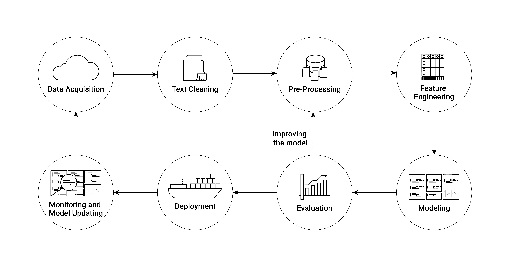

# Large-scale Text Analysis with sparklyr
\index{Text analysis}

Text analysis/natural language processing (NLP)\index{Natural Language Processing (NLP)} often involves rather large amounts of data and is particularly challenging for in-memory processing. `sparklyr` provides several easy-to-use functions to run some of the computationally most demanding text data handling on a Spark cluster. In this chapter we explore these functions and the corresponding workflows to do text analysis on an AWS EMR cluster running Spark. Thereby we focus on the first few key components of a modern NLP pipeline\index{NLP pipeline}. Figure \@ref(fig:nlppipeline) presents an overview of the main components of such a pipeline. 


```{r nlppipeline, echo=FALSE, out.width = "99%", fig.align='center', fig.cap= "(ref:nlppipeline)", purl=FALSE}

```

(ref:nlppipeline) Illustration of a NLP (Natural Language Processing)\index{Natural Language Processing (NLP)} pipeline\index{NLP pipeline}.


Up until the deployment of an NLP\index{Natural Language Processing (NLP)}  model, all the steps involved constitute the typical workflow of economic research projects based on text data. Conveniently, all these first crucial steps of analyzing text data are covered in a few high-level functions provided in the `sparklyr` package\index{sparklyr package}. Implementing these steps and running them based on massive amounts of text data on an AWS EMR\index{AWS EMR} cluster is thus straightforward.

To get familiar with the basic syntax, the following subsection covers the first steps in such a pipeline based on a very simple text example.


## Getting started: Import, pre-processing, and word count
\index{Word count}
The following example briefly guides the reader through some of the most common first steps when processing text data for NLP. In the code example, we process Friedrich Schiller's "Wilhelm Tell" (English edition; Project Gutenberg Book ID 2782), which we download from [Project Gutenberg](https://www.gutenberg.org/) by means of the `gutenbergr` package\index{gutenbergr package} [@gutenbergr]. The example can easily be extended to process many more books.

The example is set up to work straightforwardly on an AWS EMR\index{AWS EMR} cluster. However, given the relatively small amount of data processed here, you can also run it locally. If you want to run it on EMR, simply follow the steps in Chapter 6.4 to set up the cluster and log in to RStudio on the master node. The `sparklyr`\index{sparklyr package} package is already installed on EMR (if you use the bootstrap-script introduced in Chapter 6.4 for the setup of the cluster), but other packages might still have to be installed.

We first load the packages and connect the RStudio session to the cluster (if you run this locally, use `spark_connect(master="local")`).

```{r eval=FALSE}
# install additional packages
# install.packages("gutenbergr") # download book from Project Gutenberg
# install.packages("dplyr") # for the data preparatory steps

# load packages
library(sparklyr)
library(gutenbergr)
library(dplyr)

# fix vars
TELL <- "https://www.gutenberg.org/cache/epub/6788/pg6788.txt"


# connect rstudio session to cluster
sc <- spark_connect(master = "yarn")

```


```{r echo=FALSE, message=FALSE, warning=FALSE}
# install additional packages
# install.packages("gutenbergr") # to download book texts from Project Gutenberg
# install.packages("dplyr") # for the data preparatory steps
# load packages
library(sparklyr)
library(gutenbergr)
library(dplyr)
# fix vars
TELL <- "https://www.gutenberg.org/cache/epub/6788/pg6788.txt"
# connect rstudio session to cluster
conf <- spark_config()
conf$`sparklyr.shell.driver-memory` <- "8g"
sc <- spark_connect(master = "local",
                    config = conf)

```


We fetch the raw text of the book and copy it to the Spark cluster. Note that you can do this sequentially for many books without exhausting the master node's RAM\index{Random Access Memory (RAM)} and then further process the data on the cluster.

```{r warning=FALSE, message=FALSE}
# Data gathering and preparation
# fetch Schiller's Tell, load to cluster
tmp_file <- tempfile()
download.file(TELL, tmp_file)
raw_text <- readLines(tmp_file)
tell <- data.frame(raw_text=raw_text)
tell_spark <- copy_to(sc, tell,
                      "tell_spark",
                      overwrite = TRUE)

```

The text data will be processed in a `SparkDataFrame`\index{SparkDataFrame} column behind the `tbl_spakr` object. First, we remove empty lines of text, select the column containing all the text, and then remove all non-numeric and non-alphabetical characters. The last step is an important text cleaning step as we want to avoid special characters being considered words or parts of words later on.

```{r warning=FALSE, message=FALSE}
# data cleaning
tell_spark <- filter(tell_spark, raw_text!="")
tell_spark <- select(tell_spark, raw_text)
tell_spark <- mutate(tell_spark, 
                     raw_text = regexp_replace(raw_text, "[^0-9a-zA-Z]+", " "))

```

Now we can split the lines of text in the column `raw_text` into individual words (sequences of characters separated by white space). To this end we can call a Spark feature transformation routine called tokenization, which essentially breaks text into individual terms. Specifically, each line of raw text in the column `raw_text` will be split into words. The overall result (stored in a new column specified with `output_col`), is then a nested list in which each word is an element of the corresponding line element.

```{r warning=FALSE, message=FALSE}

# split into words
tell_spark <- ft_tokenizer(tell_spark, 
                           input_col = "raw_text",
                           output_col = "words")

```

Now we can call another feature transformer called "stop words remover", which excludes all the stop words (words often occurring in a text but not carrying much information) from the nested word list.

```{r warning=FALSE, message=FALSE}

# remove stop-words
tell_spark <- ft_stop_words_remover(tell_spark,
                                    input_col = "words",
                                    output_col = "words_wo_stop")

```

Finally, we combine all of the words in one vector and store the result in a new SparkDataFrame\index{SparkDataFrame} called "all_tell_words" (by calling `compute()`\index{compute()}) and add some final cleaning steps. 

```{r warning=FALSE, message=FALSE}
# unnest words, combine in one row
all_tell_words <- mutate(tell_spark, 
               word = explode(words_wo_stop))

# final cleaning
all_tell_words <- select(all_tell_words, word)
all_tell_words <- filter(all_tell_words, 2<nchar(word))
```

Based on this cleaned set of words, we can compute the word count\index{Word count} for the entire book.

```{r warning=FALSE, message=FALSE}
# get word count and store result in Spark memory
compute(count(all_tell_words, word), "wordcount_tell")
```

Finally, we can disconnect the R session from the Spark cluster

```{r}
spark_disconnect(sc)
```


## Tutorial: political slant


The tutorial below shows how to use `sparklyr`\index{sparklyr package} (in conjunction with AWS EMR\index{AWS EMR}) to run the entire raw text processing of  academic research projects in economics. We will replicate the data preparation and computation of the *slant measure* for congressional speeches suggested by @gentzkow_shapiro2010 in the tutorial. To keep things simple, we'll use the data compiled by @gentzkow_etal2019 and made available at https://data.stanford.edu/congress_text. 

### Data download and import

To begin, we download the corresponding zip-file to the EMR\index{AWS EMR} master node (if using EMR) or to your local RStudio\index{RStudio} working directory if using a local Spark\index{Apache Spark} installation. The unzipped folder contains text data from all speeches delivered from the 97th to the 114th US Congress, among other things. We will primarily work with the raw speeches text data\index{Text data}, which is stored in files with the naming pattern `"speeches CONGRESS.txt,"` where `CONGRESS` is the number of the corresponding US Congress. To make things easier, we put all of the `speeches`-files in a subdirectory called `'speeches`. The following section simply illustrates one method for downloading and rearranging the data files. The following code chunks require that all files containing the text of speeches be stored in `data/text/speeches` and all speaker information be stored in `data/text/speakers`.  

```{r eval=FALSE}
# download and unzip the raw text data
URL <- "https://stacks.stanford.edu/file/druid:md374tz9962/hein-daily.zip"
PATH <- "data/hein-daily.zip"
system(paste0("curl ",
              URL, 
              " > ", 
              PATH,
              " && unzip ", 
              PATH))
# move the speeches files
system("mkdir data/text/ && mkdir data/text/speeches")
system("mv hein-daily/speeches* data/text/speeches/")
# move the speaker files
system("mkdir data/text/speakers")
system("mv hein-daily/*SpeakerMap.txt data/text/speakers/")

```


In addition, we download an extra file in which the authors kept only valid phrases (after removing procedural phrases that often occur in congressional speeches but that do not contribute to finding partisan phrases). Thus we can later use this additional file to filter out invalid bigrams.^[Invalid for the context of this study.]

```{r eval=FALSE}
# download and unzip procedural phrases data
URL_P <- "https://stacks.stanford.edu/file/druid:md374tz9962/vocabulary.zip"
PATH_P <- "data/vocabulary.zip"
system(paste0("curl ",
              URL_P, 
              " > ", 
              PATH_P,
              " && unzip ",
              PATH_P))
# move the procedural vocab file
system("mv vocabulary/vocab.txt data/text/")
```


We begin by loading the corresponding packages, defining some fix variables, and connecting the R session to the Spark cluster, using the same basic pipeline structure as in the previous section's introductory example. Typically, you would first test these steps on a local Spark installation before feeding in more data to process on a Spark cluster in the cloud. In the following example, we only process the congressional speeches from the 97th to the 114th US Congress. The original source provides data for almost the entire history of Congress (see https://data.stanford.edu/congress_text for details). Recall that for local tests/working with the local Spark installation, you can connect your R session with `sc <- spark_connect(master = "local")`\index{spark\_connect()}. Since even the limited speeches set we work with locally is several GBs in size, we set the memory available to our local Spark node to 16GB. This can be done by fetching the config file via `spark_config()`\index{spark\_config()} and then setting the `driver-memory` accordingly before initializing the Spark connection with the adapted configuration object (see `config = conf` in the `spark_connect()`\index{spark\_connect()} command).

```{r echo=FALSE, warning=FALSE, message=FALSE}
# SET UP ----------------

# load packages
library(sparklyr)
library(dplyr)
# fix vars
INPUT_PATH_SPEECHES <- "data/text/speeches/" 
INPUT_PATH_SPEAKERS <- "data/text/speakers/" 

# configuration of local spark cluster
conf <- spark_config()
conf$`sparklyr.shell.driver-memory` <- "16g"
# connect rstudio session to cluster
sc <- spark_connect(master = "local", 
                    config = conf)

```


Unlike in the simple introductory example above, the raw data is distributed in multiple files. By default, Spark expects to load data from multiple files in the same directory. Thus, we can use the `spark_read_csv()`\index{spark\_read\_csv()} function to specify where all of the raw data is located in order to read in all of the raw text data at once. The data in this example is essentially stored in CSV format, but the pipe symbol `|`  is used to separate columns instead of the more common commas. By specifying `delimiter="|"`, we ensure that the data structure is correctly captured. 


```{r eval=TRUE}
# LOAD TEXT DATA  --------------------

# load data
speeches <- spark_read_csv(sc,
                           name = "speeches",
                           path =  INPUT_PATH_SPEECHES,
                           delimiter = "|")
speakers <- spark_read_csv(sc,
                           name = "speakers",
                           path =  INPUT_PATH_SPEAKERS,
                           delimiter = "|")
```


### Cleaning speeches data

The intermediate goal of the data preparation steps is to determine the number of bigrams\index{Bigram} per party. That is, we want to know how frequently members of a particular political party have used a two-word phrase.As a first step, we must combine the speeches and speaker data to obtain the party label per speech, and then clean the raw text to extract words, and create and count bigrams\index{Bigram}. Congressional speeches frequently include references to dates, bill numbers, years, and so on. This introduces a slew of tokens\index{Token} made up entirely of digits, single characters, and special characters.The cleaning steps that follow are intended to remove the majority of those. 


```{r}

# JOIN --------------------
speeches <- 
     inner_join(speeches,
                speakers,
                by="speech_id") %>%
     filter(party %in% c("R", "D"), chamber=="H")  %>%
     mutate(congress=substr(speech_id, 1,3)) %>%
     select(speech_id, speech, party, congress)
     

# CLEANING ----------------
# clean text: numbers, letters (bill IDs, etc.
speeches <- 
     mutate(speeches, speech = tolower(speech)) %>%
     mutate(speech = regexp_replace(speech,
                                    "[_\"\'():;,.!?\\-]",
                                    "")) %>%
     mutate(speech = regexp_replace(speech, "\\\\(.+\\\\)", " ")) %>%
     mutate(speech = regexp_replace(speech, "[0-9]+", " ")) %>%
     mutate(speech = regexp_replace(speech, "<[a-z]+>", " ")) %>%
     mutate(speech = regexp_replace(speech, "<\\w+>", " ")) %>%
     mutate(speech = regexp_replace(speech, "_", " ")) %>%
     mutate(speech = trimws(speech))
```


### Create a bigrams count per party

Based on the cleaned text, we now split the text into words (tokenization)\index{Tokenization}, remove stopwords\index{stopwords}, and create a list of bigrams\index{Bigram} (2-word phrases). Finally, we unnest the bigram list and keep the party and bigram\index{Bigram} column. The resulting spark table contains a row for each bigram mentioned in any of the speeches along the information of whether the speech in which the bigram\index{Bigram} was mentioned was given by a Democrat or a Republican.

```{r}

# TOKENIZATION, STOPWORDS REMOVAL, NGRAMS ----------------

# stopwords list 
stop <- readLines("http://snowball.tartarus.org/algorithms/english/stop.txt")
stop <- trimws(gsub("\\|.*", "", stop))
stop <- stop[stop!=""]

# clean text: numbers, letters (bill IDs, etc.
bigrams <- 
     ft_tokenizer(speeches, "speech", "words")  %>%
     ft_stop_words_remover("words", "words_wo_stop",
                           stop_words = stop )  %>%
     ft_ngram("words_wo_stop", "bigram_list", n=2)  %>%
     mutate(bigram=explode(bigram_list)) %>%
     mutate(bigram=trim(bigram)) %>%
     mutate(n_words=as.numeric(length(bigram) - 
                                    length(replace(bigram, ' ', '')) + 1)) %>%
     filter(3<nchar(bigram), 1<n_words) %>%
     select(party, congress, bigram)


```

Before counting the bigrams\index{Bigram count} by party, we need an additional context-specific cleaning step in which we remove procedural phrases from the speech bigrams\index{Bigram}.

```{r}
# load the procedural phrases list
valid_vocab <- spark_read_csv(sc,
                             path="data/text/vocab.txt",
                             name = "valid_vocab",
                             delimiter = "|",
                             header = FALSE)
# remove corresponding bigrams via anti-join
bigrams <- inner_join(bigrams, valid_vocab, by= c("bigram"="V1"))
```


### Find "partisan" phrases

At this point, we have all pieces in place in order to compute the bigram count\index{Bigram count} (how often a certain bigram\index{Bigram} was mentioned by a member of either party). As this is an important intermediate result, we evaluate the entire operation for all the data and cache it in spark memory through `compute()`\index{compute()}. Note that if you run this code on your local machine, it can take a while to process.

```{r}
# BIGRAM COUNT PER PARTY ---------------
bigram_count <- 
     count(bigrams, party, bigram, congress)  %>%
     compute("bigram_count")
```

Finally, we can turn to the actual method/analysis suggested by @gentzkow_shapiro2010. They suggest a simple chi-squared test to find the most partisan bigrams\index{Bigram}. For each bigram, we compute the corresponding chi-squared value.

```{r}
# FIND MOST PARTISAN BIGRAMS ------------

# compute frequencies and chi-squared values
freqs <- 
     bigram_count  %>%
     group_by(party, congress)  %>%
     mutate(total=sum(n), f_npl=total-n)
freqs_d <-
     filter(freqs, party=="D") %>%
     rename(f_pld=n, f_npld=f_npl) %>%
     select(bigram, congress, f_pld, f_npld)
freqs_r <-
     filter(freqs, party=="R") %>%
     rename(f_plr=n, f_nplr=f_npl) %>%
     select(bigram, congress, f_plr, f_nplr)
```


Based on the computed bigram frequencies, we can compute the chi-squared test\index{Chi-squared test} as follows.

```{r warning=FALSE, message=FALSE}
pol_bigrams <-
     inner_join(freqs_d, freqs_r, by=c("bigram", "congress")) %>%
     group_by(bigram, congress) %>%
     mutate(x2=((f_plr*f_npld-f_pld*f_nplr)^2)/
                 ((f_plr + f_pld)*(f_plr + f_nplr)*
                       (f_pld + f_npld)*(f_nplr + f_npld))) %>%
     select(bigram, congress, x2, f_pld, f_plr) %>%
     compute("pol_bigrams")

```


### Results: most partisan phrases by congress

In order to present a first glimpse at the results we first select the 2,000 most partisan phrases per Congress according to the procedure above. To do so, we need to first create an index column in the corresponding spark table.^[Recall that Spark\index{Apache Spark} is made to operate on distributed systems\index{Distributed system}. Since the entire dataset is distributed (as subsets) across the cluster, it is not as straightforward to fetch the first N entries of a dataset as compared to a situation in which the entire dataset is stored in one data frame residing in RAM\index{Random Access Memory (RAM)}.] We then collect the 2,000 most partisan bigrams.^[The output of the entire pipeline is not at all large anymore at this stage, thus we can confidently call `collect()`\index{collect()} to download the results (output data) from the Spark cluster into our local R memory (or the master node's R memory when working in the cloud).] 

```{r message=FALSE, warning=FALSE}
# create output data frame
output <- pol_bigrams  %>%
     group_by(congress) %>%
     arrange(desc(x2)) %>%
     sdf_with_sequential_id(id="index")  %>%
     filter(index<=2000) %>%
     mutate(Party=ifelse(f_pld<f_plr, "R", "D"))%>%
     select(bigram, congress, Party, x2) %>%
     collect()

# disconnect from cluster
spark_disconnect(sc)
```

From the subset of the 2,000 most partisan bigrams, we then generate a table of the top 5 most partisan bigrams\index{Bigram} per congress.

```{r warning=FALSE, message=FALSE}
# packages to prepare and plot
library(data.table)
library(ggplot2)
# select top ten per congress, clean
output <- as.data.table(output)
topten <- output[order(congress, x2, decreasing = TRUE),
                 rank:=1:.N, by=list(congress)][rank %in% (1:5)]
topten[, congress:=gsub("990", "99", congress)]
topten[, congress:=gsub("980", "98", congress)]
topten[, congress:=gsub("970", "97", congress)]

# plot a visualization of the most partisan terms
ggplot(topten, mapping=aes(x=as.integer(congress), y=log(x2), color=Party)) +
     geom_text(aes(label=bigram), nudge_y = 1)+
     ylab("Partisanship score (Ln of Chisq. value)") +
     xlab("Congress") +
     scale_color_manual(values=c("D"="blue", "R"="red"), name="Party") +
     guides(color=guide_legend(title.position="top")) +
     scale_x_continuous(breaks=as.integer(unique(topten$congress))) +
     theme_minimal() +
     theme(axis.text.x = element_text(angle = 90, hjust = 1),
           axis.text.y = element_text(hjust = 1),
           panel.grid.major = element_blank(),
           panel.grid.minor = element_blank(),
           panel.background = element_blank())
     

```


## Natural Language Processing at Scale

The examples above merely scratch the surface of what is possible these days in the realm of text analysis. With increasing availability of big data and the recent boost in deep learning, Natural Language Processing (NLP)\index{Natural Language Processing (NLP)}  put forward several very powerful (and very large) language models for various text prediction tasks. Due to the improvement of these models when trained on massive amounts of text data and the rather generic application of many of these large models, it has become common practice to directly work with a pre-trained model. That is, we do not actually train the algorithm based on our own training dataset, but rather build on a model that has been trained on a large text corpus and then has been made available to the public. In this section, we look at one straightforward way to build on such models with `sparklyr`\index{sparklyr package}. 

### Preparatory steps

Specifically, we look at a few brief example based on the `sparknlp` package\index{sparknlp package} [@sparknlp] providing a `sparklyr`\index{sparklyr package} extension for using the [John Snow Labs Spark NLP](https://www.johnsnowlabs.com/spark-nlp) library. The package can be directly installed from GitHub: `devtools::install_github("r-spark/sparknlp")` To begin, we load the corresponding packages and initialize a pre-trained NLP pipeline\index{NLP pipeline} for entity recognition, which we will then apply to the congressional speeches data. Note that the `sparknlp`\index{sparknlp package} package needs to be loaded before we connect the R session to the Spark cluster. In the following code chunk we thus first load the package and initiate the session by connecting again to the local spark node. In addition to loading the `sparklyr`\index{sparklyr package} and `dplyr` packages\index{dplyr package}, we also load the `sparklyr.nested` package\index{sparklyr.nested package} [@sparklyr.nested]. The latter is useful when working with `sparknlp`'s\index{sparknlp package} pipelines because the results are often returned as nested lists (in Spark table columns).

```{r eval=TRUE, message=FALSE}
# load packages
library(dplyr)
library(sparklyr)
library(sparknlp)
library(sparklyr.nested)

# configuration of local spark cluster
conf <- spark_config()
conf$`sparklyr.shell.driver-memory` <- "16g"
# connect rstudio session to cluster
sc <- spark_connect(master = "local", 
                    config = conf)
```

The goal of this brief example of `sparknlp`\index{sparknlp package} is to demonstrate how we can easily tap into very powerful pre-trained models to categorize text.To keep things simple, we return to the previous context (congressional speeches) and reload the speeches dataset. To make the following chunks of code run smoothly and relativel fast on a local Spark installation (for test purposes), we use `sample_n()`\index{sample\_n()} for a random draw of 10,000 speeches. 

```{r}
# LOAD --------------------

# load speeches
INPUT_PATH_SPEECHES <- "data/text/speeches/" 
speeches <- 
     spark_read_csv(sc,
                    name = "speeches",
                    path =  INPUT_PATH_SPEECHES,
                    delimiter = "|",
                    overwrite = TRUE) %>% 
     sample_n(10000, replace = FALSE)  %>% 
     compute("speeches")
     
```


### Sentiment annotation

In this short tutorial, we'll examine the tone (sentiment) of the congressional speeches. Sentiment analysis is a fairly common task in NLP, but it is frequently a computationally demanding task with numerous preparatory steps. `sparknlp`\index{sparknlp package} provides a straightforward interface for creating the necessary NLP pipeline\index{NLP pipeline} in R and massively scaling the analysis on Spark. Let's begin by loading the pretrained NLP pipeline\index{NLP pipeline} for sentiment analysis provided in `sparknlp`\index{sparknlp package}. 

```{r}
# load the nlp pipeline for sentiment analysis
pipeline <- nlp_pretrained_pipeline(sc, "analyze_sentiment", "en")
```

We can easily feed in the entire speech corpus via the `target` argument and point to the column containing the raw text (here `"speech"`). The code below divides the text into sentences and tokens (words) and returns the sentiment annotation for each sentence. 

```{r}
speeches_a <- 
     nlp_annotate(pipeline,
                  target = speeches,
                  column = "speech")
```

The sentiment of the sentences is then extracted for each corresponding speech ID and coded with two additional indicator variables, indicating whether a sentence was classified as positive or negative. 

```{r}
# extract sentiment coding per speech
sentiments <- 
     speeches_a %>%
     sdf_select(speech_id, sentiments=sentiment.result) %>% 
     sdf_explode(sentiments)  %>% 
     mutate(pos = as.integer(sentiments=="positive"),
            neg = as.integer(sentiments=="negative"))  %>% 
     select(speech_id, pos, neg) 

```

## Aggregation and visualization

Finally, we compute the proportion of sentences with a positive sentiment per speech and export the aggregate sentiment analysis result to the R environment for further processing.^[Note that even if we run this NLP pipeline\index{NLP pipeline} for the entire text dataset of congressional speeches, the final aggregate output will easily fit into the RAM\index{Random Access Memory (RAM)} of a standard PC.] 


```{r}
# aggregate and download to R environment -----
sentiments_aggr <- 
     sentiments  %>%
     select(speech_id, pos, neg) %>%
     group_by(speech_id) %>%
     mutate(rel_pos = sum(pos)/(sum(pos) + sum(neg))) %>%
     filter(0<rel_pos) %>%
     select(speech_id, rel_pos) %>%
     sdf_distinct(name = "sentiments_aggr") %>%
     collect()
```

```{r eval=FALSE}
# disconnect from cluster
spark_disconnect(sc)
```


We can easily plot the aggregate speech sentiment over time because the speech ID is based on the Congress number and the sequential number of speeches in this Congress. This allows us to compare (in the simple setup of this tutorial) the sentiment of congressional speeches over time.

```{r}
# clean
library(data.table)
sa <- as.data.table(sentiments_aggr)
sa[, congress:=substr(speech_id, 1,3)]
sa[, congress:=gsub("990", "99", congress)]
sa[, congress:=gsub("980", "98", congress)]
sa[, congress:=gsub("970", "97", congress)]

# visualize results
library(ggplot2)
ggplot(sa, aes(x=as.integer(congress),
               y=rel_pos,
               group=congress)) +
     geom_boxplot() +
     ylab("Share of sentences with positive tone") +
     xlab("Congress") +
     theme_minimal()

```

## `sparklyr` and lazy evaluation
\index{Lazy evaluation}
When running the code examples above, you may have noticed that the execution times vary significantly between the different code chunks, and maybe not always in the expected way. When using Apache Spark\index{Apache Spark} via the `sparklyr`/`dplyr`-interface as we did above, the evaluation of the code is intentionally (very) lazy\index{Lazy evaluation}. That is, unless a line of code really requires data to be processed (for example, due to printing the results to the console or explicitly due to calling `collect()`), Spark will not be triggered to run the actual processing of the entire data involved.When working with extremely large datasets, it makes sense to modify one's workflow to accommodate this behavior. A reasonable workflow would then be to write down the pipeline so that the heavy load processing happens at the very end (which can then take several minutes, but you will have time for other things to do.) 

The following short example taken from the script developed above illustrates this point. The arguably computationally most intensive part of the previous section was the sentiment annotation via `nlp_annotate()`\index{nlp\_annotate()}:

```{r}
system.time(
speeches_a <- 
     nlp_annotate(pipeline,
                  target = speeches,
                  column = "speech")
)
```

Remember that the pre-trained pipeline used in this example includes many steps, such as breaking down speeches into sentences and words, cleaning the text, and predicting the sentiment of each sentence. When you run the code above, you'll notice that this was not the most time-consuming part to compute. That chunk of code runs in less than a second on my machine (with a local Spark node). Because we do not request the sentiment analysis results at this point, the pipeline is not actually run. It is only executed when we request it. For example, by adding the `compute()`\index{compute()} call at the end.

```{r}
system.time(
speeches_a <- 
     nlp_annotate(pipeline,
                  target = speeches,
                  column = "speech") %>%
     compute(name= "speeches_a")
)
```

As you can see, this takes an order of magnitude longer, which makes perfect sense given that the pipeline is now running for the entire dataset fed into it. Unless you require the intermediate results (for example, for inspection), it makes thus sense to only process the big workload at the end of your `sparklyr`-analytics script.


```{r echo=FALSE}
# disconnect from cluster
spark_disconnect(sc)
```

