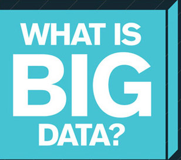
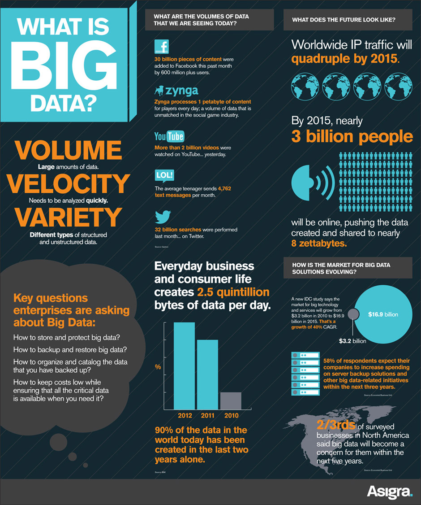
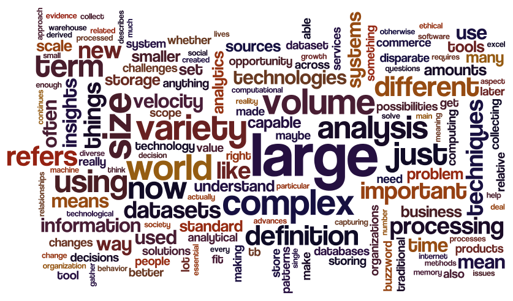
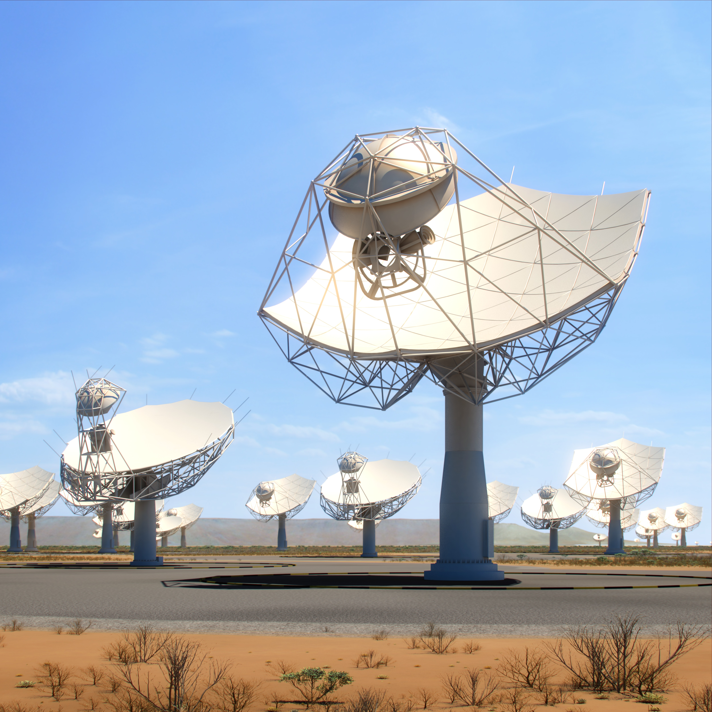
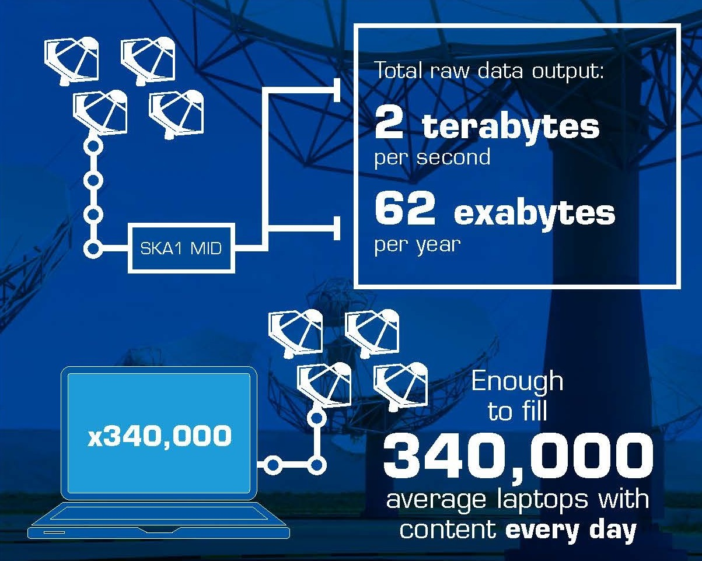
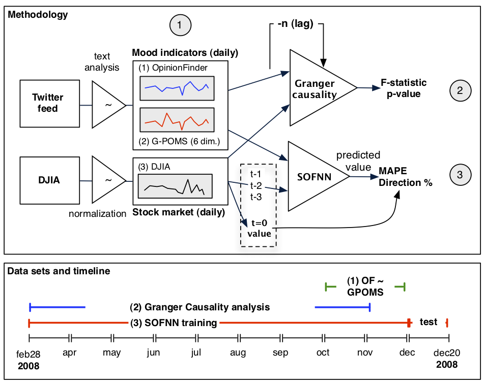
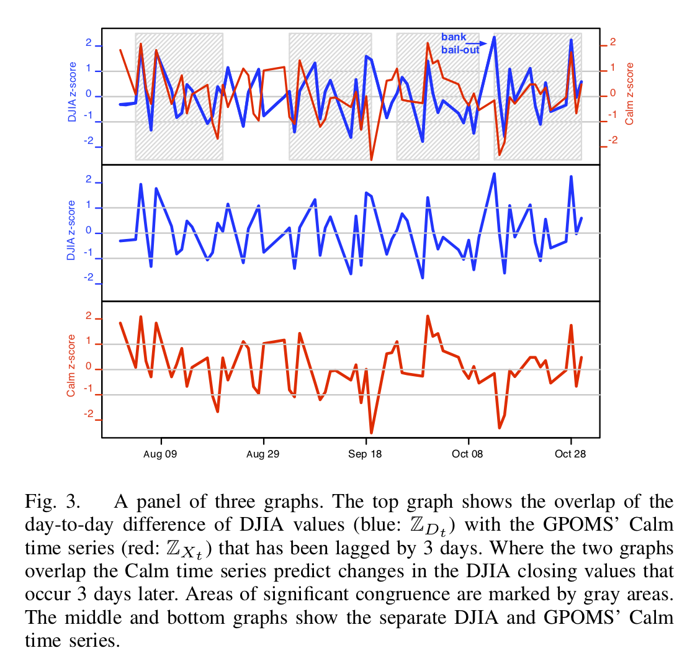
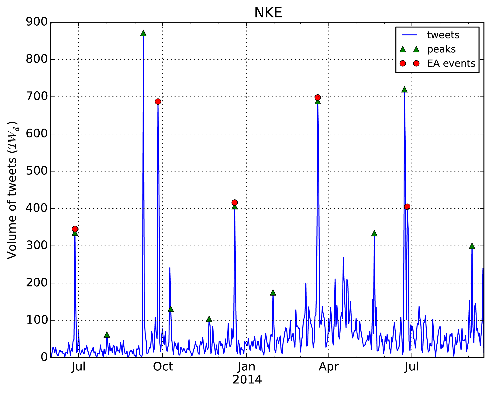

```{r set-options, echo=FALSE, cache=FALSE, purl=FALSE}
options(width = 100)
library(knitr)
```

# Big Data?

------

```{r whatis, echo=FALSE, out.width = "50%", fig.align='center', purl=FALSE}

```


 - Go to this page: http://bit.ly/bigdatastat  !
 - Fill in some keywords related to Big Data!


## Class Survey

```{r setup, echo=FALSE, purl=FALSE, message=FALSE, warning=FALSE}
# Load required packages. Install if needed.
library(gsheet)
library(tidyverse)

# Download survey data
# Download data
URL <- 'https://docs.google.com/spreadsheets/d/1_eF-DN2ie13doVQRjJNtjplzfKCLk6z6g8fk96cs1dA/edit#gid=0'
keywords <- gsheet2tbl(URL)
names(keywords) <- "keyword"

# clean data
keywords$keyword <- tolower(keywords$keyword)
keywords$keyword <- trimws(keywords$keyword)
keywords$keyword <- gsub("[^[:alnum:][:blank:]+?&/\\-]", "", keywords$keyword)

# analyze data
keywords_count <- keywords %>% group_by(keyword) %>% tally()

# prepare data
keywords_count <-  keywords_count[order(keywords_count$n, 
                                        decreasing = FALSE),]
keywords_count$keyword <- factor(keywords_count$keyword, 
                                 levels = keywords_count$keyword)
max_show <- ifelse(nrow(keywords_count)>9, 10, nrow(keywords_count))
keywords_count <- keywords_count[1:max_show, ]

# plot data
ggplot(keywords_count, aes(x= keyword, y = n)) +
     ggtitle("Big Data", subtitle = "What comes to mind?") +
     geom_bar(fill= "darkgreen", stat = "identity") +
     coord_flip() + 
     theme_minimal(base_size = 20) +
     xlab("Keyword (standardized)") +
     ylab("Frequency mentioned")
     

```


-----

```{r intro, echo=FALSE, out.width = "60%", fig.align='center', purl=FALSE, fig.cap="Posted on flickr by BBVAtech in 2012, by Asigra [CC BY 2.0](https://creativecommons.org/licenses/by/2.0/)"}

```


## Expert Survey (UC Berkeley, 2014)

- Ask 40 experts to define *"big data"*...


## Expert Survey (UC Berkeley, 2014)

- Ask 40 experts to define *"big data"*...
- ... get 40 different definitions :)


## Expert Survey (UC Berkeley, 2014)

```{r wordcloud, echo=FALSE, out.width = "90%", fig.align='center', purl=FALSE, fig.cap="Image by Jennifer Dutcher, datascience@berkeley, source: https://datascience.berkeley.edu/what-is-big-data/"}

```


## Expert Survey: Example 1

"Big Data is the result of *collecting information at its most granular level* — it’s what you get when you instrument a system and keep all of the data that your instrumentation is able to gather."

*Jon Bruner*
(Editor-at-Large, O’Reilly Media)


## Expert Survey: Example 2

"Big data is data that contains enough observations to *demand unusual handling because of its sheer size*, though what is unusual changes over time and varies from one discipline to another."

*Annette Greiner*<br>
(Lecturer, UC Berkeley School of Information)


## Expert Survey: Example 3

"[...] 'big data' will ultimately describe any dataset large enough to necessitate *high-level programming skill* and *statistically defensible methodologies* in order to transform the data asset into something of value."

*Reid Bryant*<br>
(Data Scientist, Brooks Bell)


## Conclusion

```{r hard, echo=FALSE, out.width = "60%", fig.align='center', purl=FALSE}
include_graphics("../img/01_its_hard.jpeg")
```


## Conclusion

- Large amounts of data 
- Various types/formats of data
- Unusual sources
- Speed of data flow/stream
- Use programming and statistics (in a broad sense) to extract value


## 'Learn Big Data'?

```{r landscape, echo=FALSE, out.width = "90%", fig.align='center', purl=FALSE, fig.cap="'Big Data Landscape (2018)', source: http://mattturck.com"}
include_graphics("http://mattturck.com/wp-content/uploads/2018/07/Matt_Turck_FirstMark_Big_Data_Landscape_2018_Final.png")
```


## Domains Affected
- How to design/set-up the machinery to handle large amounts of data?
- How to use the existing machinery most efficiently for large amounts of data?
- How to approach the analysis of large amounts of data with statistics?


## Focus in This Course 
- How to design/set-up the machinery to handle large amounts of data?
- *How to use the existing machinery most efficiently for large amounts of data?*
- *How to approach the analysis of large amounts of data with statistics?*

## Focus in This Course 
- How to design/set-up the machinery to handle large amounts of data?
- *How to use the existing machinery most efficiently for large amounts of data?*
- *How to approach the analysis of large amounts of data with statistics?*
     1. Compute 'usual' statistics based on large dataset (many observations).

## Focus in This Course 
- How to design/set-up the machinery to handle large amounts of data?
- *How to use the existing machinery most efficiently for large amounts of data?*
- *How to approach the analysis of large amounts of data with statistics?*
     1. Compute 'usual' statistics based on large dataset (many observations).
     2. Multivariate Statistics to gain insights from Big Data (many variables).


# Big Data in Scientific Research

## Big Data in the Sciences
- Mother nature always has provided the data, but...
     - ... instruments have gotten more precise
     - ... new measurement methods have been developed 
- Prominent examples: Astronomy, Genomics/Bioinformatics

```{r nightsky, echo=FALSE, out.width = "45%", fig.align='center', purl=FALSE, fig.cap="Photo by Joe Parks, [(CC BY-NC 2.0)](https://creativecommons.org/licenses/by-nc/2.0/) source: https://flic.kr/p/e2umhv"}

```


## Big Data in the Sciences
*Astronomy*: SKA Radio Telescope

```{r ska1, echo=FALSE, out.width = "60%", fig.align='center', purl=FALSE, fig.cap="Image by SKA Organisation, source: https://www.skatelescope.org/multimedia/image"}

```

## Big Data in the Sciences
*Astronomy*: SKA Radio Telescope

```{r ska2, echo=FALSE, out.width = "60%", fig.align='center', purl=FALSE, fig.cap="Image by SKY Organisation, source: https://www.skatelescope.org/multimedia/image"}

```


## Big Data in the Social Sciences

```{r prog_web, echo=FALSE, out.width = "90%", fig.align='center', purl=FALSE}

```


## Big Data in the Social Sciences

- *Hardware*: Diffusion of the Internet and mobile-phone networks.
- *Software*: Web 2.0 Technologies (APIs, JSON, Programmable Web, etc.).

     
## Big Data in the Social Sciences

- *Hardware*: Diffusion of the Internet and mobile-phone networks.
- *Software*: Web 2.0 Technologies (APIs, JSON, Programmable Web, etc.).
     - Backbone of social media and many prominent web services (e.g., Google Maps).
     - Data integration across platforms and services.
     - Exchange of data between/across applications.

## Big Data in the Social Sciences/Economics

```{r twitter1, echo=FALSE, out.width = "80%", fig.align='center', purl=FALSE, fig.cap='Source: @bollen_etal2011'}

```

## Big Data in the Social Sciences/Economics

```{r twitter2, echo=FALSE, out.width = "70%", fig.align='center', purl=FALSE, fig.cap='Source: @bollen_etal2011'}

```

## Big Data in the Social Sciences/Economics

```{r twitter3, echo=FALSE, out.width = "80%", fig.align='center', purl=FALSE, fig.cap='Source: @ranco_etal2015'}

```


## Big Data in the Social Sciences/Economics

- Often tied to web applications and digitization of economic and political processes.

## Big Data in the Social Sciences/Economics

- Often tied to web applications and digitization of economic and political processes.
- *Volume* of data is substantial (but usually smaller than in the natural sciences).

## Big Data in the Social Sciences/Economics

- Often tied to web applications and digitization of economic and political processes.
- *Volume* of data is substantial (but usually smaller than in natural sciences)
- *Variety* and *variability* often more challenging than in natural sciences.
     - Various sources
     - Data generation/sensors are independent from research endeavor.

## Big Data in the Social Sciences/Economics

- Often tied to web applications and digitization of economic and political processes.
- *Volume* of data is substantial (but usually smaller than in natural sciences)
- *Variety* and *variability* often more challenging than in natural sciences.
     - Various sources
     - Data generation/sensors are independent from research endeavor.
- Questions/Problems often similar to applied research in the industry.
     - Key difference: usually no streaming applications (*velocity* not that much of an an issue).


# This Course

## Two Parts 

1. Big Data: Basic Concepts and Applications in R (Ulrich Matter)
2. Multivariate Statistics in Python (Matthias Fengler)

## Objectives

 ‐ Understand the *concept of Big Data* in the context of economic research.
 
 ‐ Understand the *technical challenges* of Big Data Analytics and how to practically deal with them.
 
 ‐ Students will know the basic *statistical techniques* of clustering, dimensionality reduction, and factor models.


## Schedule: Part I {.smaller}

 1. *Introduction: Big Data, Data Economy (Concepts). M: Walkowiak (2016): Chapter 1*
 2. Programming with Data, R Refresher Course (Concepts/Applied). M: Walkowiak (2016): Chapter 2
 3. Computation and Memory (Concepts)
 4. Cleaning and Transformation of Big Data (Applied). M: Walkowiak (2016): Chapter 3: p. 74‐118.
 5. Aggregation and Visualization (Applied: data tables, ggplot). M: Walkowiak (2016): Chapter 3: p. 118‐127. C: Wickham et al. (2015), Schwabish (2014).
 6. Distributed Systems, MapReduce/Hadoop with R (Concepts/Applied). M: Walkowiak (2016): Chapter 4
 7. Data Storage, Databases Interaction with R. M: Walkowiak (2016): Chapter 5

## Schedule: Part I {.smaller}

 1. Introduction: Big Data, Data Economy (Concepts). M: Walkowiak (2016): Chapter 1
 2. *Programming with Data, R Refresher Course (Concepts/Applied). M: Walkowiak (2016): Chapter 2*
 3. Computation and Memory (Concepts)
 4. Cleaning and Transformation of Big Data (Applied). M: Walkowiak (2016): Chapter 3: p. 74‐118.
 5. Aggregation and Visualization (Applied: data tables, ggplot). M: Walkowiak (2016): Chapter 3: p.  118‐127. C: Wickham et al. (2015), Schwabish (2014).
 6. Distributed Systems, MapReduce/Hadoop with R (Concepts/Applied). M: Walkowiak (2016): Chapter 4
 7. Data Storage, Databases Interaction with R. M: Walkowiak (2016): Chapter 5

## Schedule: Part I {.smaller}

 1. Introduction: Big Data, Data Economy (Concepts). M: Walkowiak (2016): Chapter 1
 2. Programming with Data, R Refresher Course (Concepts/Applied). M: Walkowiak (2016): Chapter 2
 3. *Computation and Memory (Concepts)*
 4. Cleaning and Transformation of Big Data (Applied). M: Walkowiak (2016): Chapter 3: p. 74‐118.
 5. Aggregation and Visualization (Applied: data tables, ggplot). M: Walkowiak (2016): Chapter 3: p.  118‐127. C: Wickham et al. (2015), Schwabish (2014).
 6. Distributed Systems, MapReduce/Hadoop with R (Concepts/Applied). M: Walkowiak (2016): Chapter 4
 7. Data Storage, Databases Interaction with R. M: Walkowiak (2016): Chapter 5

## Schedule: Part I {.smaller}

 1. Introduction: Big Data, Data Economy (Concepts). M: Walkowiak (2016): Chapter 1
 2. Programming with Data, R Refresher Course (Concepts/Applied). M: Walkowiak (2016): Chapter 2
 3. Computation and Memory (Concepts)
 4. *Cleaning and Transformation of Big Data (Applied). M: Walkowiak (2016): Chapter 3: p. 74‐118.*
 5. Aggregation and Visualization (Applied: data tables, ggplot). M: Walkowiak (2016): Chapter 3: p. 118‐127. C: Wickham et al. (2015), Schwabish (2014).
 6. Distributed Systems, MapReduce/Hadoop with R (Concepts/Applied). M: Walkowiak (2016): Chapter 4
 7. Data Storage, Databases Interaction with R. M: Walkowiak (2016): Chapter 5

## Schedule: Part I {.smaller}

 1. Introduction: Big Data, Data Economy (Concepts). M: Walkowiak (2016): Chapter 1
 2. Programming with Data, R Refresher Course (Concepts/Applied). M: Walkowiak (2016): Chapter 2
 3. Computation and Memory (Concepts)
 4. Cleaning and Transformation of Big Data (Applied). M: Walkowiak (2016): Chapter 3: p. 74‐118.
 5. *Aggregation and Visualization (Applied: data tables, ggplot). M: Walkowiak (2016): Chapter 3: p.  118‐127. C: Wickham et al. (2015), Schwabish (2014).*
 6. Distributed Systems, MapReduce/Hadoop with R (Concepts/Applied). M: Walkowiak (2016): Chapter 4
 7. Data Storage, Databases Interaction with R. M: Walkowiak (2016): Chapter 5

## Schedule: Part I {.smaller}

 1. Introduction: Big Data, Data Economy (Concepts). M: Walkowiak (2016): Chapter 1
 2. Programming with Data, R Refresher Course (Concepts/Applied). M: Walkowiak (2016): Chapter 2
 3. Computation and Memory (Concepts)
 4. Cleaning and Transformation of Big Data (Applied). M: Walkowiak (2016): Chapter 3: p. 74‐118.
 5. Aggregation and Visualization (Applied: data tables, ggplot). M: Walkowiak (2016): Chapter 3: p. 118‐127. C: Wickham et al. (2015), Schwabish (2014).
 6. *Distributed Systems, MapReduce/Hadoop with R (Concepts/Applied). M: Walkowiak (2016): Chapter 4*
 7. Data Storage, Databases Interaction with R. M: Walkowiak (2016): Chapter 5

## Schedule: Part I {.smaller}

 1. Introduction: Big Data, Data Economy (Concepts). M: Walkowiak (2016): Chapter 1
 2. Programming with Data, R Refresher Course (Concepts/Applied). M: Walkowiak (2016): Chapter 2
 3. Computation and Memory (Concepts)
 4. Cleaning and Transformation of Big Data (Applied). M: Walkowiak (2016): Chapter 3: p. 74‐118.
 5. Aggregation and Visualization (Applied: data tables, ggplot). M: Walkowiak (2016): Chapter 3: p. 118‐127. C: Wickham et al. (2015), Schwabish (2014).
 6. Distributed Systems, MapReduce/Hadoop with R (Concepts/Applied). M: Walkowiak (2016): Chapter 4
 7. *Data Storage, Databases Interaction with R. M: Walkowiak (2016): Chapter 5*

## Schedule: Part II {.smaller}

 1. Multivariate random variables and distributions M: Härdle, Simar (2015): Chapter 4‐5 
 2. Clustering M: Härdle, Simar (2015): Chapter 13
 3. Principal Component Analysis M: Härdle, Simar (2015): Chapter 11
 4. Factor Models M: Härdle, Simar (2015): Chapter 12
 5. Summary/Q&A


## Examination: Part I

 - Decentral 
 ‐ Group examination 'paper' (all given the same grades) (50%).
 - Group size: 2 to max 3. people.
 - Take‐home exercises (group task): Application of basic concepts in R when working with big data. Conceptual questions related to the application.

<center> *Hand in: 2 weeks after the semester break!* </center>
<center> *(More details next week)* </center>
 
 
## Examination: Part II

 - Decentral 
 ‐ Oral examination (individual) (50%, 15 mins.)
 - Oral exam: Multivariate statistics (methods/concepts).

 
# This Part of the Course

---

```{r rlogo, echo=FALSE, out.width = "70%", fig.align='center', purl=FALSE}
include_graphics("../img/01_rlogo.png")
```

---
 
```{r rstudio, echo=FALSE, out.width = "70%", fig.align='center', purl=FALSE}
include_graphics("../img/01_rstudio.png")
```


## Approach to Big Data Statistics

1. *Analyze the underlying problem*.
2. Understand the underlying *concept*.
3. *Apply* the understanding in a hands-on exercise.

## R used in two ways

- A tool to analize problems posed by large datasets.
     - For example, memory usage (in R).
- A practical tool for Big Data Analytics.

## Example
Preparations
```{r}
# read dataset into R
economics <- read.csv("../data/economics.csv")
# have a look at the data
head(economics, 2)
# create a 'large' dataset out of this
for (i in 1:3) {
     economics <- rbind(economics, economics)
}
dim(economics)

```

## Example

Compute the real personal consumption expenditures (`pce`): Divide each value of `pce` by the deflator `1.05`.

```{r}
# Naïve approach (ignorant of R)
deflator <- 1.05 # define deflator
# iterate through each observation
pce_real <- c()
n_obs <- length(economics$pce)
for (i in 1:n_obs) {
  pce_real <- c(pce_real, economics$pce[i]/deflator)
}

# look at the result
head(pce_real, 2)


```

## Example

How long does it take?

```{r}
# Naïve approach (ignorant of R)
deflator <- 1.05 # define deflator
# iterate through each observation
pce_real <- list()
n_obs <- length(economics$pce)
time_elapsed <-
     system.time(
         for (i in 1:n_obs) {
              pce_real <- c(pce_real, economics$pce[i]/deflator)
})

time_elapsed

```


## Example

Assuming a linear time algorithm ($O(n)$), we need that much time for one additional row of data: 

```{r}

time_per_row <- time_elapsed[3]/n_obs
time_per_row

```

## Example

If we deal with big data, say 100 million rows, that is

```{r}
# in seconds
(time_per_row*100^4) 
# in minutes
(time_per_row*100^4)/60 
# in hours
(time_per_row*100^4)/60^2 

```


## Example

What happens in the background?

- Evaluation/computation
- Memory allocation/deallocation


## Example

Can we improve this?

```{r}
# Improve memory allocation (still somewhat ignorant of R)
deflator <- 1.05 # define deflator
n_obs <- length(economics$pce)
pce_real <- list()
# allocate memory beforehand
# tell R how long the list will be
length(pce_real) <- n_obs


```


## Example

Can we improve this?

```{r}
# Improve memory allocation (still somewhat ignorant of R)
deflator <- 1.05 # define deflator
n_obs <- length(economics$pce)
pce_real <- list()
# allocate memory beforehand
# tell R how long the list will be
length(pce_real) <- n_obs
# iterate through each observation
time_elapsed <-
     system.time(
         for (i in 1:n_obs) {
              pce_real[[i]] <- economics$pce[i]/deflator
})

time_elapsed

```


## Example

Any improvements?

```{r}

time_per_row <- time_elapsed[3]/n_obs
time_per_row

```

## Example

```{r}
# in seconds
(time_per_row*100^4) 
# in minutes
(time_per_row*100^4)/60 
# in hours
(time_per_row*100^4)/60^2 

```

This looks much better, but we can do even better...


## Example

Can we improve this?

```{r}
# Do it 'the R wqy'
deflator <- 1.05 # define deflator
# Exploit R's vectorization!
time_elapsed <- 
     system.time(
     pce_real <- economics$pce/deflator
          )
# same result
head(pce_real, 2)
# but much faster!
time_elapsed
```

## Example

About 10x faster!

```{r}
# in seconds
(time_per_row*100^4) 
# in minutes
(time_per_row*100^4)/60 
# in hours
(time_per_row*100^4)/60^2 

```


## What do we learn from this?

1. How R allocates and deallocates memory can have a substantial effect on computation time.
     - (Particularly, if we deal with a large dataset!)
2. In what way the computation is implemented can matter a lot for the time elapsed.
     - (For example, loops vs. vectorization/apply)

<center>*More on this in Lecture 3*</center>


# Resources for Part I

## Literature

### Book
[Walkowiak, Simon (2016): Big Data Analytics with R.Birmingham, UK: Packt Publishing.](https://subscription.packtpub.com/book/big_data_and_business_intelligence/9781786466457)

### Journal Articles

[Wickham, Hadley and Dianne Cook and Heike Hofmann (2015): Visualizing statistical models: Removing the blindfold.Statistical Analysis and Data Mining: The ASA Data Science Journal. 8(4):203‐225.](https://onlinelibrary.wiley.com/doi/full/10.1002/sam.11271?scrollTo=references)

[Schwabish, Jonathan A. (2014): An Economistʹs Guide to Visualizing Data.Journal of Economic Perspectives. 28(1):209‐234.](https://pubs.aeaweb.org/doi/pdfplus/10.1257/jep.28.1.209)

<center>*Lecture notes and slides will point to further reading...*</center>

## Notes, Slides, Code, et al.

- [umatter.github.io/courses](https://umatter.github.io/courses.html)
- [github.com/umatter/BigData](https://github.com/umatter/BigData)
- [StudyNet](https://fronter.com/unisg/main.phtml)

## Suggested Learning Procedure

- Clone/fork the course's GitHub-repository
- During class, use the Rmd-file of the slide-set as basis for your notes
- After class, enrich/merge/extend your notes with the lecture notes.

## TODO (for next week!)

- [Install R](https://stat.ethz.ch/CRAN/), [RStudio](https://www.rstudio.com/products/rstudio/download/#download)
- Set up your own [GitHub](https://github.com/)-account
- [Get familiar with Git/GitHub](https://guides.github.com/activities/hello-world/)


## References {.smaller}

<style>
slides > slide { overflow: scroll; }
slides > slide:not(.nobackground):after {
  content: '';
}
</style>
 