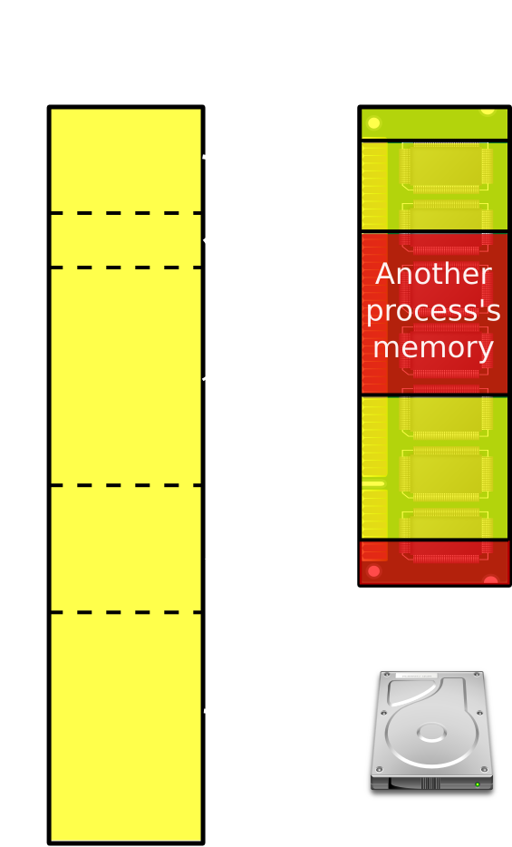
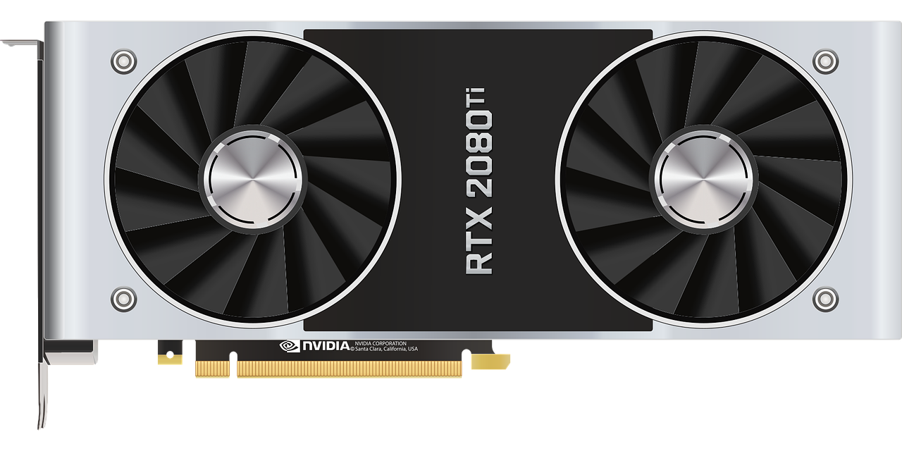
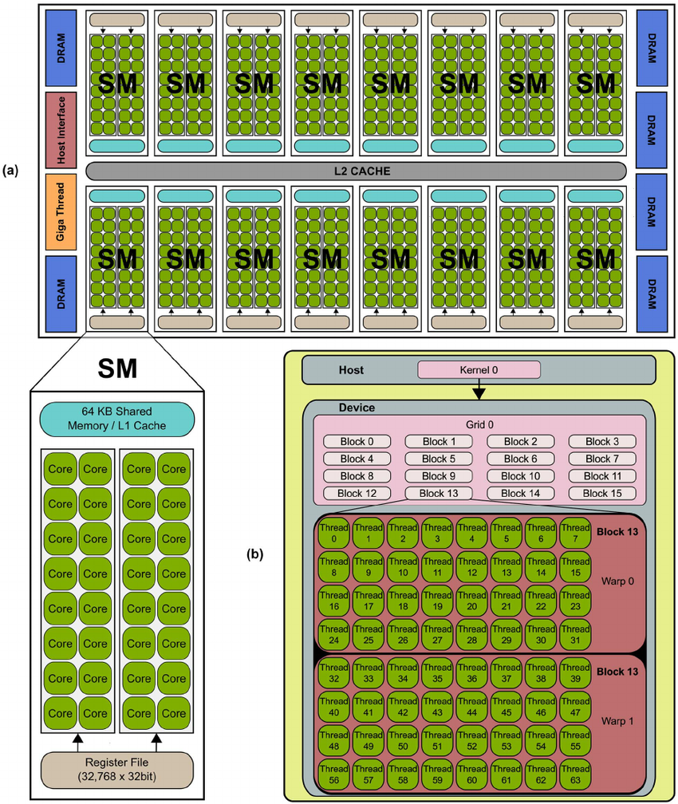

```{r set-options, echo=FALSE, cache=FALSE}
options(width = 100)
library(knitr)
```


# Updates

## Group projects

- Contact me in case of questions regarding topic/data.
- Next week: GitHub classroom assignment for Group work will open.
- Please add your team to the list: [https://bit.ly/hsg_bda](https://bit.ly/hsg_bda).
- *Add a team name!*

## 31 March: online only

- The lecture of the 31 March will be pre-recorded and made accessible via StudyNet.
- All other lectures: in person (hybrid option).

## Goals of today's lecture

- Know the core components of a computer
- Understand the very basics of information processing on a computer
- Have a basic idea of how to think about and approach computational challenges
  - What techniques are there to use each of the components more efficiently?
- *R:* Know how to compress CSV-files, how to parallelize a simple task, how to do simple matrix multiplications on the GPU.

# Recap

## SQL/SQLite

```{sql eval=FALSE}
SELECT 
strftime('%Y', econ.date)  AS year,
AVG(unemploy/pop)*100 AS average_unemp_percent,
inflation_percent
FROM econ INNER JOIN inflation ON year = strftime('%Y', inflation.date)
GROUP BY year
```


# Hardware Basics

## Components of a standard computing environment

&nbsp;

```{r components, echo=FALSE, out.width = "95%", fig.align='center', purl=FALSE}
include_graphics("../img/03_script-hardware.jpg")
```

## Central Processing Unit

&nbsp;


```{r cpu2, echo=FALSE, out.width = "50%", fig.align='center', purl=FALSE}
include_graphics("../img/03_cpu.jpg")
```


## Random Access Memory

&nbsp;

```{r ram2, echo=FALSE, out.width = "65%", fig.align='center', purl=FALSE}
include_graphics("../img/03_ram.jpg")
```


## Mass storage: hard drive

&nbsp;

```{r harddrive2, echo=FALSE, out.width = "55%", fig.align='center', purl=FALSE}
include_graphics("../img/03_harddrive.jpg")
```


## Too much data?

Two  strategies to scale *hardware*:

- *Scale up ('horizontal scaling')*: Extend the physical capacity of the affected component by building a system with large RAM shared between applications. This sounds like a trivial solution ('if RAM is too small, buy more RAM...'), but in practice it can be very expensive. 
- *Scale out ('vertical scaling')*: Distribute the workload over several computers (or separate components of a system). 

## Too much data?

- Many strategies that can help to use the available hardware resources more efficiently.

- To get a first overview, we first focus on *each hardware component* individually.


## Units of information storage

  - Smallest unit (a `0` or a `1`): *bit* (from *bi*nary dig*it*; abbrev. 'b').
  - *Byte* (1 byte = 8 bits; abbrev. 'B')
    - For example, `10001011` (`139`)

## Units of information storage

Bigger units for storage capacity usually build on bytes:

 - $1 \text{ kilobyte (KB)} = 1000^{1}   \approx 2^{10}   \text{ bytes}$
 - $1 \text{ megabyte (MB)} = 1000^{2}   \approx 2^{20}   \text{ bytes}$
 - $1 \text{ gigabyte (GB)} = 1000^{3}   \approx 2^{30}   \text{ bytes}$
 - $1 \text{ terabyte (TB)} = 1000^{4}   \approx 2^{40}   \text{ bytes}$
 - $1 \text{ petabyte (PB)} = 1000^{5}   \approx 2^{50}   \text{ bytes}$
 - $1 \text{ exabyte (EB)} = 1000^{6}    \approx 2^{60}   \text{ bytes}$
 - $1 \text{ zettabyte (ZB)} = 1000^{7}  \approx 2^{70}   \text{ bytes}$

$$1 ZB = 1000000000000000000000\text{ bytes} = 1 \text{ billion terabytes}.$$


# Mass storage


## Mass storage: avoid redundancies

- Different formats to store the same data on disk use up more or less space!

- Using one or the other format depends on how the data will be ultimately used. 

- Using the approapriate format (given the context) helps avoiding redundancies and consequently save mass storage space.

## Avoid redundancies: example

- Example: [JSON (JavaScript Object Notaion)](https://en.wikipedia.org/wiki/JSON) vs. [CSV (Comma Separated Values)](https://en.wikipedia.org/wiki/Comma-separated_values).

- Any commmon data set could be stored in either format. JSON allows for much more flexibility (is favorable when working with complex data), but needs more syntax to store the structure.

## Avoid redundancies: example

*JSON* 

```
{
    "realtime_start": "2013-08-14",
    "realtime_end": "2013-08-14",
    "observation_start": "1776-07-04",
    "observation_end": "9999-12-31",
    "units": "lin",
    "output_type": 1,
    "file_type": "json",
    "order_by": "observation_date",
    "sort_order": "asc",
    "count": 84,
    "offset": 0,
    "limit": 100000,
    "observations": [
        {
            "realtime_start": "2013-08-14",
            "realtime_end": "2013-08-14",
            "date": "1929-01-01",
            "value": "1065.9"
        },
        {
            "realtime_start": "2013-08-14",
            "realtime_end": "2013-08-14",
            "date": "1930-01-01",
            "value": "975.5"
        },
        ...,
        {
            "realtime_start": "2013-08-14",
            "realtime_end": "2013-08-14",
            "date": "2012-01-01",
            "value": "15693.1"
        }
    ]
}
```

## Avoid redundancies: example

*CSV*

```
"date","value"
"1929-01-01", "1065.9"
"1930-01-01", "975.5"

...,

"2012-01-01", 15693.1"
```

## Read/write data to disk in different formats

*Read*:

- CSV: `read.csv()`, `data.table::fread()`, (and many more).
- JSON: `jsonlite::fromJSON()` (and others).

*Write*:

- CSV: `write.csv()`, `data.table::fwrite()`, (and many more).
- JSON: `jsonlite::toJSON()` (and others).


## Data compression 

- Generalizes the idea of *avoiding redundancies in data storage*.
- Data compression algorithms *encode* the information contained in the original representation of the data *with fewer bits*. 
- Compression replaces repeatedly occurring sequences with shorter expressions and keeps track of replacements in a table.

## Data compression: illustration

Uncompressed string

```
"xxxxxyyyyyzzzz"
```

"Compressed" string:

```
"5x6y4z"
```

## Data compression in R: CSV


```{r warning=FALSE, message=FALSE}
# load packages
library(data.table)

# load example data from basic R installation
data("LifeCycleSavings")

# write data to normal csv file and check size
fwrite(LifeCycleSavings, file="lcs.csv")
file.size("lcs.csv")

# write data to a GZIPPED (compressed) csv file and check size
fwrite(LifeCycleSavings, file="lcs.csv.gz")
file.size("lcs.csv.gz")

# read/import the compressed data
lcs <- data.table::fread("lcs.csv.gz")
```


## Data compression in R: general

```{r}
# common ZIP compression (independent of data.table package)
write.csv(LifeCycleSavings, file="lcs.csv")
file.size("lcs.csv")
zip(zipfile = "lcs.csv.zip", files =  "lcs.csv")
file.size("lcs.csv.zip")

# unzip/decompress and read/import data
lcs_path <- unzip("lcs.csv.zip")
lcs <- read.csv(lcs_path)

```

## Mass storage: take-aways

- Avoid redundancies in storage *format* (depends on purpose!)
- Use *compression* (but be aware of trade-off)
  - Time-memory trade-off.
  - Encoding/decoding takes time!
  
# Random Access Memory (RAM)

## Random access memory (RAM)

- Common laptop/desktop computers have 8-32 GB of RAM capacity.
- Very generally speaking, we can consider a data set as *big* if it takes up several GBs in RAM (this will introduce noticable "problems" in R).

```{r ram3, echo=FALSE, out.width = "30%", fig.align='center', purl=FALSE}
include_graphics("../img/03_ram.jpg")
```


## RAM: memory allocation

- Standard computation procedures happen *in-memory*: data needs to be loaded into RAM.
- Default lower-level procedures to *allocate memory* might not be optimal for large data sets.
- We can explicitly use *faster* memory allocation procedures for a specific big data task.


## Memory allocation example: CSV import

Inspect the memory usage.

```{r message=FALSE, warning=FALSE}

# SET UP -----------------

# fix variables
DATA_PATH <- "../../data/flights.csv"
# load packages
library(pryr) 

# DATA IMPORT ----------------
mem_change(flights <- read.csv(DATA_PATH))

```


## Memory allocation example: CSV import

Alternative approach (via memory mapping).

```{r message=FALSE, warning=FALSE}

# fix variables
DATA_PATH <- "../../data/flights.csv"
# load packages
library(pryr) 
library(data.table)

# DATA IMPORT ----------------
flights <- fread(DATA_PATH, verbose = TRUE)


```


## Memory allocation example: CSV import

Alternative approach (via memory mapping).


```{r message=FALSE, warning=FALSE}

# SET UP -----------------

# fix variables
DATA_PATH <- "../../data/flights.csv"
# load packages
library(pryr) 
library(data.table)

# housekeeping
rm(flights)
gc()

# check the change in memory due to each step

# DATA IMPORT ----------------
mem_change(flights <- fread(DATA_PATH))


```

## RAM: things to keep in mind

1. The same data stored on the mass storage device (e.g., in a CSV file) might take up more or less space in RAM. 
2. Analysing a dataset might require much more memory than the dataset itself (example: `lm()`/ model matrix $X$). 
3. How much space imported data takes up in R can depend on data structures and data types.
4. Memory allocation affects speed (growing objects, memory mapping). Write efficient code, use efficient packages.


# Virtual Memory

## Combining RAM and hard-disk: virtual memory

 - What if we run out of RAM?
 - The OS deals with this by using part of the hard disk as *virtual memory*.
 - By explicitly instructing the computer how to use *virtual memory for specific big data tasks*, we can speed things up.

---

```{r vm, echo=FALSE, out.width = "60%", fig.align='center', fig.cap= "Virtual memory. Figure by Ehamberg ([CC BY-SA 3.0](https://creativecommons.org/licenses/by-sa/3.0/))", purl=FALSE}

```

## Explicitly make use of virtual memory in data analysis

- Basic idea: *map* a data set to the hard disk when `loading it into R'. Data values stored on disk, structure/metadata loaded into R.
- R packages for *"out-of-memory"* strategies: *`ff`*, *`bigmemory`* (we will work with those when cleaning and aggregating big data).


# Central Processing Unit (CPU)

## CPU

- "Speed" of a computer: *clock rate* measured in gigaherz (GHz).
- Example: a CPU with a clock rate of 4.8 GHz can execute 4.8 billion basic operations per second.
- Modern CPUs can work on several tasks *in parallel*.

&nbsp;

```{r cpu3, echo=FALSE, out.width = "25%", fig.align='center', purl=FALSE}
include_graphics("../img/03_cpu.jpg")
```

## CPU: Parallel processing

- Modern CPUs have several *cores*. 
- The OS automatically takes care of which tasks/processes should run on which core.
- We can explicitly instruct the computer to dedicate $N$ cores to a specific computational task: *parallel processing*.
- Run R jobs *in parallel*.

## Parallel processing in R

1. Several instances of R are running at the same time. The *"master"* instance breaks the computation into batches and sends those to the other instances.
2. Each of the instances processes its batch and sends the results back to the master instance.
3. The master instance combines the partial results to the final result and returns it to the user.

## Illustration of parallelization in R: case study

- A customer [data set](https://www.kaggle.com/jackdaoud/marketing-data?select=marketing_data.csv) with detailed data on customer characteristics, past customer behavior and information on online marketing campaigns.
- Which customers are more likely to react positively to the most recent online marketing campaign?

*The task:* run all possible regressions with the dependent variable  `Response` (equal to 1 if the customer took the offer in the campaign and 0 otherwise). In total you have 21 independent variables, thus you need to run $2^20=1048576$ logit regressions.

## Parallelization case study: sequential implementation 


```{r}
# you can download the data set from 
# https://www.kaggle.com/jackdaoud/marketing-data?select=marketing_data.csv

# PREPARATION -----------------------------

# packages
library(stringr)

# import data
marketing <- read.csv("../../data/marketing_data.csv")
# clean/prepare data
marketing$Income <- as.numeric(gsub("[[:punct:]]", "", marketing$Income)) 
marketing$days_customer <- as.Date(Sys.Date())- as.Date(marketing$Dt_Customer, "%m/%d/%y")
marketing$Dt_Customer <- NULL

# all sets of independent vars
indep <- names(marketing)[ c(2:19, 27,28)]
combinations_list <- lapply(1:length(indep),
                            function(x) combn(indep, x, simplify = FALSE))
combinations_list <- unlist(combinations_list, recursive = FALSE)
models <- lapply(combinations_list,
                 function(x) paste("Response ~", paste(x, collapse="+")))

# COMPUTE REGRESSIONS --------------------------

N <- 10 # just for illustration, the actual code is N <- length(models)
pseudo_Rsq <- list()
length(pseudo_Rsq) <- N
for ( i in 1:N) {
  # fit the logit model via maximum likelihood
  fit <- glm(models[[i]], data=marketing, family = binomial())
  # compute the proportion of deviance explained by the independent vars (~R^2)
  pseudo_Rsq[[i]] <- 1-(fit$deviance/fit$null.deviance)
}

# SELECT THE WINNER ---------------
models[[which.max(pseudo_Rsq)]]

```


## Parallelization case study: naive multi-session approach

- R script that loads the data set, runs the fist $n$ of the total of $N$ regressions and stores the result in a local text file.
- Run the script in your current RStudio session.
- Open an additional RStudio session and run the script with the next $n$ regressions, and so on.
- Manually collect/combine the results.

## Better: multi-core and multi-node approaches

- Write one R script (with the help of some specialized packages) that instructs R to automatically distribute the batches to different cores (or different computing nodes in a cluster computer).
- Control and monitor the progress in all cores.
- Automatically collect and combine the results from all cores


## Approach I: parallel for-loops using socket


```{r message=FALSE, warning=FALSE}
# COMPUTE REGRESSIONS IN PARALLEL (MULTI-CORE) --------------------------

# packages for parallel processing
library(parallel)
library(doSNOW)

# get the number of cores available
ncores <- parallel::detectCores()
# set cores for parallel processing
ctemp <- makeCluster(ncores)
registerDoSNOW(ctemp)

# prepare loop
N <- 10000 # just for illustration, the actual code is N <- length(models)
# run loop in parallel
pseudo_Rsq <-
  foreach ( i = 1:N, .combine = c) %dopar% {
    # fit the logit model via maximum likelihood
    fit <- glm(models[[i]], data=marketing, family = binomial())
    # compute the proportion of deviance explained by the independent vars (~R^2)
    return(1-(fit$deviance/fit$null.deviance))
}

# SELECT THE WINNER ---------------
models[[which.max(pseudo_Rsq)]]

```

## Parallel for-loops using socket (`foreach`)

- *Advantages:* Intuitive syntax, easy to use, works on all platforms, usually very stable.
- *Disadvantages:* needs to "distribute" variables/objects from the master to all workers (cores do not share same variables/environment). Creates overhead!

## Approach II: parallel lapply using forking

```{r}
# COMPUTE REGRESSIONS IN PARALLEL --------------------------


# prepare parallel lapply (based on forking, here clearly faster than foreach)
N <- 10000 # just for illustration, the actual code is N <- length(models)
# run parallel lapply
pseudo_Rsq <- mclapply(1:N,
                       mc.cores = ncores,
                       FUN = function(i){
                         # fit the logit model via maximum likelihood
                         fit <- glm(models[[i]], data=marketing, family = binomial())
                         # compute the proportion of deviance explained by the independent vars (~R^2)
                         return(1-(fit$deviance/fit$null.deviance))
                         })

# SELECT THE WINNER, SHOW FINAL OUTPUT ---------------

best_model <- models[[which.max(pseudo_Rsq)]]
best_model

#summary(glm(best_model, data=marketing, family = binomial()))

```

## Parallel lapply using forking

- *Advantages:* each core works with the same objects/variables in a shared environment. Very fast!
- *Disadvantages:* sharing an environment can cause problems (depends on the parallelized task). Does not work on Windows machines.

<!-- #### Parallelization based on futures -->
<!-- https://github.com/HenrikBengtsson/future -->
<!-- https://cran.r-project.org/web/packages/future/vignettes/future-3-topologies.html -->


## CPU/Parallelization: take-away messages

- CPUs have several cores.
- Explicitly use several cores to work on the same problem *in parallel*: speed things up!
- R packages (for example): `parallel`, `doSNOW`.
- "General purpose approach": `foreach()`.


#  GPUs for scientific computing

## GPUs for scientific computing

- *Graphic Processing Units (GPUs)*.
- 'Side product' of the computer games industry.
- More demanding games needed better graphic cards (with faster *GPUs*).

## GPUs

```{r nvidiagpu, echo=FALSE, out.width = "60%", fig.align='center', purl=FALSE}

```

## Why GPUs?

- Why not more powerful CPUs to deal with the more demanding PC games?
- CPUs: designed not only for *efficiency but also flexibility*.
- GPUs: designed to excel at computing graphics.
  - Highly parallel numerical floating point workloads.
  - Very useful in some core scientific computing tasks (see @fatahalian_etal2004)!

## GPU characteristics

- Composed of several multiprocessor units.
- Each multiprocessor unit has several cores.
- GPUs can perform computations with thousands of threads in parallel.

## GPU characteristics


```{r nvidia_architecture, echo=FALSE, out.width = "40%", fig.align='center', fig.cap= "Typical NVIDIA GPU architecture (illustration and notes by @hernandez_etal2013): The GPU is comprised of a set of Streaming MultiProcessors (SM). Each SM is comprised of several Stream Processor (SP) cores, as shown for the NVIDIA’s Fermi architecture (a). The GPU resources are controlled by the programmer through the CUDA programming model, shown in (b).", purl=FALSE}

```

## Challenges to using GPUs for scientific computing

- Different hardware architecture, different low-level programming model.
- Good understanding of hardware needed.
- But, more and more high-level APIs available (e.g., in tensorflow/keras).


# GPUs in R

## Example: Matrix multiplication comparison (`gpuR`)

- `gpuR`: basic R functions to compute with GPUs from within the R environment. 
- Example: compare the performance of the CPU with the GPU based on a matrix multiplication exercise. 
  - (For a large $N\times P$ matrix $X$, we want to compute $X^tX$.)


## Example: Matrix multiplication comparison (`gpuR`)

```{r  warning=FALSE, message=FALSE }
# load package
library(bench)
library(gpuR)

```

## Example: Matrix multiplication comparison (`gpuR`)

Initiate a large matrix filled with pseudo random numbers ($N$ observations and $P$ variables).

```{r}
# initiate dataset with pseudo random numbers
N <- 10000  # number of observations
P <- 100 # number of variables
X <- matrix(rnorm(N * P, 0, 1), nrow = N, ncol =P)

```


## Example: Matrix multiplication comparison (`gpuR`)

Prepare for GPU computation.

```{r}
# prepare GPU-specific objects/settings
gpuX <- gpuMatrix(X, type = "float")  # point GPU to matrix (matrix stored in non-GPU memory)
vclX <- vclMatrix(X, type = "float")  # transfer matrix to GPU (matrix stored in GPU memory)
```

## Example: Matrix multiplication comparison (`gpuR`)


Now we run the three examples: 1) using the CPU, 2) computing on the GPU but using CPU memory, 3) computing on the GPU and using GPU memory. 

```{r message=FALSE}
# compare three approaches
gpu_cpu <- bench::mark(
  
  # compute with CPU 
  cpu <- t(X) %*% X,
  
  # GPU version, GPU pointer to CPU memory (gpuMatrix is simply a pointer)
  gpu1_pointer <- t(gpuX) %*% gpuX,
  
  # GPU version, in GPU memory (vclMatrix formation is a memory transfer)
  gpu2_memory <- t(vclX) %*% vclX,
 
check = FALSE, memory=FALSE, min_iterations = 20)
```


## Example: Matrix multiplication comparison (`gpuR`)


```{r}
plot(gpu_cpu, type = "boxplot")
```


## Scientific computing with GPUs: take-away messages

- GPUs allow for *massive parallelization*.
- Particularly useful for *matrix/tensor multiplication*.
- Main usage domain: *deep learning* (`tensorflow`/`keras`).


# Q&A


## References {.smaller}

<style>
slides > slide { overflow: scroll; }
slides > slide:not(.nobackground):after {
  content: '';
}
</style>


