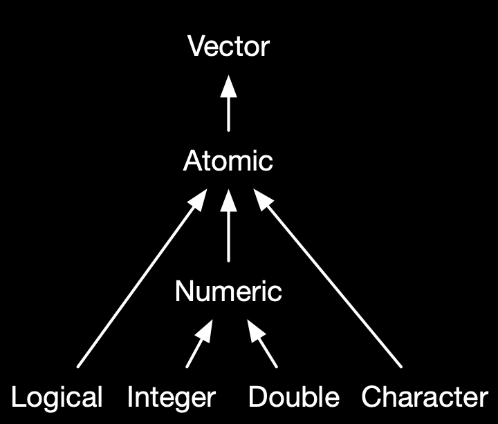

```{r set-options, echo=FALSE, cache=FALSE, purl=FALSE}
options(width = 100)
library(knitr)
```


# Updates

## Schedule update {.smaller}

 1. Introduction: Big Data, Data Economy. Walkowiak (2016): Chapter 1.
 2. Computation and Memory in Applied Econometrics.
 3. *Computation and Memory in Applied Econometrics II.*
 4. *Advanced R Programming. Wickham (2019): Chapters 2, 3, 17,23, 24.*
 5. Import, Cleaning and Transformation of Big Data. Walkowiak (2016): Chapter 3: p. 74‑118.
 6. Aggregation and Visualization. Walkowiak (2016): Chapter 3: p. 118‑127; Wickham et al.(2015); Schwabish (2014).
 7. Data Storage, Databases Interaction with R. Walkowiak (2016): Chapter 5.
 8. *Cloud Computing: Introduction/Overview, Distributed Systems, Walkowiak (2016): Chapter 4.*
 9. Applied Econometrics with Spark; Machine Learning and GPUs.
 10. Project Presentations (7 May, 2020; 08:15-10:00; Room 23-103).
 11. Project Presentations; Q&A.

## Canvas

- Use canvas discussion for issues with installation etc.
- Discussion forum is under 'Modules'.
  - Also: Stackoverflow & co.
- *Also, get ready for online lectures via Canvas/Zoom!*

## Project/Exercises teams

- GitHub classroom *Registration* assignment: ✅ 👍
- *Group Formation for Examination* assignment: ❗
  - If you you are in a team, please make sure to complete the *group assignment on GitHub Classroom*.
  - Students without team: please approach me in the break.
  
## Projects: More data

- https://datasetsearch.research.google.com/
- [Google Cloud Datasets](https://console.cloud.google.com/marketplace/browse?filter=solution-type:dataset)

## Goals for today

1. Understand the basics of R's memory management (with a practical big data focus).
2. Understand how data types and data structures of R objects are related to efficient memory allocation.
3. Know the basic tools and approaches to measuring and improving the performance of your R code.
4. (Review of/ideas about workflow with RStudio and GitHub for data projects.)


# Advanced R Programming

## 'Data projects' with RStudio and GitHub

-----

```{r github, echo=FALSE, out.width = "70%", fig.align='center', purl=FALSE, fig.cap="Image by [jonobacon](https://www.flickr.com/photos/jonobacon/22160892602) ([CC BY 2.0](https://creativecommons.org/licenses/by/2.0/)) "}
include_graphics("../img/02_githublogo.gif")
```

## Suggestion for set up

- Organize data analytics project as RStudio-project
- Rstudio project folder = GitHub repository
- (essentially what you will do in your group examination tasks)

## Version control with Git

- Keep track of your code.
- Develop in different branches.
- Safely go back to previous versions.

## Code repository on GitHub

- Work from different machines.
- Manage and document the project.
- Publish and collaborate. 


# Names and Values


## Names and Values

(Code examples and illustrations by @wickham_2019, chapter 2, licensed under [CC BY-NC-SA 4.0](https://creativecommons.org/licenses/by-nc-sa/4.0/))

- Prerequesites: `install.packages("lobstr")`
- Background: memory allocation and memory addresses
- 'Where' is an R object located in memory?
- How is a variable name associated with the object?
- What happens when we 'copy'/modify an object in R?


```{r echo=FALSE, message=FALSE, warning=FALSE}
library(lobstr)
```


## Bindings basics

- Objects/values do not have names but _names have values_!
- Objects have a 'memory address'/identifiers.

```{r}
x <- c(1, 2, 3)
```

```{r binding1, echo=FALSE, out.width = "25%", purl=FALSE, fig.align='left', purl=FALSE}
include_graphics("../img/binding-1.png")
```


## Bindings basics

- We can 'bind' several different names to values.

```{r}
y <- x
```


```{r binding2, echo=FALSE, out.width = "25%", purl=FALSE, fig.align='left', purl=FALSE}
include_graphics("../img/binding-2.png")
```

## Binding basics

- Understand the concept of names and values: check identifiers

```{r}
obj_addr(x)
obj_addr(y)
```


## Copy-on-modify

- 'Copying' simply binds a new name to the same (existing) value.

```{r}
x <- c(1, 2, 3)
y <- x
obj_addr(x)
obj_addr(y)
```

## Copy-on-modify

- But if we modify values in a vector, actual 'copying' is necessary (depending on the data structure of the object...).

```{r}
y[[3]] <- 4
x
```

```{r binding3, echo=FALSE, out.width = "25%", purl=FALSE, fig.align='left', purl=FALSE}
include_graphics("../img/binding-3.png")
```


## Copy-on-modify

- Understand the concept better with `tracemem()`: observe changes in identifiers.

```{r}
x <- c(1, 2, 3)
cat(tracemem(x), "\n")
```

## Copy-on-modify

- Only the first modification actually triggers the copying.

```{r}
y <- x
y[[3]] <- 4L
```

```{r}
y[[3]] <- 5L
```

- *Why?*


## Modify-in-place

- Objects with a single binding get modified in place (no copying needed).
- Enhances performance.

```{r}
v <- c(1, 2, 3)
```


```{r inplace1, echo=FALSE, out.width = "25%", purl=FALSE, fig.align='left', purl=FALSE}
include_graphics("../img/v-inplace-1.png")
```


```{r}
v[[3]] <- 4
```

```{r inplace2, echo=FALSE, out.width = "25%", purl=FALSE, fig.align='left', purl=FALSE}
include_graphics("../img/v-inplace-2.png")
```

## Modify-in-place

- In practice (more complex code) it is often hard to predict whether or not a copy will occur.
  - E.g., usual R functions vs. 'primitive' C functions.
- Use `tracemem()` to check your code for potential improvements (avoid unnecessary copying).

## Unbinding and the garbage collector

- What happens when we 'delete' (remove) an object?

```{r}
x <- 1:3
```

```{r unbinding1, echo=FALSE, out.width = "25%", purl=FALSE, fig.align='left', purl=FALSE}
include_graphics("../img/unbinding-1.png")
```

## Unbinding and the garbage collector

- What happens when we 'delete' (remove) an object?

```{r}
x <- 2:4
```

```{r unbining2, echo=FALSE, out.width = "25%", purl=FALSE, fig.align='left', purl=FALSE}
include_graphics("../img/unbinding-2.png")
```

## Unbinding and the garbage collector

- What happens when we 'delete' (remove) an object?

```{r}
rm(x)
```

```{r unbining3, echo=FALSE, out.width = "25%", purl=FALSE, fig.align='left', purl=FALSE}
include_graphics("../img/unbinding-3.png")
```


## Unbinding and the garbage collector

- R collects the garbage automatically (but only cares about R, not other programs).
- Force garbage collection with `gc()` (OS has more memory available!).

```{r}
gc()
```


# Data Structures and Data Types

## R-tools to investigate structures and types

package | function | purpose
-------- | ---------- | ---------------------------------------------
`utils`  | `str()`    | Compactly display the structure of an arbitrary R object.
`base`   | `class()`   | Prints the class(es) of an R object.
`base`   | `typeof()`  | Determines the (R-internal) type or storage mode of an object.


## Structures to work with (in R)

We distinguish two basic characteristics:

  1. Data **types**: integers; real numbers (floating point numbers); text ('string', 'character values').

    
    
## Structures to work with (in R)

We distinguish two basic characteristics:

  1. Data **types**: integers; real numbers (floating point numbers); text ('string', 'character values').
  2. Basic **data structures** in RAM:
      - *(Atomic) vectors*
      - *Factors*
      - *Arrays/Matrices*
      - *Lists*
      - *Data frames* et al. (very `R`-specific)


## Data types: numeric

```{r}
a <- 1.5
b <- 3
a + b
```

## Data types: numeric

R interprets this data as type `double` (class 'numeric'):

```{r}
typeof(a)
class(a)
object.size(a)
```


## Data types: character

```{r eval=FALSE}
a <- "1.5"
b <- "3"
a + b
```

```{r echo=FALSE}
a <- "1.5"
b <- "3"
```


## Data types: character

```{r}
typeof(a)
class(a)
object.size(a)
```


## Data structures: vectors

```{r vectors, echo=FALSE, out.width = "60%", fig.align='center', purl=FALSE, fig.cap= "Figure by @wickham_2019 (licensed under [CC BY-NC-SA 4.0](https://creativecommons.org/licenses/by-nc-sa/4.0/)).", purl=FALSE}

```


## Data structures: vectors

```{r atomicvectors, echo=FALSE, out.width = "65%", fig.align='center', purl=FALSE, fig.cap= "Figure by @wickham_2019 (licensed under [CC BY-NC-SA 4.0](https://creativecommons.org/licenses/by-nc-sa/4.0/)).", purl=FALSE}
include_graphics("../img/atomic.png")
```


## Data structures: vectors

Example:

```{r}
hometown <- c("St.Gallen", "Basel", "St.Gallen")
hometown
object.size(hometown)
```

## Character vectors and memory

```{r}
x <- c("a", "a", "abc", "d")
```

```{r character, echo=FALSE, out.width = "35%", fig.align='left', purl=FALSE, fig.cap= "Figure by @wickham_2019 (licensed under [CC BY-NC-SA 4.0](https://creativecommons.org/licenses/by-nc-sa/4.0/)).", purl=FALSE}
include_graphics("../img/character.png")
```

## Character vectors and memory

- R uses a global string pool where each element of a character vector is a pointer to a unique string in the pool.

```{r character2, echo=FALSE, out.width = "35%", fig.align='center', purl=FALSE, fig.cap= "Figure by @wickham_2019 (licensed under [CC BY-NC-SA 4.0](https://creativecommons.org/licenses/by-nc-sa/4.0/)).", purl=FALSE}
include_graphics("../img/character-2.png")
```

## Character vectors and memory


```{r}
ref(x, character = TRUE)
```

## Character vectors and memory

- The global string pool saves memory if a string vector is large!

```{r}
obj_size(x)
obj_size(rep(x, 100))
```


## Data structures: factors

```{r factor, echo=FALSE, out.width = "50%", fig.align='center', fig.cap= "Figure by @wickham_2019 (licensed under [CC BY-NC-SA 4.0](https://creativecommons.org/licenses/by-nc-sa/4.0/)).", purl=FALSE}
include_graphics("../img/factor.png")
```

## Data structures: factors

Example:

```{r}
hometown_f <- factor(c("St.Gallen", "Basel", "St.Gallen"))
hometown_f
object.size(hometown_f)
```

## Data structures: Factors

- Certain 'overhead' costs: the structure stored in a factor object is also information (takes up memory)
- Similar as in previous examples: 'overhead' diminishes (relatively) with larger datasets

```{r}
# create a large character vector
hometown_large <- rep(hometown, times = 1000)
# and the same content as factor
hometown_large_f <- factor(hometown_large)
# compare size
object.size(hometown_large)
object.size(hometown_large_f)
```


## Data structures: matrices/arrays

- Like (atomic) vectors, but in 2 or more dimensions.

```{r}
my_matrix <- matrix(c(1,2,3,4,5,6), nrow = 3)
my_matrix

```

```{r}
my_array <- array(c(1,2,3,4,5,6), dim = 3)
my_array

```


## Data structures: lists

```{r list, echo=FALSE, out.width = "65%", fig.align='center', fig.cap= "Figure by @wickham_2019 (licensed under [CC BY-NC-SA 4.0](https://creativecommons.org/licenses/by-nc-sa/4.0/)).", purl=FALSE}
include_graphics("../img/list.png")
```


## Data structures: lists

```{r}
l1 <- list(
  1:3, 
  "a", 
  c(TRUE, FALSE, TRUE), 
  c(2.3, 5.9)
)

typeof(l1)

str(l1)
```


## Lists and memory

```{r}
l1 <- list(1, 2, 3)
```

```{r listb, echo=FALSE, out.width = "35%", fig.align='left', fig.cap= "Figure by @wickham_2019 (licensed under [CC BY-NC-SA 4.0](https://creativecommons.org/licenses/by-nc-sa/4.0/)).", purl=FALSE}
include_graphics("../img/list-1.png")
```


## Lists and memory

```{r}
l2 <- l1
```

```{r list2, echo=FALSE, out.width = "35%", fig.align='left', fig.cap= "Figure by @wickham_2019 (licensed under [CC BY-NC-SA 4.0](https://creativecommons.org/licenses/by-nc-sa/4.0/)).", purl=FALSE}
include_graphics("../img/l-modify-1.png")
```


## Lists and memory

```{r}
l2[[3]] <- 4
```

```{r list3, echo=FALSE, out.width = "35%", fig.align='left', fig.cap= "Figure by @wickham_2019 (licensed under [CC BY-NC-SA 4.0](https://creativecommons.org/licenses/by-nc-sa/4.0/)).", purl=FALSE}
include_graphics("../img/l-modify-2.png")
```


## Lists and memory

- *Shallow copy*: list object and its bindings are copied, values pointed to by the bindings not.
- Opposite of a shallow copy is a *deep copy*: contents of every reference are copied.
- Prior to R 3.1.0, copies were always deep copies! 
  - 😴😴😴


## Data frames, tibbles, and data tables
 

```{r df, echo=FALSE, out.width = "35%", fig.align='center', fig.cap= "Figure by @wickham_2019 (licensed under [CC BY-NC-SA 4.0](https://creativecommons.org/licenses/by-nc-sa/4.0/)).", purl=FALSE}
include_graphics("../img/data-frame-2.png")
```


## Data frames, tibbles, and data tables

- Classic `data.frame`

```{r}

df <- data.frame(person = c("Alice", "Ben"),
                 age = c(50, 30),
                 gender = c("f", "m"))
df

```

## Data frames, tibbles, and data tables

- `data.table`

```{r}

library(data.table)
dt <- data.table(person = c("Alice", "Ben"),
                 age = c(50, 30),
                 gender = c("f", "m"))
dt

```

## Data frames, tibbles, and data tables

- `tibble`

```{r}

library(tibble)
tib <- tibble(person = c("Alice", "Ben"),
                 age = c(50, 30),
                 gender = c("f", "m"))
tib

```

## Data frames and memory

```{r}
d1 <- data.frame(x = c(1, 5, 6), y = c(2, 4, 3))
```


```{r df1, echo=FALSE, out.width = "35%", fig.align='left', fig.cap= "Figure by @wickham_2019 (licensed under [CC BY-NC-SA 4.0](https://creativecommons.org/licenses/by-nc-sa/4.0/)).", purl=FALSE}
include_graphics("../img/dataframe.png")
```


## Data frames and memory

- Modify one column: only one column needs to be copied.

```{r}
d2 <- d1
d2[, 2] <- d2[, 2] * 2
```


```{r df2, echo=FALSE, out.width = "35%", fig.align='left', fig.cap= "Figure by @wickham_2019 (licensed under [CC BY-NC-SA 4.0](https://creativecommons.org/licenses/by-nc-sa/4.0/)).", purl=FALSE}
include_graphics("../img/d-modify-c.png")
```


## Data frames and memory

- Modify one row: *all* columns need to be copied.

```{r}
d3 <- d1
d3[1, ] <- d3[1, ] * 3
```


```{r df3, echo=FALSE, out.width = "45%", fig.align='left', fig.cap= "Figure by @wickham_2019 (licensed under [CC BY-NC-SA 4.0](https://creativecommons.org/licenses/by-nc-sa/4.0/)).", purl=FALSE}
include_graphics("../img/d-modify-r.png")
```


# Programming with (Big) Data in R

## Typical Programming Tasks

- Procedures to import/export data.
- Procedures to clean and filter data.
- Implement functions for statistical analysis.


## R-tools to investigate performance/resource allocation

package | function | purpose
-------- | ---------- | ---------------------------------------------
`utils`  | `object.size()` | Provides an estimate of the memory that is being used to store an R object.
`pryr`   | `object_size()` | Works similarly to `object.size()`, but counts more accurately and includes the size of environments.
`pryr` | `compare_size()` | Makes it easy to compare the output of object_size and object.size.
`pryr` | `mem_used()`     | Returns the total amount of memory (in megabytes) currently used by R.
`pryr` | `mem_change()`   | Shows the change in memory (in megabytes) before and after running code.
`base`   | `system.time()` | Returns CPU (and other) times that an R expression used.
`microbenchmark` | `microbenchmark()` | Highly accurate timing of R expression evaluation.
`bench` |  `mark()` | Benchmark a series of functions.
`profvis`| `profvis()`   | Profiles an R expression and visualizes the profiling data (usage of memory, time elapsed, etc.).


## Building blocks for programming with big data

- Several basic functions and packages: Which one to use?
- Example: Data import.
     - `utils::read.csv()` 
     - `data.table::fread()`

## Building blocks for programming with big data

```{r message=FALSE}
# read a CSV-file the 'traditional way'
flights <- read.csv("../data/flights.csv")
class(flights)

# alternative (needs the data.table package)
library(data.table)
flights <- fread("../data/flights.csv")
class(flights)

```

## Building blocks for programming with big data

```{r}
system.time(flights <- read.csv("../data/flights.csv"))
system.time(flights <- fread("../data/flights.csv"))
```

## Writing efficient code

- Memory allocation (before looping)
- Vectorization (different approaches)
- Beyond R

## Loops: Memory allocation before looping

```{r}
# naïve implementation
sqrt_vector <- 
     function(x) {
          output <- c()
          for (i in 1:length(x)) {
               output <- c(output, x[i]^(1/2))
          }
          
          return(output)
     }

```


## Loops: Memory allocation before looping

```{r}

# implementation with pre-allocation of memory
sqrt_vector_faster <- 
     function(x) {
          output <- rep(NA, length(x))
          for (i in 1:length(x)) {
               output[i] <-  x[i]^(1/2)
          }
          
          return(output)
     }

```


##  Loops: Memory allocation before looping

*Test it!*

```{r}
# the different sizes of the vectors we will put into the two functions
input_sizes <- seq(from = 100, to = 10000, by = 100)
# create the input vectors
inputs <- sapply(input_sizes, rnorm)

# compute ouputs for each of the functions
output_slower <- 
     sapply(inputs, 
            function(x){ system.time(sqrt_vector(x))["elapsed"]
                 }
            )
output_faster <- 
     sapply(inputs, 
            function(x){ system.time(sqrt_vector_faster(x))["elapsed"]
                 }
            )
```


##  Loops: Memory allocation before looping

```{r echo=FALSE}
# load packages
library(ggplot2)

# initiate data frame for plot
plotdata <- data.frame(time_elapsed = c(output_slower, output_faster),
                       input_size = c(input_sizes, input_sizes),
                       Implementation= c(rep("sqrt_vector", length(output_slower)),
                            rep("sqrt_vector_faster", length(output_faster))))

```


```{r echo=FALSE}
# plot
ggplot(plotdata, aes(x=input_size, y= time_elapsed)) +
     geom_point(aes(colour=Implementation)) +
     theme_minimal(base_size = 18) +
     ylab("Time elapsed (in seconds)") +
     xlab("No. of elements processed")
     
```


##  Loops: Avoid unnecessary copying 

- Substract a number from each column of a large `data.frame`.
- Very slow...

```{r}
x <- data.frame(matrix(runif(5 * 1e4), ncol = 5))
numbers <- rnorm(5)

for (i in 1:5) {
  x[[i]] <- x[[i]] - numbers[i]
}
```


##  Loops: Avoid unnecessary copying 

- Problem: each iteration of the loop copies the `data.frame`.
- Copying means additional memory allocation.

```{r}
cat(tracemem(x), "\n")

for (i in 1:5) {
  x[[i]] <- x[[i]] - numbers[i]
}
```


## Loops: Avoid unnecessary copying

- Solution: store data (columns) in list.
- Uses internal C code and avoids additional copies.

```{r}
y <- as.list(x)
cat(tracemem(y), "\n")

for (i in 1:5) {
  y[[i]] <- y[[i]] - numbers[i]
}
```


## Vectorization 

- "In R, everything is a vector..."
- Directly operate on vectors, not elements.
- Avoid unnecessary repetition of 'preparatory steps'.

## Vectorization: Example 

```{r}
# implementation with vectorization
sqrt_vector_fastest <- 
     function(x) {
               output <-  x^(1/2)
          return(output)
     }

# speed test
output_fastest <- 
     sapply(inputs, 
            function(x){ system.time(sqrt_vector_fastest(x))["elapsed"]
                 }
            )
```


## Vectorization: Example 

```{r echo=FALSE}
# load packages
library(ggplot2)

# initiate data frame for plot
plotdata <- data.frame(time_elapsed = c(output_faster, output_fastest),
                       input_size = c(input_sizes, input_sizes),
                       Implementation= c(rep("sqrt_vector_faster", length(output_faster)),
                            rep("sqrt_vector_fastest", length(output_fastest))))
 
```


```{r echo=FALSE}
# plot
ggplot(plotdata, aes(x=input_size, y= time_elapsed)) +
     geom_point(aes(colour=Implementation)) +
     theme_minimal(base_size = 18) +
     ylab("Time elapsed (in seconds)") +
     xlab("No. of elements processed")
     
```


## Vectorization: `apply`-type functions vs loops

- Apply a function to each element of a vector/list.
- For example, `lapply()`. 

## Example

- Read several data files into R.
- Example data source: [Health News in Twitter Data Set](https://archive.ics.uci.edu/ml/datasets/Health+News+in+Twitter) by @karami_etal2017.
- Loop vs `lapply()`, vs `Vectorization()`

## Example: Preparations

```{r message=FALSE}
# load packages
library(data.table)

# get a list of all file-paths
textfiles <- list.files("../data/twitter_texts", full.names = TRUE)

```

## Example: `for`-loop approach

```{r message=FALSE, warning=FALSE}
# prepare loop
all_texts <- list()
n_files <- length(textfiles)
length(all_texts) <- n_files
# read all files listed in textfiles
for (i in 1:n_files) {
     all_texts[[i]] <- fread(textfiles[i])
}

```

## Example: `for`-loop approach

*Check the results*

```{r}
# combine all in one data.table
twitter_text <- rbindlist(all_texts)
# check result
str(twitter_text)

```

## Example: `lapply` approach

```{r message=FALSE, warning=FALSE}
# prepare loop
all_texts <- lapply(textfiles, fread)
# combine all in one data.table
twitter_text <- rbindlist(all_texts)
# check result
str(twitter_text)

```


## Example: `Vectorization` approach

```{r message=FALSE, warning=FALSE}
# initiate the import function
import_file <- 
     function(x) {
          parsed_x <- fread(x)
          return(parsed_x)
     }

# 'vectorize' it
import_files <- Vectorize(import_file, SIMPLIFY = FALSE)
```


## Example: `Vectorization` approach

```{r message=FALSE, warning=FALSE}
# Apply the vectorized function
all_texts <- import_files(textfiles)
twitter_text <- rbindlist(all_texts)
# check the result
str(twitter_text)
```


# Profiling and Benchmarking

## Profiling

- Use a 'profiler' to understand code performance.
- Get an overview over which parts of a program need how much memory and how much execution time.


## Profiling with `profvis`

A simple nested function (with clearly defined execution time):

```{r}
# implement function
f <- function() {
  pause(0.1)
  g()
  h()
}
g <- function() {
  pause(0.1)
  h()
}
h <- function() {
  pause(0.1)
}

```


## Profiling with `profvis`

```{r eval=FALSE}
# load package with profiler
library(profvis)
# get performance profile of function
profvis(f())
```


## Benchmarking with `bench::mark()`

- Alternative tool to measure execution time (see `microbenchmark` in previous lectures)
- Recall: execution time is not deterministic (it comes with statistical error).
- Benchmarking means runnign the code several times to get a distribution of execution times.

## Benchmarking with `bench::mark()`

```{r}
# load package
library(bench)

# run squareroot example
# primitive (C) sqrt vs. 'own implementation'
x <- runif(100)
(lb <- bench::mark(
  sqrt(x),
  x ^ 0.5
))
```

## Benchmarking with `bench::mark()`

```{r}
plot(lb)
```


# Improving Performance

## Improving performance

- Bottleneck(s) identified, what now?
- See previous examples for typical problems in a data analytics context.
- Vast variety of potential bottlenecks. Hard to give general advice.

## Programming with Big Data

1. Which basic (already implemented) R functions are more or less suitable as building blocks for the program?
2. How can we exploit/avoid some of R's lower-level characteristics in order to implement efficient functions?
3. Is there a need to interface with a lower-level programming language in order to speed up the code? (advanced topic)

+ Independent of *how* we write a statistical procedure in R (or in any other language, for that matter), is there an *alternative statistical procedure/algorithm* that is faster but delivers approximately the same result.


## Issues to keep in mind

- Vectorization.
- Memory: avoid copying, pre-allocate memory.
- Use built in primitive (C) functions (caution: not always faster, if aim is precision).
- Existing solutions: load additional packages (`read.csv()` vs. `data.table::fread()`).
  - Focus of what follows in this course (approach taken in @walkowiak_2016).

## Procedural view and further reading

- Consider Hadley's advice: @wickham_2019: Chapter 24
- Experienced coder? Have a look at [R Inferno](https://www.burns-stat.com/pages/Tutor/R_inferno.pdf)
- Further reading after this course: [The Art of R Programming](http://heather.cs.ucdavis.edu/~matloff/132/NSPpart.pdf)

## R, beyond R

- For advanced programmers, R offers various options to directly make use of compiled programs (for example, written in C, C++, or FORTRAN). 

- Several of the core R functions are implemented in one of these lower-level programming languages.

## R, beyond R

*Have a look at a function's source code!* 

```{r}
import_file
```

## R, beyond R

*Have a look at a function's source code!* 

```{r}
sum
```


## References {.smaller}

<style>
slides > slide { overflow: scroll; }
slides > slide:not(.nobackground):after {
  content: '';
}
</style>
