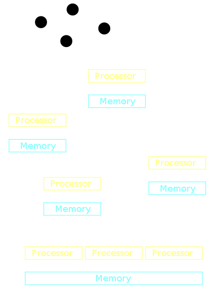

```{r set-options, echo=FALSE, cache=FALSE, purl=FALSE}
options(width = 100)
library(knitr)
```

# Updates

## Schedule {.smaller}

 1. Introduction: Big Data, Data Economy. Walkowiak (2016): Chapter 1.
 2. Computation and Memory in Applied Econometrics.
 3. Computation and Memory in Applied Econometrics II.
 4. Advanced R Programming. Wickham (2019): Chapters 2, 3, 17,23, 24.
 5. Import, Cleaning and Transformation of Big Data. Walkowiak (2016): Chapter 3: p. 74‑118.
 6. Aggregation and Visualization. Walkowiak (2016): Chapter 3: p. 118‑127; Wickham et al.(2015); Schwabish (2014).
 7. Data Storage, Databases Interaction with R. Walkowiak (2016): Chapter 5.
 8. Cloud Computing: Introduction/Overview, Distributed Systems, Walkowiak (2016): Chapter 4.
 9. *Applied Econometrics with Spark; Machine Learning and GPUs.*
 10. *Announcement Take-Home Exercises, Q&A in Zoom.*
 11. *Feedback, Q&A in Zoom, (hand in presentations).*


## Feedback

- Course Evaluation
- Additional course evaluation: Online Teaching Spring 2020
- Both open on Canvas/StudyNet!
- Please report technical problems!
 

# Distributed Systems/MapReduce

## Distributed systems


```{r distributedsystems, echo=FALSE, out.width = "30%", fig.align='center', fig.cap= "(a), (b): a distributed system. (c): a parallel system.I llustration by [Miym](https://commons.wikimedia.org/wiki/User:Miym). [CC BY-SA 3.0](https://creativecommons.org/licenses/by-sa/3.0/deed.en)", purl=FALSE}

```

<!-- Note: Parallel system has shared memory (several processors/cores accessing the same memory) -->

## Map/Reduce with Hadoop 


```{r hadoop, echo=FALSE, out.width = "90%", fig.align='center', purl=FALSE}
include_graphics("../img/hadoop.png")
```


## Map/Reduce with Hadoop 

- Basic Hadoop installation comes with a few examples for very typical map/reduce programs.
- More sophisticated programs need to be custom made, written in Java.

## Map/Reduce with Hadoop 


```{bash eval=FALSE}
# run mapreduce word count
# the specific hadoop program with the implemented wordcount is stored in a java-archive application (.jar-file)
/usr/local/hadoop/bin/hadoop jar /usr/local/hadoop/share/hadoop/mapreduce/hadoop-mapreduce-examples-2.10.0.jar wordcount ~/input ~/wc_example
```


## Map/Reduce with Hadoop 


```{bash eval=FALSE}
cat ~/wc_example/*
```


```{ eval=FALSE}
## Ann  2
## Becky    2
## Simon    2
## a    3
## friend   3
## is   3
## not  1
## of   3
```


## MapReduce/Hadoop summary

- Motivation: need to scale out storage/memory.
- Allows for massive horizontal scaling.
- RAM/storage distributed across machines.


# Applied Econometrics with Apache Spark

<!-- TODO: -->
<!-- - cover http://localhost:4040 briefly -->
<!-- - cover more of sparklyr -->

---

```{r sparklogo, echo=FALSE, out.width = "80%", fig.align='center',  purl=FALSE}
include_graphics("https://upload.wikimedia.org/wikipedia/commons/thumb/f/f3/Apache_Spark_logo.svg/1000px-Apache_Spark_logo.svg.png")
```


## Spark basics

- Cluster computing platform made for data analytics.
- Based on Hadoop, but much faster in many core data analytics tasks.
- Easy to use from R.


##  Spark basics

```{r sparkstack, echo=FALSE, out.width = "60%", fig.align='center', fig.cap= "Basic Spark stack (source: https://spark.apache.org/images/spark-stack.png)", purl=FALSE}
include_graphics("https://spark.apache.org/images/spark-stack.png")
```

## Spark basics: RDDs

- Fundamental data structure: *resilient distributed dataset' (RDD).
- Distributed collections of elements.
- Manipulations are executed in parallel in these RDDs. 


## Spark in R 

- Two prominent packages connect R to Spark: `SparkR` and RStudio's `sparklyr`.
- Similarly easy to use and cover all the basics for analytics tasks.
- See, e.g., [this blog post](https://cosminsanda.com/posts/a-compelling-case-for-sparkr/) for pros and cons.


## `SparkR` in action

Note: by default, Spark/`SparkR` runs on a local standalone session (no cluster computer needed to learn Spark, test code etc.!)
```{r warning=FALSE, message=FALSE}
# install.packages("SparkR")

# load packages
library(SparkR)

# start session
sparkR.session()

```


## Data import and summary statistics

We analyze the already familiar `flights.csv` dataset. 

```{r}

# Import data and create a SparkDataFrame (a distributed collection of data, RDD)
flights <- read.df(path="../data/flights.csv", source = "csv", header="true")

```

## Data import and summary statistics

- 'Import' means creating the RDDs and an R-object pointing to the data.
- The data is not actually loaded into the global R environment (see the Environment pane in RStudio).

```{r}
# inspect the object
str(flights)
head(flights)
```


## Data import and summary statistics

- By default, all variables have been imported as type `character`.
- Convert some columns to other data types with the `cast` function.

```{r}
flights$dep_delay <- cast(flights$dep_delay, "double")
flights$dep_time <- cast(flights$dep_time, "double")
flights$arr_time <- cast(flights$arr_time, "double")
flights$arr_delay <- cast(flights$arr_delay, "double")
flights$air_time <- cast(flights$air_time, "double")
flights$distance <- cast(flights$distance, "double")
```


## Data import and summary statistics

- Task: Compute average arrival delays per carrier for flights with a distance over 1000 miles. 
- Variable selection and filtering of observations is implemented in `select()` and `filter()` (as in the `dplyr` package). 


```{r}
# filter
long_flights <- select(flights, "carrier", "year", "arr_delay", "distance")
long_flights <- filter(long_flights, long_flights$distance >= 1000)
head(long_flights)
```

## Data import and summary statistics

- Summarize the arrival delays for the subset of long flights by carrier. 
- This is the 'split-apply-combine' approach in `SparkR`!¨

```{r}
# aggregation: mean delay per carrier
long_flights_delays<- summarize(groupBy(long_flights, long_flights$carrier),
                      avg_delay = mean(long_flights$arr_delay))
head(long_flights_delays)
```

## Data import and summary statistics

- Convert the result back into a usual `data.frame` (loaded in our current R session).
- Converting a `SparkDataFrame` back into a native R object means *all the data* stored in the RDDs constituting the `SparkDataFrame` object are *loaded into local RAM*!

```{r}
# Convert result back into native R object
delays <- collect(long_flights_delays)
class(delays)
delays
```


### Regression analysis

- Correlation study of what factors are associated with more or less arrival delay.
- Built-in 'MLib' library several high-level functions for regression analyses. 


### Regression analysis: comparison with native R

- First estimate a linear model with the usual R approach (all computed in the R environment). 

```{r warning=FALSE, message=FALSE}
# flights_r <- collect(flights) # very slow!
flights_r <- data.table::fread("../data/flights.csv", nrows = 300) 
```


```{r}
# specify the linear model
model1 <- arr_delay ~ dep_delay + distance
# fit the model with ols
fit1 <- lm(model1, flights_r)
# compute t-tests etc.
summary(fit1)
```


### Regression analysis: comparison with native R

- Compute essentially the same model estimate in `SparkR`. 
- Note that most regression models commonly used in traditional applied econometrics are accessible via `SparkR::glm()`. 

```{r message=FALSE, warning=FALSE}
# create SparkDataFrame
flights2 <- createDataFrame(flights_r)
# fit the model
fit1_spark <- spark.glm(formula = model1, data = flights2 , family="gaussian")
# compute t-tests etc.
summary(fit1_spark)

```


<!-- Alternative with `sparklyr`: -->

<!-- ```{r message=FALSE, warning=FALSE} -->
<!-- library(sparklyr) -->

<!-- # connect with default configuration -->
<!-- sc <- spark_connect(master = "local",  -->
<!--                     version = "2.4.5") -->

<!-- # load data to spark -->
<!-- flights3 <- copy_to(sc, flights_r, "flights3") -->

<!-- # fit the model -->
<!-- fit2_spark <- ml_linear_regression(flights3, formula = model1) -->
<!-- # compute t-tests etc. -->
<!-- summary(fit2_spark) -->
<!-- ``` -->


# GPUs for Scientific Computing

## GPUs for scientific computing

- *Graphic Processing Units (GPUs)*.
- 'Side product' of the computer games industry.
- More demanding games needed better graphic cards (with faster *GPUs*).

## GPUs

```{r nvidiagpu, echo=FALSE, out.width = "60%", fig.align='center', purl=FALSE}
include_graphics("../img/nvidia_geeforce.png")
```

## Why GPUs?

- Why not more powerful CPUs to deal with the more demanding PC games?
- CPUs: designed not only for *efficiency but also flexibility*.
- GPUs: designed to excel at computing graphics.
  - Highly parallel numerical floating point workloads.
  - Very useful in some core scientific computing tasks (see @fatahalian_etal2004)!

## GPU characteristics

- Composed of several multiprocessor units.
- Each multiprocessor units has several cores.
- GPUs can perform computations with thousands of threads in parallel.

## GPU characteristics


```{r nvidia_architecture, echo=FALSE, out.width = "40%", fig.align='center', fig.cap= "Typical NVIDIA GPU architecture (illustration and notes by @hernandez_etal2013): The GPU is comprised of a set of Streaming MultiProcessors (SM). Each SM is comprised of several Stream Processor (SP) cores, as shown for the NVIDIA’s Fermi architecture (a). The GPU resources are controlled by the programmer through the CUDA programming model, shown in (b).", purl=FALSE}
include_graphics("../img/nvidia_gpu.png")
```

## Challenges to using GPUs for scientific computing

- Different hardware architecture, different low-level programming model.
- Good understanding of hardware needed.
- But, more and more high-level APIs available (e.g., in tensorflow/keras).


# GPUs in R

<!-- ## Installation -->

<!-- This is for pop OS machines. Install drivers etc. for NVIDIA card -->
<!-- ```{bash eval=FALSE} -->
<!-- # sudo apt install tensorflow-cuda-latest -->
<!-- ``` -->

<!-- Install OpenCL -->

<!-- ```{bash eval=FALSE} -->
<!-- # sudo apt install tensorflow-cuda-latest -->
<!-- ``` -->


<!-- Install `gpuR` in R (`install.packages("gpuR")`). -->


## Example I: Matrix multiplication comparison (`gpuR`)

- `gpuR`: basic R functions to compute with GPUs from within the R environment. 
- Example: compare the performance of the CPU with the GPU based on a matrix multiplication exercise. 
  - (For a large $N\times P$ matrix $X$, we want to compute $X^tX$.)


## Example I: Matrix multiplication comparison (`gpuR`)

```{r  warning=FALSE, message=FALSE }
# load package
library(bench)
library(gpuR)

```

## Example I: Matrix multiplication comparison (`gpuR`)

Initiate a large matrix filled with pseudo random numbers ($N$ observations and $P$ variables).

```{r}
# initiate dataset with pseudo random numbers
N <- 10000  # number of observations
P <- 100 # number of variables
X <- matrix(rnorm(N * P, 0, 1), nrow = N, ncol =P)

```


## Example I: Matrix multiplication comparison (`gpuR`)

Prepare for GPU computation.

```{r}
# prepare GPU-specific objects/settings
gpuX <- gpuMatrix(X, type = "float")  # point GPU to matrix (matrix stored in non-GPU memory)
vclX <- vclMatrix(X, type = "float")  # transfer matrix to GPU (matrix stored in GPU memory)
```

## Example I: Matrix multiplication comparison (`gpuR`)


Now we run the three examples: 1) using the CPU, 2) computing on the GPU but using CPU memory, 3) computing on the GPU and using GPU memory. 

```{r message=FALSE}
# compare three approaches
gpu_cpu <- bench::mark(
  
  # compute with CPU 
  cpu <- t(X) %*% X,
  
  # GPU version, GPU pointer to CPU memory (gpuMatrix is simply a pointer)
  gpu1_pointer <- t(gpuX) %*% gpuX,
  
  # GPU version, in GPU memory (vclMatrix formation is a memory transfer)
  gpu2_memory <- t(vclX) %*% vclX,
 
check = FALSE, min_iterations = 20)
```


## Example I: Matrix multiplication comparison (`gpuR`)


```{r}
plot(gpu_cpu, type = "boxplot")
```


<!-- ## Example II: Basic statistics (`Rth`) -->

<!-- Install package  -->
<!-- - needs cuda and thrust (in latest cuda versions included). -->
<!-- - gcc version 8 or younger (use ` sudo update-alternatives --config gcc` to switch to version 8 if necessary). -->
<!-- - point directly to thrust when installing -->
<!--  STILL DOES NOT WORK -->
<!-- ```{r} -->
<!-- devtools::install_github("matloff/Rth", configure.args = "--with-thrust-home=/usr/lib/cuda-10.2/targets/x86_64-linux/include/thrust/ --with-backend=CUDA") -->
<!-- ``` -->


<!-- Load package -->
<!-- ```{r} -->
<!-- # load packages -->
<!-- library(Rth) -->
<!-- ``` -->

<!-- Compute histogram and correlation of a 100 million row dataset. -->

<!-- Create the dataset (based on pseudo random numbers) -->
<!-- ```{r} -->
<!-- # set fix vars -->
<!-- N <- 100000000 # number of observations -->
<!-- P <- 2 # number of variables -->

<!-- # draw random dataset -->
<!-- randat <- matrix(runif(N*P), ncol = P) -->

<!-- ``` -->


<!-- Compute histogram of first var -->
<!-- ```{r} -->
<!-- var1 <- randat[,1] -->
<!-- rthhist("var1") -->
<!-- Rth::rthhist("var1") -->
<!-- ``` -->


<!-- Micro benchmarking of correlation computation -->


<!-- # Extended Example: OLS -->
<!-- Here, the CPU is faster! -->

<!-- ```{r} -->

<!-- # Example taken from https://www.arc.vt.edu/wp-content/uploads/2017/04/GPU_R_Workshop_2017_slidy.html#13 -->

<!-- set.seed(123456) -->
<!-- np <- 40  #number of predictors -->
<!-- nr <- 1e+05  #number of observations -->
<!-- X <- cbind(5, 1:nr, matrix(rnorm((np - 1) * nr, 0, 0.01), nrow = nr, ncol = (np - -->
<!--     1))) -->
<!-- beta <- matrix(c(1, 3, runif(np - 1, 0, 0.2)), ncol = 1) -->
<!-- y <- X %*% beta + matrix(rnorm(nr, 0, 1), nrow = nr, ncol = 1) -->
<!-- # CPU bound version, slight optimize via crossprod but otherwise vanilla -->
<!-- time2 <- system.time({ -->
<!--     ms2 <- solve(crossprod(X), crossprod(X, y)) -->
<!-- }) -->
<!-- # GPU version, GPU pointer to CPU memory!! (gpuMatrix is simply a pointer) -->
<!-- gpuX = gpuMatrix(X, type = "float")  #point GPU to matrix -->
<!-- gpuy = gpuMatrix(y, type = "float") -->
<!-- time4 <- system.time({ -->
<!--     ms4 <- gpuR::solve(gpuR::crossprod(gpuX), gpuR::crossprod(gpuX, gpuy)) -->
<!-- }) -->
<!-- # GPU version, in GPU memory!! (vclMatrix formation is a memory transfer) -->
<!-- vclX = vclMatrix(X, type = "float")  #push matrix to GPU -->
<!-- vcly = vclMatrix(y, type = "float") -->
<!-- time5 <- system.time({ -->
<!--     ms5 <- gpuR::solve(gpuR::crossprod(vclX), gpuR::crossprod(vclX, vcly)) -->
<!-- }) -->

<!-- data.frame(CPU=time3[3], -->
<!--            GPU_CPUmem=time4[3], -->
<!--            GPU_GPUmem=time5[3]) -->
<!-- ``` -->


## Example II: GPUs and Machine Learning

- Training deep learning (DL) models depends on tensor (matrix) multiplications. 
- DL typically relies on highly parallelized computing based on GPUs.
- Software to build and train deep neural nets ([tensorflow](https://www.tensorflow.org/), and the high-level [Keras](https://keras.io/) API) make it comparatively simple to use GPUs.


<!-- ```{r warning=FALSE, message=FALSE} -->

<!-- library(keras) -->
<!-- mnist <- dataset_mnist() -->
<!-- x_train <- mnist$train$x -->
<!-- y_train <- mnist$train$y -->
<!-- x_test <- mnist$test$x -->
<!-- y_test <- mnist$test$y -->


<!-- # reshape -->
<!-- x_train <- array_reshape(x_train, c(nrow(x_train), 784)) -->
<!-- x_test <- array_reshape(x_test, c(nrow(x_test), 784)) -->
<!-- # rescale -->
<!-- x_train <- x_train / 255 -->
<!-- x_test <- x_test / 255 -->


<!-- y_train <- to_categorical(y_train, 10) -->
<!-- y_test <- to_categorical(y_test, 10) -->


<!-- model <- keras_model_sequential() -->
<!-- model %>% -->
<!--   layer_dense(units = 256, activation = 'relu', input_shape = c(784)) %>% -->
<!--   layer_dropout(rate = 0.4) %>% -->
<!--   layer_dense(units = 128, activation = 'relu') %>% -->
<!--   layer_dropout(rate = 0.3) %>% -->
<!--   layer_dense(units = 10, activation = 'softmax') -->


<!-- summary(model) -->


<!-- model %>% compile( -->
<!--   loss = 'categorical_crossentropy', -->
<!--   optimizer = optimizer_rmsprop(), -->
<!--   metrics = c('accuracy') -->
<!-- ) -->


<!-- history <- model %>% fit( -->
<!--   x_train, y_train, -->
<!--   epochs = 30, batch_size = 128, -->
<!--   validation_split = 0.2 -->
<!-- ) -->


<!-- plot(history) -->
<!-- ``` -->


##  Tensorflow/Keras example: predict housing prices

In this example we train a simple sequential model with two hidden layers in order to predict the median value of owner-occupied homes (in USD 1,000) in the Boston area (data are from the 1970s). The original data and a detailed description can be found [here](https://www.cs.toronto.edu/~delve/data/boston/bostonDetail.html). The example follows closely [this keras tutorial](https://keras.rstudio.com/articles/tutorial_basic_regression.html#the-boston-housing-prices-dataset) published by RStudio.


##  Tensorflow/Keras example: predict housing prices

```{r echo=FALSE, message=FALSE, warning=FALSE}
if (Sys.info()["sysname"]=="Darwin"){ # run on mac os machine
     
        use_python("/Users/umatter/opt/anaconda3/bin/python") # IMPORTANT: keras/tensorflow is set up to run in this environment on this machine!
}

```

```{r warning=FALSE, message=FALSE}
# load packages
library(keras)
library(tibble)
library(ggplot2)


# load data shipped with the keras library
boston_housing <- dataset_boston_housing() 
str(boston_housing)
```


##  Training and test dataset

- First split the data into a training set and a test set.
- Reason: Monitor the out-of-sample performance of the trained model!
  - (Deep) neural nets are often susceptible to over-fitting.
  - Validity checks based on the test sample are often an integral part of modelling with tensorflow/keras.

```{r}
# assign training and test data/labels
c(train_data, train_labels) %<-% boston_housing$train
c(test_data, test_labels) %<-% boston_housing$test

```


##  Prepare training data

In order to better understand and interpret the dataset we add the original variable names, and convert the dataset to a `tibble`. 

```{r warning=FALSE}
# prepare data 
column_names <- c('CRIM', 'ZN', 'INDUS', 'CHAS', 'NOX', 'RM', 'AGE', 
                  'DIS', 'RAD', 'TAX', 'PTRATIO', 'B', 'LSTAT')
train_df <- as_tibble(train_data)
colnames(train_df) <- column_names

train_df
```


##  Inspect training data

Next, we have a close look at the data. Note the usage of the term 'label' for what is usually called the 'dependent variable' in econometrics.

<!-- ^[Typical textbook examples in machine learning deal with classification (e.g. a logit model), while in microeconometrics the typical example is usually a linear model (continuous dependent variable).] As the aim of the exercise is to predict median prices of homes, the output of the model will be a continuous value ('labels'). -->


```{r}
# check example data dimensions and content
paste0("Training entries: ", length(train_data), ", labels: ", length(train_labels))
summary(train_data)
summary(train_labels) # Display first 10 entries
```

##  Normalize features

- The dataset contains variables ranging from per capita crime rate to indicators for highway access (different units, different scales).
- Not per se a problem, but fitting is more efficient when all features are normalized.


## Normalize features


```{r}
# Normalize training data
train_data <- scale(train_data) 

# Use means and standard deviations from training set to normalize test set
col_means_train <- attr(train_data, "scaled:center") 
col_stddevs_train <- attr(train_data, "scaled:scale")
test_data <- scale(test_data, center = col_means_train, scale = col_stddevs_train)

train_data[1, ] # First training sample, normalized

```


## Model specification

We specify the model as a linear stack of layers: 

 - The input (all 13 explanatory variables).
 - Two densely connected hidden layers (each with a 64-dimensional output space).
 - The one-dimensional output layer (the 'dependent variable').


```{r warning=FALSE, message=FALSE}
# Create the model
# model specification
model <- keras_model_sequential() %>%
  layer_dense(units = 64, activation = "relu",
              input_shape = dim(train_data)[2]) %>%
  layer_dense(units = 64, activation = "relu") %>%
  layer_dense(units = 1)
```

## Training configuration

In order to fit the model, we first have to 'compile' it (configure it for training):

- Set the parameters that will guide the training/optimization procedure. 
    - Mean squared errors loss function (`mse`) typically used for regressions. 
    - [RMSProp](http://www.cs.toronto.edu/~tijmen/csc321/slides/lecture_slides_lec6.pdf) optimizer to find the minimum loss.

```{r}
# compile the model  
  model %>% compile(
    loss = "mse",
    optimizer = optimizer_rmsprop(),
    metrics = list("mean_absolute_error"))
```

## Training configuration

Now we can get a summary of the model we are about to fit to the data.

```{r}
# get a summary of the model
model
```


## Monitoring training progress

- Set number of epochs.
- Allow for early stopping based on validation loss.

```{r}

# Set max. number of epochs
epochs <- 500

# The patience parameter is the amount of epochs to check for improvement.
early_stop <- callback_early_stopping(monitor = "val_loss", patience = 20)

```

## Fit (train) the model


```{r warning=FALSE, message=FALSE}
# Fit the model and store training stats
history <- model %>% fit(
  train_data,
  train_labels,
  epochs = epochs,
  validation_split = 0.2,
  verbose = 0,
  callbacks = list(early_stop)
)

plot(history, metrics = "mean_absolute_error", smooth = FALSE) +
  coord_cartesian(xlim = c(0, 100), ylim = c(0, 5))
```


## Parallelization: A word of caution

Why not always use GPUs for parallel tasks in scientific computing? 

- Whether a GPU implementation is faster, depends on many factors.
- Also, proper implementation of parallel tasks (either on GPUs or CPUs) can be very tricky (and a lot of work).


## References {.smaller}


